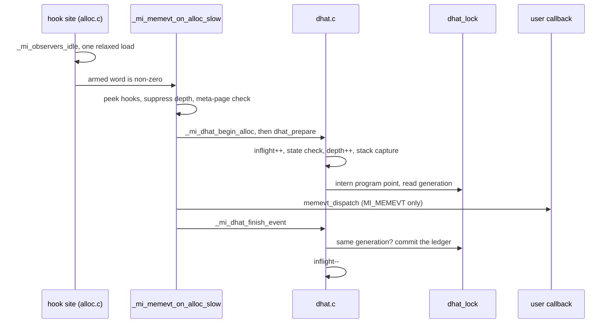

# Exact DHAT profiler internals

*Part of the [mimalloc-pprof](../README.md) documentation.*

How the exact DHAT observer reaches, stores, isolates and serializes what it sees. The user
contract is [docs/dhat-and-memory-events.md](dhat-and-memory-events.md); the hook sites DHAT
shares with memory-events are in [docs/memory-events-internals.md](memory-events-internals.md),
and this page covers that dispatch only as far as DHAT needs it.

## 1. Purpose and provenance

The sampled pprof profiler ([docs/profiler.md](profiler.md)) answers "where does the heap
come from" at production cost. It cannot answer "how long did these blocks live" or "what
was live at the global peak", because it only sees one allocation in N. DHAT records
**every** non-internal allocation, free and resize, with its birth time. It writes Valgrind's
DHAT file-version-2 JSON, which is heap and lifetime data only (`bklt: true`,
`bkacc: false`). It is meant for short diagnostic runs and tests.

Everything here was written for this fork; upstream mimalloc and Bun's fork have no DHAT
observer. From the source comments: #238 added it (`src/dhat.c`), independent of `MI_PPROF`
and of `mi_memory_set_callbacks`; #266 moved its per-thread state off `mi_decl_thread` onto
`mi_tld_t::hooks`; #270 added fork handlers and a lock-order slot; #371/#372 added the
armed-word fast path and the `MI_DHAT` switch; #414 made every subsystem opt-in (for DHAT,
the owner decision of 2026-09-18) and kept the hook sites whenever `MI_MEMEVT || MI_DHAT`.

## 2. Build and configuration surface

| surface | spelling | default | notes |
|---|---|---|---|
| CMake option | `-DMI_DHAT=ON` | `OFF` | appends `MI_DHAT=1` to `mi_defines`; adds `src/dhat-stack.c` to the sources |
| C define | `MI_DHAT` | `0` (`include/mimalloc/types.h`) | a direct `src/static.c` compile must pass `-DMI_DHAT=1`; `src/static.c` includes `dhat.c` always and `dhat-stack.c` only `#if MI_DHAT` |
| cargo feature | `dhat` | off (`default = []`) | `dhat = ["memory-events"]`; also part of `full`. `rust/mimalloc-pprof/build.rs` maps `CARGO_FEATURE_DHAT` to `MI_DHAT` |

CMake allows `MI_MEMEVT=0 MI_DHAT=1`, the `dhat-on` CI row, where the shared
`#if MI_MEMEVT || MI_DHAT` hook-site guard is load-bearing. The crate cannot build that
shape: its `dhat` feature always turns `memory-events` on as well.

**Compile-time constants** (`src/dhat.c`, `src/dhat-stack.c`): `DHAT_STACK_MAX` 64 (frames
per allocation), `MI_DHAT_STACK_MAX` 128 (a clamp in `_mi_dhat_stack_capture` that never
binds), `DHAT_CHUNK_SIZE` 64 KiB (minimum arena chunk), `DHAT_DEFAULT_BUDGET` 64 MiB, and
`DHAT_BUCKETS` 4096 (both hash tables; a power of two, since the index is
`hash & (DHAT_BUCKETS - 1)`). None has an `#ifndef` guard, so a `-D` override is a
redefinition, short of CLAUDE.md rule 11 (newer than this file); the frame walk's 8 MiB
limit (`8u << 20`) is inline too.

**Runtime configuration.** DHAT has no `mi_option_*` entry. It reads three variables
directly through `_mi_getenv`:

| variable | read by | effect |
|---|---|---|
| `MIMALLOC_DHAT` | `dhat_resolve_env` (once) | intended: start at process init when set, non-empty and not starting with `0`. **See the defect below.** |
| `MIMALLOC_DHAT_DUMP_AT_EXIT` | `dhat_resolve_env`, or the first `mi_dhat_start`, once | path (1024-byte buffer) that `_mi_dhat_process_done` dumps to at exit |
| `MIMALLOC_DHAT_MAX_BYTES` | every fresh session (`dhat_resolve_env`, `mi_dhat_start`) | decimal budget in bytes; `0` means unlimited; an unparsable value keeps 64 MiB |

> **Known defect: `MIMALLOC_DHAT` cannot enable DHAT.** `dhat_resolve_env` reads it into a
> `char value[8]`. `_mi_getenv` (`src/libc.c`) returns `ENOENT` for any buffer smaller than
> 64 bytes, so `env_enabled` is always false. A scratch `MI_DHAT=1` build confirmed this:
> `MIMALLOC_DHAT=1` leaves `mi_dhat_is_enabled()` false, while `MIMALLOC_DHAT_MAX_BYTES`
> (read into `char buf[64]`) works. Until the buffer is widened, start DHAT with
> `mi_dhat_start` / `dhat::start()`. `MIMALLOC_DHAT_DUMP_AT_EXIT` is unaffected.

**What compiles away with `MI_DHAT=0`.** The `#else` block at the end of `src/dhat.c` keeps
the public API (all `false` / no-op), `_mi_dhat_is_active`, and the entry points upstream
files call unconditionally: `_mi_dhat_forget_heap` (heap.c), `_mi_dhat_process_init` /
`_mi_dhat_process_done` (init.c) and the three `_mi_dhat_fork_*` (fork.c). The per-event
entry points (`_mi_dhat_begin_alloc`, `_mi_dhat_begin_free`, `_mi_dhat_begin_resize`,
`_mi_dhat_finish_event`) and `_mi_dhat_stack_capture` are deliberately **not** stubbed:
their declarations in `include/mimalloc/internal.h` are `#if MI_DHAT`, so an unguarded call
site is a compile error, never a silent hot-path cost. With neither `MI_MEMEVT` nor
`MI_DHAT` the `_mi_memevt_on_*` wrappers expand to nothing.

## 3. Public API

Declared in `include/mimalloc/dhat.h`. All functions are `mi_attr_noexcept`.

| function | contract |
|---|---|
| `bool mi_dhat_start(void)` | Starts a **fresh** session. It frees the previous session's arena (`dhat_release_locked`), re-reads the budget, bumps `dhat_generation`, stores `DHAT_ENABLED` and publishes the armed bit. It returns `false` if DHAT is compiled out, already active, if a stop is still draining (`dhat_stopping`), or if **any** thread is between prepare and finish (`dhat_inflight != 0`). That last case includes the momentary bump each slow-path event makes while DHAT is off (for example with memory-events tracking on), so a `false` can be transient. It also returns `false` when called on a thread whose own DHAT event is armed, that is, from a memory-change callback. |
| `void mi_dhat_stop(void)` | Idempotent. It stops observing but **keeps** every record for dumping. It sets `dhat_stopping`, stores `DHAT_DISABLED`, clears the armed bit, then yield-spins (`_mi_prim_thread_yield`) until `dhat_inflight` is zero, and stamps `dhat_ended`. It is a no-op from inside an armed event, which is how the spin avoids waiting on itself. |
| `bool mi_dhat_is_enabled(void)` | A relaxed load of `dhat_state == DHAT_ENABLED`. It is false before resolution. |
| `bool mi_dhat_stats_get(mi_dhat_stats_t*)` | Requires `size == sizeof(mi_dhat_stats_t)` and `version == MI_DHAT_STATS_VERSION` (1). It copies the ledger under `dhat_lock`, so it is consistent with the dump, and it works while stopped. `mi_dhat_stats_t_decl(name)` fills both (a lower-case macro grandfathered in `ci/macro_case_baseline.txt`). Fields: `enabled`, `incomplete`, `total_bytes`/`total_blocks` (every observed allocation call, realloc included), `live_*`, `peak_*` (at the byte peak), `dropped`, `internal_bytes` (committed collector chunks). |
| `bool mi_dhat_dump(const char* path)` | Writes the JSON of §5, while active or stopped, and even if DHAT never started (an empty `pps`). It returns `false` for a `NULL` path, from inside an armed event or a nested dump, if `fopen` fails, or if `fclose` fails. `fprintf` errors are not checked. |

```c
#include <mimalloc.h>
#include <mimalloc/dhat.h>

int main(void) {
  if (!mi_dhat_start()) return 1;          /* compiled out, running, or draining a stop */
  void* p = mi_malloc(100);
  p = mi_realloc(p, 200);                   /* a second allocation call, same identity */
  mi_free(p);
  mi_dhat_stats_t_decl(st);
  const int partial = mi_dhat_stats_get(&st) && st.incomplete;
  mi_dhat_stop();                           /* stop observing, keep the records */
  if (!mi_dhat_dump("heap.dhat.json")) return 2;
  return partial ? 3 : 0;
}
```

**Rust** (`pub mod dhat` in `rust/mimalloc-pprof/src/lib.rs`, FFI in `sys.rs` beside it):
`dhat::start`, `dhat::stop`, `dhat::is_enabled`, `dhat::stats() -> dhat::Stats` (fills
`size`/`version`; `Stats::default()` if C rejects it or DHAT is compiled out) and
`dhat::dump_file(&Path) -> io::Result<()>`, which rejects non-UTF-8 paths and NULs and maps
a C `false` to `io::Error::last_os_error()`, unrelated when the cause was the depth guard.

## 4. Architecture

### 4.1 How an event reaches DHAT

DHAT has no hook sites of its own: the memory-events slow paths in `src/memory-events.c`
call it. Their inline wrappers (`_mi_memevt_on_alloc`, `_mi_memevt_on_free`,
`_mi_memevt_on_realloc_in_place`, `_mi_memevt_on_resize`, in `include/mimalloc/internal.h`)
sit on one guarded line each in `src/alloc.c`, `src/alloc-aligned.c` and `src/free.c`, and
first test `_mi_observers_idle()`, one relaxed load of the cache-aligned `_mi_observers_armed`
word. DHAT owns its bits `MI_OBSERVERS_DHAT_UNRESOLVED` (4) and `MI_OBSERVERS_DHAT_ON` (8).



Every slow path has the same bracket: `begin_*` → memory-events dispatch → `finish`. DHAT
captures identity **before** the application callback runs and commits **after** it
returns. Every slow path returns early when `memevt_suppress_depth > 0`. That shared
counter keeps three things out of **both** observers: allocations made inside a callback,
the internal allocate/free pair of a moving realloc (`mi_theap_realloc_zero_ex` then emits
one synthesized resize), and the over-allocation of the guarded and over-aligned paths
(which then emit one event keyed by the block start, `_mi_page_ptr_unalign`). The alloc and
free slow paths run `_mi_meta_is_meta_page_safe` before calling DHAT, so
allocator metadata is never recorded. The free-side check exists for memory-events' balance;
DHAT would ignore the free of a never-recorded pointer anyway.

Identity is always the **block start**, never an interior aligned pointer. The comments in
`src/alloc.c` and `src/alloc-aligned.c` explain that getting this wrong leaks a record
forever. `mi_free_block_mt` fires the free hook **before** it publishes the block to the
owner's `xthread_free` list, so a plain free cannot let the owner reuse the address while
DHAT still holds the old record. **Possible defect (static trace, not reproduced):** a
moving realloc breaks this. Its internal `mi_free(p)` runs under suppression, so the free
hook returns early and the old block is published *before* `_mi_memevt_on_resize` re-keys
the record. For a cross-thread pointer the owner can reuse the address in that window, and
its allocation then collides with the stale record and is dropped.

### 4.2 State machine

`dhat_state` is an `_Atomic(size_t)`:

| state | how it is entered | armed bits |
|---|---|---|
| `DHAT_UNINIT` (0) | static initial value | `UNRESOLVED` set (`MI_OBSERVERS_DHAT_INITIAL`), so the first hook takes the slow path |
| `DHAT_DISABLED` (1) | `dhat_resolve_env` with no enable, or `mi_dhat_stop` | `ON` and `UNRESOLVED` cleared |
| `DHAT_ENABLED` (2) | `mi_dhat_start` (or the env path, see §2) | `ON` set **before** `UNRESOLVED` is cleared, so the word is never zero while running |

Resolution runs once under `dhat_once` (an `mi_atomic_once_t`), won by the first of
`_mi_dhat_process_init` (from `mi_process_init_once`), a `dhat_prepare` seeing `DHAT_UNINIT`,
or `mi_dhat_start`. So DHAT normally resolves at process init, contrary to the lazy "first
hook, never at startup" wording in `include/mimalloc/internal.h` (true of memory-events only).
A winning `mi_dhat_start` reads only `MIMALLOC_DHAT_DUMP_AT_EXIT`: explicit start wins.

### 4.3 The collector arena (rule 4)

All persistent DHAT state lives in a bump arena on the raw OS layer. `dhat_arena_alloc`
rounds each request up to `MI_MAX_ALIGN_SIZE` (the arena holds `uint64_t` counters too) and,
when the chunk is full, pushes a new `max(DHAT_CHUNK_SIZE, header + request)` chunk from
`_mi_os_alloc(_mi_subproc_main(), ...)` onto `dhat_chunks`, adding it to
`dhat_internal_bytes`. It never calls a hooked path. `ci/internal-state-inventory.json`
classifies that one site as `dhat-collector-arena-chunk`, enforced by
`ci/check_internal_state.py` ([internal-state-diagnostics.md](internal-state-diagnostics.md)).

The arena is always touched under `dhat_lock` and is **never freed piecemeal**: a freed
record is unlinked, not reused, so collector memory grows with the number of **observed
allocations** in a session (one `dhat_record_t` each; a resize re-keys its record and
allocates nothing) plus one `dhat_pp_t` per distinct stack, not with the live set. A
`dhat_record_t` is six 8-byte fields on a 64-bit target, and a scratch run measured 49 bytes
per allocation including the tables, so the default 64 MiB covers roughly 1.3 million
allocations. Nothing is returned until the **next** `mi_dhat_start` calls `dhat_release_locked`, which gives
every chunk back with `_mi_os_free`. `mi_dhat_stop` keeps it all, and process exit simply
abandons it. Before each new chunk the budget check compares `dhat_internal_bytes` with
`dhat_budget`. On refusal the event that needed the memory is **dropped**
(`dhat_mark_dropped`: increment `dhat_dropped`, set `dhat_incomplete`), and the application
allocation still succeeds.

### 4.4 Data structures and lookup

| type | holds | keyed by |
|---|---|---|
| `dhat_pp_t` (program point) | `hash`, `depth`, `pcs[]`, and per-point counters `tb`, `tbk`, `tl`, `live`, `livek`, `mb`, `mbk`, `gb`, `gbk`, plus `dump_tl` scratch | FNV-1a over the PC bytes (`dhat_hash_stack`), then an exact compare (`dhat_stack_equal`) |
| `dhat_record_t` (live block) | `ptr`, requested `size`, `born`, `page`, `pp` | a 64-bit multiply-xorshift of the pointer (`dhat_hash_ptr`) |
| `dhat_pp_table`, `dhat_live_table` | `DHAT_BUCKETS` chained buckets each, allocated lazily from the arena by `dhat_init_tables_locked` | |

Neither table ever resizes. A lookup is one bucket plus a chain walk, so chains average
`live / 4096`. New program points are pushed at the chain head; live records are appended
at the tail (`dhat_record_slot_locked` returns the terminating slot). `dropped` counts **failure
occurrences**, which is not always the number of lost events. Budget exhaustion after the
tables exist is counted per event. But if one table allocation succeeds and the other fails,
`dhat_init_tables_locked` marks one drop and then refuses every later event without counting
it (`incomplete` is already set). A scratch run with a 70000-byte budget recorded 0 of
1000 allocations and reported `dropped == 1`.

### 4.5 What each event commits

The commit functions run under `dhat_lock`, and only if the event's `generation` equals
`dhat_generation` (§6):

- **alloc** (`dhat_commit_alloc_locked`). If a record already exists at that address (a free
  DHAT missed), the event is dropped. Otherwise it creates a record and adds the request to
  `tb`/`tbk`/`live`/`livek`, raising `mb`/`mbk` if exceeded. It adds to the global
  total/live counters and calls `dhat_snapshot_global_peak_locked`.
- **free** (`dhat_commit_free_locked`). It unlinks the record, subtracts from the point and
  global live counters (an underflow clamps to 0 and marks a drop) and adds `at - born` to
  the point's `tl`. An unknown pointer (allocated before start, or forgotten) is a no-op.
- **resize** (`dhat_commit_resize_locked`, for both in-place and moving). It keeps the
  record's `pp` and `born`, so realloc keeps its identity and lifetime. A moving resize
  re-keys the record to `newp`. It counts as **another allocation call** in the totals
  (`tb += size`, `tbk++`) and adjusts `live` by the size delta. Resizes of unknown pointers
  are ignored entirely.
- **heap destroy** (`_mi_dhat_forget_heap`, called by `_mi_heap_force_destroy` before
  `_mi_heap_destroy_pages`). Each record whose `mi_page_heap(rec->page)` is the dying heap is
  freed now, so a later allocation at that address cannot collide with a stale record.
  `mi_heap_delete` needs no forget: its blocks survive.

A new global peak happens whenever `dhat_live_bytes` exceeds `dhat_peak_bytes`. At each
one, `dhat_snapshot_global_peak_locked` copies `live`/`livek` into `gb`/`gbk` for **every**
program point and records `dhat_peak_at`. That walk is O(buckets + points) per new peak.

### 4.6 Per-thread state (`include/mimalloc/hooks-tld.h`)

DHAT's per-thread state lives in `mi_tld_t::hooks` (`mi_hooks_tld_t`, in
`include/mimalloc/types.h`): `dhat_observer_depth` and the in-flight `dhat_event`.
`dhat_event` mirrors `dhat_event_t`, with `kind` as `int` and `pp` as `void*`, because
`types.h` cannot see dhat.c's private types; `dhat_event_load` converts it back. It used to
be `mi_decl_thread`, but on a macOS dylib a first `__thread` touch can call a dyld-interposed
`calloc` from inside `_mi_meta_zalloc`, which holds `theap_meta_lock` (#266).

Only peeks are allowed, never forced initialization. `_mi_dhat_begin_alloc`,
`_mi_dhat_begin_free`, `_mi_dhat_begin_resize` and `_mi_dhat_finish_event` use
`_mi_hooks_tld_peek` and return on `NULL`. A stack-local fallback cannot work for them,
because the armed event must survive from `begin_*` to the separate `finish` call. As a
result, a thread with no tld of its own is not tracked. For example, a foreign thread whose
first mimalloc call is a cross-thread `mi_free` has its free go unseen. That block stays
"live" in the report, and a later allocation that reuses the address is dropped.
`mi_dhat_dump` does use `_mi_hooks_tld_peek_or_local`, because its depth bump lives only
within the call. That does not hold if the dumping thread has no tld when the dump starts
(see §6). (The `hooks-tld.h` file comment lists `_mi_dhat_begin_free` and
`_mi_dhat_begin_resize` under peek-or-local; the code uses the plain peek.)

### 4.7 Stack capture (`src/dhat-stack.c`)

`_mi_dhat_stack_capture` fills a caller-supplied buffer and allocates nothing:

| platform | method |
|---|---|
| `_WIN32` (MSVC **and** win-gnu) | `RtlCaptureStackBackTrace(2, ...)` |
| `__APPLE__` | `backtrace()` from `<execinfo.h>` into a `MI_DHAT_STACK_MAX + 1` buffer, dropping frame 0 (libSystem strips arm64e PAC bits; see the #35 comment in `src/profile-stack.c`) |
| everything else | a frame-pointer walk from `__builtin_frame_address(0)`. It stops on a `NULL` return address, a non-increasing frame pointer, a jump over 8 MiB, or a frame pointer that is not 8-byte aligned |

This is a copy of the capture in `src/profile-stack.c`, which is compiled only `#if
MI_PPROF`, because DHAT must work with the profiler compiled out. One consequence: CMake adds
`-fno-omit-frame-pointer` to mimalloc's own sources only under `MI_PPROF` on non-Windows,
so an `MI_PPROF=OFF MI_DHAT=ON` Linux build walks through mimalloc frames the compiler may
have compiled without frame pointers. Stacks that are truncated or wrong count as captured,
not dropped. Your own code needs frame pointers either way; see
[c-integration.md](c-integration.md#build-flags-for-usable-stacks) and
[rust-integration.md](rust-integration.md#frame-pointers-and-symbols).

Frames are **not trimmed**: the innermost PCs are DHAT's hook chain and the allocator path
that served the call (inline fast path or `_mi_malloc_generic`), so one source line can
appear under several program points. A capture of depth 0 drops the event.

## 5. Output: the DHAT v2 JSON as emitted

`dhat_write_json_locked` writes the whole document under `dhat_lock`. Top-level keys, in
order:

| key | value |
|---|---|
| `dhatFileVersion` | `2` |
| `mode` | `"mimalloc-heap"` (a producer-specific mode string) |
| `verb` | `"Allocated"` |
| `bklt` / `bkacc` | `true` / `false`: lifetimes present, no access data |
| `tu` / `Mtu` | `"ms"` / `"ms"`: monotonic milliseconds from `_mi_clock_now`, not instruction counts |
| `tuth` | constant `1` |
| `cmd` / `pid` | `""` / `0`: constants, never the real process |
| `tg` | `dhat_peak_at`: ms from start to the global byte peak |
| `te` | ms from start to now, or to `dhat_ended` once stopped. If DHAT never started, this is the raw clock value |
| `mi_dhat_incomplete` | extra key: `true` if anything was dropped this session |
| `pps` | one object per program point, in bucket order and then chain order (not sorted) |
| `ftbl` | frame table of `"0x…"` hex PCs. It is *meant* to hold each distinct PC once, in first-occurrence order, but see the known defect below |

Each `pps` entry has `tb`/`tbk` (total bytes and blocks, reallocs included), `tl` (total
lifetime in ms), `mb`/`mbk` (the point's own maximum live), `gb`/`gbk` (live at the global
peak), `eb`/`ebk` (live at the end), and `fs`, an array of indices into `ftbl`, innermost
frame first. `tl` is `dump_tl`: `dhat_prepare_dump_lifetimes_locked` adds `now - born` for
records still live, and does so without changing the ledger's completed-lifetime total.
Frame-table deduplication allocates nothing; the code comment calls it O(frames³), accepted
for a diagnostic operation. The PCs are **unsymbolized runtime addresses**, and DHAT emits no
module map (unlike the profiler's `src/profile-maps.c`), so under ASLR symbolization needs
the load addresses from the same run.

> **Known defect: `ftbl` can omit PCs, and then `fs` points at the wrong frames.** The `fs`
> indices come from `dhat_frame_index_locked`, whose `dhat_frame_seen_before_locked` stops
> scanning at the current program point. The `ftbl` loop in `dhat_write_json_locked` does
> its own inline "seen" scan instead. For the current bucket (`j == i`), that scan walks the
> **whole** chain at full depth, including program points *after* the current one. A PC
> shared by two program points in one bucket, and absent from every earlier bucket, is
> therefore never emitted. Every `fs` index at or past the first omitted position then
> resolves to the wrong entry, and the largest point past the end of `ftbl`: a scratch dump
> of 72 program points emitted 3 `ftbl` entries while its `fs` indices reached 7. Treat
> `fs`/`ftbl` from non-trivial runs as unreliable until fixed; the `pps` counters are fine.

**When a report is written.** On an explicit `mi_dhat_dump`, or at exit when
`MIMALLOC_DHAT_DUMP_AT_EXIT` is set: `_mi_dhat_process_done` runs in `mi_process_done_once`
before `destroy_on_exit` and dumps whether or not a session ran.
`_mi_auto_process_done` returns immediately under `MI_NO_PROCESS_DETACH`, so such embedders
must call `mi_dhat_dump` themselves (`include/mimalloc/dhat.h`).

## 6. Invariants and concurrency

- **One global lock.** `dhat_lock` guards the arena, both tables, all counters and
  `dhat_generation`. It sits **innermost** in the lock order of `src/fork.c` (slot 13,
  `MI_FORK_LOCK_DHAT`, after `prof_lock` and before `memevt_cb_lock` and `out_buf_lock`).
  Hooks take it with allocator locks possibly held further up the stack. Under it the
  hooks take no allocator lock, only the raw OS layer, and it is never held while stacks are
  captured or while a user callback runs. **`mi_dhat_dump` is the exception (possible
  defect, static trace, not reproduced).** It holds `dhat_lock` across every `fprintf`. When
  stdio allocates through mimalloc, as in an override build, the allocator runs under
  `dhat_lock`: its slow paths can take heap and arena locks, and in an `MI_PPROF` build a
  sampled allocation takes `prof_lock` (`_mi_prof_on_alloc` checks only
  `prof_callback_depth`). Both nest a lock that `_mi_process_fork_prepare` takes *earlier*
  inside `dhat_lock`, so a `fork()` concurrent with such a dump can AB-BA deadlock.
- **Session protocol.** `dhat_prepare` increments `dhat_inflight` (acq_rel) *before* it
  reads `dhat_state`. Every early return decrements it, as does `_mi_dhat_finish_event`.
  `mi_dhat_stop` publishes `DHAT_DISABLED` and spins until `dhat_inflight` drains, and while
  it does, `dhat_stopping` blocks a concurrent start. Each fresh start bumps
  `dhat_generation`. `dhat_prepare` records that generation under the lock, and
  `_mi_dhat_finish_event` commits only on a match, so an event prepared in one session can
  never write stale `dhat_pp_t*` pointers into the arena of the next. Memory orders:
  `dhat_state` release store / relaxed load; `dhat_inflight` acq_rel RMWs, acquire loads in
  start/stop; armed bits acq_rel or/and, read relaxed by the fast path only to choose the
  slow path, where the real checks happen.
- **Reentrancy.** `dhat_observer_depth` is non-zero from `dhat_prepare` until
  `_mi_dhat_finish_event` pops it, which happens *before* the ledger is mutated. It is also
  non-zero across the whole of `mi_dhat_dump`. `mi_dhat_start`, `mi_dhat_stop` and
  `mi_dhat_dump` refuse to run while it is non-zero. Nested hooks normally never reach
  `dhat_prepare`, because the enclosing `memevt_dispatch`, or the dump's
  `_mi_memevt_suppress_begin`, raises `memevt_suppress_depth` first. That matters because
  `dhat_prepare` clears `dhat_event.armed` before it checks the depth.
  **Possible defect (static trace, not reproduced):** a thread with no tld at dump entry
  bumps a stack-local `mi_hooks_tld_t`, and `_mi_memevt_suppress_begin` only peeks, so it
  does nothing. If `fopen` then initializes the real tld, the next stdio allocation, made
  under `dhat_lock`, sees depth 0 and reaches `dhat_prepare`. There it re-acquires the
  non-recursive `dhat_lock` and self-deadlocks while DHAT is active.
- **Fork** (#270; see [fork-safety.md](fork-safety.md)). The child policy is CONTINUE:
  `_mi_dhat_fork_prepare` / `_mi_dhat_fork_parent` take and release `dhat_lock`, and
  `_mi_dhat_fork_child` re-initializes it and resets `dhat_once`. The records survive
  copy-on-write, so `mi_dhat_dump` and `mi_dhat_stats_get` work in the child.
  **Possible defect (static trace, not reproduced):** `dhat_inflight` and `dhat_stopping`
  are not reset. If any parent thread was mid-event at the fork, for example blocked on
  `dhat_lock` after its increment, then in the child `mi_dhat_stop` spins forever and
  `mi_dhat_start` always returns `false`.

## 7. Accuracy guarantees and cost

**Exact, within a session:** every allocation, free and resize that reaches a slow path on
a thread with a tld, outside suppression. DHAT records **requested** bytes (`alloc.c` passes
`size - MI_PADDING_SIZE`; memory-events reports usable size). `test-dhat` pins it: 16 + 32 +
a realloc to 20 gives `total_bytes == 68` over 3 blocks.

**Not observed:** allocations before `mi_dhat_start` (their frees and resizes are ignored);
allocator metadata (`_mi_meta_is_meta_page_safe`); callback-internal and suppressed
internal traffic; `mi_unwrapped_*` (raw OS, no hooks); frees on threads with no tld (§4.6);
reads and writes (`bkacc: false`). Times have millisecond resolution, so a short-lived
block's lifetime is 0. Anything the collector gave up on is reflected in `incomplete` and
`mi_dhat_incomplete`, never in a failed application allocation.

**Cost.** Compiled out, nothing (§2). Compiled in but idle, one relaxed load and a
not-taken branch per hook site; the crate's CHANGELOG measures DHAT's own share as
0 instructions over `memory-events`. Running, DHAT serializes by design: every observed
event takes the process-wide `dhat_lock` twice (prepare and commit; frees and resizes take
it just to read the generation) and makes two atomic RMWs on `dhat_inflight`, and every
allocation captures up to 64 frames. Memory grows with observed allocations (§4.3), hash chains
lengthen past 4096 live blocks, and a dump holds `dhat_lock` for its whole serialization,
stalling every allocating thread. Use it for short runs.

## 8. Edge cases and platform limits

- **Windows (MSVC and win-gnu)** share the `RtlCaptureStackBackTrace` path. `mi_dhat_dump`'s
  narrow `fopen` reads the path in the active code page, so a non-ASCII UTF-8 path from
  `dump_file` may not round-trip.
- **macOS** uses `backtrace()` (its dylib TLS drove #266, §4.6); **Linux/musl** walk frame pointers.
- **Stop, then destroy.** `_mi_dhat_forget_heap` acts only while active. Blocks of a heap
  destroyed after `mi_dhat_stop` still appear as live (`eb`) in that session's dump.
- **Possible defects, found by static trace and not reproduced:** a dump nesting locks inside
  `dhat_lock`, a dump from a thread without a tld, and inherited `dhat_inflight` in a fork child
  (all §6); a cross-thread moving realloc (§4.1).
- **Several mimallocs in one process.** Each copy has its own DHAT state but reads the same
  environment, so two DHAT builds with `MIMALLOC_DHAT_DUMP_AT_EXIT` set write the same path
  and the last wins ([profiler.md](profiler.md#if-your-process-contains-more-than-one-mimalloc)).

## 9. Testing and CI gates

| test | registered | asserts |
|---|---|---|
| `test-dhat` (`test/test-dhat.c`) | only `if(MI_DHAT)` | an empty dump right after start; exact totals and live counts over malloc, realloc and free, and a lower bound on peak bytes; no callback leaks during a dump while active; the over-aligned path reports caller sizes (16 and 12); after stop, the JSON has `dhatFileVersion`, `bklt`, `bkacc`, `pps` and `ftbl`. With `MI_MEMEVT` it also checks that the callback table saw 2/1/1 events; without, that the memory-events API is stubbed |
| `test-fork-locks-dhat-env` | `NOT WIN32` and `MI_DHAT`, with env `MIMALLOC_DHAT=1` | because of the §2 defect this variant arms nothing and behaves like `test-fork-locks`; DHAT is exercised only by `check_dump_in_child`, which calls `mi_dhat_start` after the fork loop (in every variant) and requires `mi_dhat_dump` to succeed in the child |
| `test-memory-events` T12 | with `MI_MEMEVT` | a brand-new thread's first allocation with memory-events, the profiler and DHAT all active must not deadlock |
| `test-observer-scaling` | always, `RUN_SERIAL` | the 4-thread / 1-thread aggregate throughput ratio stays ≥ 1.20 (`MIN_SPEEDUP`); it skips below 4 hardware threads, under `MI_OWNER_GATE`, at guarded sample rate 1, and below 1 Mops/s single-threaded. This is #371's behavioural gate against a serializing observer prologue |
| Rust `dhat_controls_report_lifecycle` / `dhat_compiled_out_is_inert` (`lib.rs`), `feature_contract.rs`, `t19_layout.rs::dhat_struct_matches_c` | per feature | start/stop/stats with the feature; stubs without it; `mi_dhat_stats_t` layout against `rust/mimalloc-pprof/layout_probe.c` |

Run locally with `uv run ci/dev_linux.py c-test`, which configures `-DMI_PPROF=ON -DMI_DHAT=ON`
among others, or with `uv run ci/verify_local.py --only dhat-on`, which also asserts
`MI_DHAT=1` reached the defines. In a build tree, run `ctest -R 'test-dhat|dhat-env'`.

CI ([ci-gates.md](ci-gates.md), rows **dhat-on** and **opt-in defaults**): the `dhat-on`
`build` row (`-DMI_PPROF=ON -DMI_DHAT=ON`, deliberately without `MI_MEMEVT`) runs the
**whole** suite and greps the configure output for `MI_DHAT=1`. `-DMI_DHAT=ON` is also on
`debug-full`, `musl`, the native `cl` tree behind `ctest (windows-latest)`, the
`release`/`debug-full` bundles of `windows-bundles.yml` and `macos-bundles.yml`, and two
`asan.yml` rows; `rust-native.yml` builds the `dhat` feature. `ci/check_fastpath_identity.py`
pins `-DMI_DHAT=ON` for its base-vs-HEAD comparison and proves the minimal build
byte-identical to upstream; `ci/check_no_diagnostic_suppression.py` compiles a
"memory-events + dhat" define set; `ci/check_rust_surface.py` covers `mimalloc/dhat.h`; and
`ci/check_crate_package.py` requires `dhat = ["memory-events"]` and `pub mod dhat`.

## 10. Where to look

| file | what |
|---|---|
| `src/dhat.c` | everything: `dhat_resolve_env`, `dhat_publish_armed`, `dhat_prepare`, `_mi_dhat_begin_alloc`/`_free`/`_resize`, `_mi_dhat_finish_event`, the `dhat_commit_*_locked` trio, `_mi_dhat_forget_heap`, `dhat_arena_alloc`, `dhat_write_json_locked`, the public API, fork hooks, the `#else` stubs |
| `src/dhat-stack.c`, `include/mimalloc/dhat.h` | `_mi_dhat_stack_capture` per platform; the public API, `mi_dhat_stats_t`, `MI_DHAT_STATS_VERSION` |
| `include/mimalloc/internal.h` | `_mi_observers_armed`, the `MI_OBSERVERS_DHAT_*` bits, `_mi_memevt_on_*` wrappers, `_mi_dhat_*` declarations |
| `src/memory-events.c` | the four `_slow` bodies that bracket DHAT (`_mi_memevt_on_alloc_slow` and siblings) |
| `include/mimalloc/hooks-tld.h`, `include/mimalloc/types.h` | `_mi_hooks_tld_peek`, `_mi_hooks_tld_peek_or_local`, `mi_hooks_tld_t` |
| `src/heap.c`, `src/init.c`, `src/fork.c`, `src/libc.c` | `_mi_heap_force_destroy`; `mi_process_init_once` / `mi_process_done_once`; the lock-order block and `_mi_process_fork_prepare`; `_mi_getenv` and its 64-byte minimum (the `MIMALLOC_DHAT` defect) |
| `rust/mimalloc-pprof/src/lib.rs`, `rust/mimalloc-pprof/build.rs`, `rust/mimalloc-pprof/Cargo.toml` | `pub mod dhat`, the `MI_DHAT` define, the `dhat` feature |
| `test/test-dhat.c`, `CMakeLists.txt` | the focused test and its `if(MI_DHAT)` registration |
