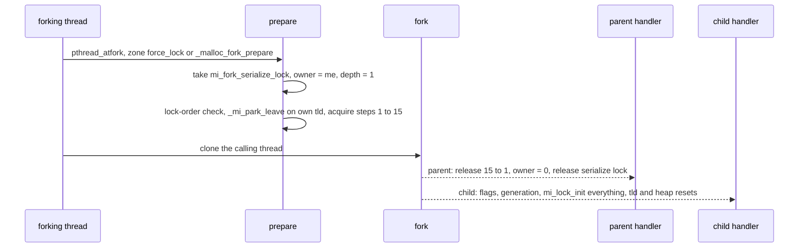

# fork() safety: the pthread_atfork handlers

*Part of the [mimalloc-pprof](../README.md) documentation.*

`fork()` from a multithreaded process clones only the calling thread. Every other thread
vanishes in the child, and any lock it held goes with it, still locked. If that lock is one
of mimalloc's, the child's first allocation that touches it hangs forever. `src/fork.c` holds
the three `pthread_atfork` handlers that close this hole, the lock order they take, and the
state the child has to reset besides locks. It is POSIX-only, has no option to turn on, and is
active in every configuration. Only the lock *skeleton* is Bun's: the lock *order* was
re-derived from this tree's real nesting graph, and the cross-thread serialization is new here.
Provenance (Bun-parity work ported, design not code, from oven-sh/mimalloc @ `942b8342`):

| issue | phase | what it added |
|---|---|---|
| [#270](https://github.com/zackees/mimalloc-pprof/issues/270) (PR [#289](https://github.com/zackees/mimalloc-pprof/pull/289)) | P5 | the handlers, the lock order, the serialize lock, the `MI_DEBUG` self-checks and test hooks |
| [#271](https://github.com/zackees/mimalloc-pprof/issues/271) | P6 | `_mi_process_is_forked_child`, so heap teardown in the child stops trusting dead threads' pages |
| [#272](https://github.com/zackees/mimalloc-pprof/issues/272) | P7a | the per-subproc tld registry (`sp->tlds`/`tlds_lock`), leaving the park before forking, scavenger and park-state resets, re-init of every tld's `theaps_lock` |
| [#293](https://github.com/zackees/mimalloc-pprof/issues/293) | — | `_mi_fork_generation`, `mi_tld_t::fork_gen` and `heap->prefork_theaps`: narrow the forked-child handling to what actually predates the fork |
| [#366](https://github.com/zackees/mimalloc-pprof/issues/366) | — | the survivor/orphan split used by `mi_purge_all`, and the resets of `_mi_purge_admission`, `sweeper`, `purge_epoch` and `gate_flags` |

## 1. Build and platform surface

There is no CMake option, cargo feature or `mi_option`. The feature is present exactly where
`fork()` exists, and four guards say so:

| where | guard |
|---|---|
| `src/fork.c` body | `#if !defined(_WIN32) && !defined(__wasi__)`, so the file is an empty translation unit on Windows and wasi |
| `CMakeLists.txt` | `if(NOT WIN32) list(APPEND mi_sources src/fork.c)` |
| `src/static.c` | `#include "fork.c"` under the same `_WIN32`/`__wasi__` guard (this covers the Rust crate, whose vendored amalgamation is generated from it) |
| `src/init.c` | the `pthread_atfork` call (and `#include <pthread.h>`) under the same guard |

`heap.c` and `arena.c` read `_mi_process_is_forked_child` and `_mi_fork_generation` on every
platform, so both are defined unconditionally in `src/subproc.c`; only their setter,
`_mi_process_fork_child`, is POSIX-only, and on Windows they stay `false`/`0`. The
per-subsystem hooks follow the #414 stub rule: the `_mi_prof_fork_*`, `_mi_dhat_fork_*` and
`_mi_memevt_fork_*` triples are empty when `MI_PPROF`, `MI_DHAT` or `MI_MEMEVT` is off (that
lock does not exist then), so `fork.c` calls them unconditionally. Debug levels add checks but
never change behaviour:

| level | what compiles in | where |
|---|---|---|
| `MI_DEBUG>0` | test hooks `_mi_test_hold_heaps_lock` and friends, `mi_debug_stall_in_thread_theaps_done`, `mi_debug_forked_claim_seized` | `src/fork.c`, `src/init.c`, `src/arena.c` |
| `MI_DEBUG>1` | the per-prepare **sequence check** (`mi_fork_lock_order_assert`) | `src/fork.c` |
| `MI_DEBUG>2` | `MI_FORK_LOCK_ORDER_CHECK`: the **observed-edge checker**, fed by `diagnostic.c`'s lock checker | `include/mimalloc/internal.h`, `src/fork.c`, `src/diagnostic.c` |

A CMake `Debug` build is `MI_DEBUG=2`; `-DMI_DEBUG_FULL=ON` is `MI_DEBUG=3`. There are no
tuning constants; `MI_FORK_TRACKED_MAX` (16) is the checker's table capacity, not a knob.

## 2. Entry points and their contract

There is no public API. The three handlers are declared in `include/mimalloc/internal.h`:

| function | runs | must |
|---|---|---|
| `_mi_process_fork_prepare` | in the parent, just before the fork | acquire every lock another thread could hold |
| `_mi_process_fork_parent` | in the parent, right after | release them, so the parent sees nothing a no-op `fork()` would not have left |
| `_mi_process_fork_child` | in the child, which now has one thread | put every lock, and every piece of state a vanished thread could have left "held", back to fresh |

**Registration happens once per process.** `mi_process_init_once` (`src/init.c`) calls
`pthread_atfork(&_mi_process_fork_prepare, &_mi_process_fork_parent, &_mi_process_fork_child)`
right after `_mi_process_is_initialized = true`, never per heap or thread: a Bun version that
registered from `mi_heap_new` exhausted the atfork table and made BoringSSL abort
(`test-fork-user-heap`'s `case_d`: 2048 heaps, then one more `pthread_atfork` must succeed).

**macOS reaches the same handlers two more ways.** With the zone override (`MI_OSX_ZONE`),
`src/prim/osx/alloc-override-zone.c` wires the zone's `intro_force_lock` / `intro_force_unlock`
/ `intro_reinit_lock` callbacks (called by libSystem's `_malloc_fork_*`) to them, and the
interpose build (`MI_OSX_INTERPOSE` with `MI_SHARED_LIB_EXPORT`) also interposes `_malloc_fork_*`
itself (`mi__malloc_fork_prepare` and the others): one `fork()` can enter a handler repeatedly.

The contract all three share:

- **They never allocate.** `prepare` ends holding most allocator locks and the child runs
  before any is reset, so the handlers do only lock operations, walks of lists those locks
  protect, atomics and (in debug) writes to static storage: rule 4 applied to themselves.
  **Known platform hazard:** on the generic-POSIX scavenger branch (FreeBSD, OpenBSD, …) the
  child's `_mi_scavenger_forked_child` → `mi_scav_fork_child_reset` → `mi_scav_init` calls
  `pthread_mutex_init` + `pthread_cond_init` before any lock is re-initialized. `mi_lock_init`
  avoids the former because it can allocate, and `scavenger.c` notes FreeBSD's thread library
  allocates mutexes/condvars, so the child may re-enter the allocator with inherited locks held.
- **They are no-ops before process init** (`!_mi_process_is_initialized`), which matters for a
  very early fork reached through the macOS zone/interpose paths.
- **Nothing may print while the locks are held.** `out_buf_lock` is step 15, and the default
  output path ends in `mi_out_buf`, which takes it while the delayed-output buffer has room.
  This is why `mi_fork_lock_order_check` runs at the very top of `prepare`, before any lock.

In the child an embedder can allocate, free, create/delete/destroy heaps, call `mi_purge_all`,
and call `mi_prof_dump`/`mi_dhat_dump` (`check_dump_in_child` in `test-fork-locks` requires both
to *succeed* if started in the parent). Memory-event handlers are the embedder's responsibility.

## 3. Serialization and nesting

Three file-static variables in `src/fork.c` pick the call that does the work:
`mi_fork_serialize_lock` (a `mi_lock_t`), `mi_fork_owner` (`_Atomic(mi_threadid_t)`, 0 when
unowned) and `mi_fork_depth` (a plain `int` only the owner touches).

**Why a lock at all.** The file comment records a probe on glibc 2.42: since glibc 2.34
(`__run_prefork_handlers` went lock-free), concurrent `fork()` calls from different threads
interleave their prepare/parent handlers, nesting 4–5 deep under load. Bun's design, one
process-wide atomic depth counter, is correct only for same-thread nesting; ported as-is it
produced a real `internal_lock_release_by_non_owner` (an ABA race across overlapping fork
"generations") under a fork-storm, caught by the `MI_DEBUG>2` reentrancy checker. The
serialize lock keeps one thread's prepare/parent/child sequence in flight process-wide; a
second thread's `fork()` blocks in `mi_lock_acquire` until the first finishes.

**Same-thread nesting (macOS).** `prepare` checks `mi_fork_owner == me` first. If this thread
already owns the fork, it bumps `mi_fork_depth` and returns unless the depth is 1. On a
thread that is not the owner, `parent` does nothing; on the owner it decrements and releases
only when the depth reaches 0. `child` resets once: its first call clears `mi_fork_owner`, so
later calls for the same fork return. A stale read of `mi_fork_owner` is never a false
positive (thread ids are unique); a miss just falls through to the lock, the source of truth.

**Ordering details.** The owner id is `mi_fork_thread_id()` = `_mi_thread_id() | 1` (the
low-bit convention of `diagnostic.c`'s `mi_lock_debug_thread`), so id 0 cannot collide with
"unowned". `prepare` release-stores the owner after taking the lock; `parent` clears it
*before* releasing the lock, so a new owner never sees the lock free but still owned.

**Why not `__thread`.** On a macOS dylib a first-touched `__thread` block can be served by a
dyld-interposed `calloc`, and `prepare` can run inside libSystem's fork machinery, so a
thread-local could re-enter the allocator there: the mistake #266 fixed for the hook state
(`include/mimalloc/hooks-tld.h`). The owner/depth pair needs no TLS.



## 4. Before any lock: leave the park

`mi_on_thread_idle_start` can return while the scavenger is still sweeping the caller's
theaps. So `prepare`'s first real action (#272) is `_mi_park_leave` on the caller's own tld
(via `_mi_theap_default()`): no claim of ours crosses the fork, and the child never inherits a
page free list the scavenger had half rewritten. In a gated build this is also the caller's
gate acquire; its `gate_depth` is left alone in both processes (see
[purge-all-implementation.md §8](purge-all-implementation.md#8-fork-srcforkc)).
`test-park-handoff`'s `test_fork_while_parked` forks inside such a park and checks that the
child refills the churned free lists without aliasing and that the parent stays intact.

## 5. The lock order

The order is a topological sort of the *actual* nesting graph, not a policy: X comes before Y
when some real code path holds X while acquiring Y, and the top of `src/fork.c` cites the call
chain behind every edge. `prepare` blocks on each acquire in turn, so any two taken the other
way round could deadlock against a thread on one of those paths.

| step | lock | one per | acquired by | why it sits here |
|---|---|---|---|---|
| 1 | `mi_subprocs_lock` | process | `fork.c`, via `_mi_subprocs_lock()` | pins the subproc list; `_mi_subproc_prof_sync_force_slow` and `_mi_subprocs_unsafe_destroy_all` hold it across the per-subproc locks |
| 2 | `sp->heaps_lock` | subproc | `fork.c` | pins `sp->heaps` for every later pass; held across heap `theaps_lock`, `mi_thread_locals_lock` and teardown frees |
| 3 | `heap->theaps_lock` | heap | `fork.c` | `mi_heap_free_theaps` → `_mi_theap_decref` → `_mi_meta_free` reaches `theap_meta_lock` under it |
| 4 | `sp->tlds_lock` | subproc | `fork.c` | not a leaf: the `mi_purge_all` walk takes it under `mi_subprocs_lock`, and `mi_arena_reclaim_subproc` takes it under `heaps_lock` and holds it across a non-main heap's `arena_pages_lock` and `theap_meta_lock`, so it follows step 2 and precedes steps 5 and 7 |
| 5 | `heap->arena_pages_lock` | non-main heap | `fork.c` | `mi_heap_ensure_arena_pages` holds it across a full `mi_heap_zalloc_aligned` on `heap_main`; `mi_heap_free` holds it across `mi_stat_free` |
| 6 | `mi_thread_locals_lock` | process | `_mi_thread_locals_fork_prepare` | held across `_mi_meta_zalloc_aligned` / `_mi_meta_free`, i.e. before `theap_meta_lock` |
| 7 | `sp->theap_meta_lock` | subproc | `fork.c` | `_mi_meta_zalloc` holds it across a full `mi_theap_zalloc` on `heap_main`, whose slow path reaches steps 8, 9, 11 and the hooks |
| 8 | `heap_main->arena_pages_lock` | subproc | `fork.c` | leaf: for the main heap `mi_heap_ensure_arena_pages` only stores a pointer |
| 9 | `sp->arena_reserve_lock` | subproc | `fork.c` | leaf: arena reservation is raw OS memory plus atomics |
| 10 | `heap->os_abandoned_pages_lock` | heap | `fork.c` | leaf: a list splice |
| 11 | `_mi_page_map()->lock` | process | `fork.c` | leaf: `_mi_os_zalloc` of a submap |
| 12 | `prof_lock` | process | `_mi_prof_fork_prepare` | taken by `_mi_prof_on_alloc`, an alloc/free hook that can run under any lock above |
| 13 | `dhat_lock` | process | `_mi_dhat_fork_prepare` | same, for the DHAT hooks |
| 14 | `memevt_cb_lock` | process | `_mi_memevt_fork_prepare` | grouped with the hooks; it guards only a snapshot copy of the callback table |
| 15 | `out_buf_lock` | process | `_mi_options_fork_prepare` | a memcpy into a fixed buffer, reachable from a warning under any lock |

Two edges shaped this table, and both came from real deadlocks:

- **`theap_meta_lock` before the main heap's arena, reserve and page-map locks.** The meta
  theap's heap *is* `heap_main`, so a meta allocation is an ordinary slow path inside
  `theap_meta_lock`. The first version had this backwards and deadlocked against any thread
  starting up, since a new thread allocates its tld and theap through `_mi_meta_zalloc`.
- **The hook locks last.** Bun's stated rule assumed hook locks are never taken inside the
  plain allocation path; here `prof_lock`/`dhat_lock` are, possibly with a heap's
  `arena_pages_lock` held a few frames up. Taking them first gave a deterministic AB-BA
  deadlock under `MIMALLOC_PROF=1`.

**Why passes, not one walk per subprocess.** `mi_thread_locals_lock` is process-global but sits
*between* two per-subprocess levels, and a heap's three locks do not share one level: its
`theaps_lock` must precede `theap_meta_lock`, while the *main* heap's `arena_pages_lock` must
follow it. So `prepare` runs one pass per level, and each pass walks all subprocesses or all
heaps. The walks are stable from step 2 on: step 1 pins `mi_subprocs` and step 2 pins every
`sp->heaps`. `parent` releases the levels in reverse. Within one level only acquire order can
deadlock, so each release pass simply walks its list forward.

**Not in the order, on purpose:**

- **`mi_tld_t::theaps_lock`** is re-initialized in the child, never acquired: its holder must
  be able to outlive a fork. `mi_thread_theaps_done` holds it across a whole theap teardown,
  and `test-fork-user-heap`'s `case_b` forks inside that window; acquiring it in `prepare`
  would move the child-side deadlock into the *parent*. Re-init is correct because the holder
  does not exist in the child and every consumer of a pre-fork thread's theaps is gated on the
  forked-child state (section 6). Bun does the same.
- **`mi_fork_serialize_lock`** is its own lock, outside the order.
- **`_mi_scav_mutex`/`_mi_scav_cond`** (the generic-POSIX scavenger wait) are raw pthread
  objects. Nothing is acquired while holding them, so they cannot deadlock against `prepare`.
  The child re-initializes them through `mi_scav_fork_child_reset`. Linux (futex), macOS
  (`__ulock`) and Windows keep no such state.
- **Cross-tld claims** (#366) are not `mi_lock_t` edges but are ordered *self RUNNING → other
  SWEEPING*. The purge walk and the scavenger drop `tlds_lock` before a sweep body;
  `mi_arena_reclaim_subproc` holds it across its claimed body (after steps 1–2), and
  `mi_heap_detach_theaps` across `_mi_park_leave`, which waits on a sweep body taking none of
  steps 1–3. So step 4 cannot deadlock against a claimant.

**Hazards this does not close** (both exist without any `fork()`): `mi_prof_visit` holds
`prof_lock` across a user visitor, so an allocating visitor inverts the hook level (its
contract in `include/mimalloc/profile.h` forbids allocating; `mi_prof_snapshot_visit` takes no
lock), and `mi_out_buf_flush` calls the `mi_register_output` function under `out_buf_lock`,
upstream's own contract. The `MI_DEBUG>2` checker reports either at the next fork.

## 6. What the child does

`_mi_process_fork_child` runs on the single surviving thread, in this order:

1. `_mi_process_is_forked_child = true`. It is set once and never cleared.
2. `_mi_fork_generation++`, once per fork (not once per subproc). Every tld that `mi_tld_init`
   stamped (`tld->fork_gen`) before this fork now predates it.
3. `_mi_scavenger_forked_child()`: the scavenger thread is gone but its flags were inherited.
   It clears `_mi_scavenger_running`, `_mi_scavenger_joinable`, `_mi_scavenger_shutdown` and
   `_mi_scavenger_tld`, re-initializes the generic-POSIX wait mutex/cond
   (`mi_scav_fork_child_reset`) and sets `_mi_scavenger_needs_restart`. It starts no thread
   (most children exec at once); `_mi_scavenger_start_lazy` restarts one on the child's next
   park or second thread. Without it `_mi_arenas_purge_now` signals a thread that does not
   exist and the child never purges (`test-fork-user-heap`'s `case_c`).
4. `_mi_arenas_fork_child()` releases `mi_arenas_purge_guard`, the one-purger-at-a-time flag.
   It is a plain atomic no lock quiesces, so a fork during a scavenger purge would otherwise
   leave a child that never purges again.
5. `_mi_purge_all_fork_child()` clears `_mi_purge_admission`, so a `mi_purge_all` in flight in
   the parent cannot leave the child permanently `MI_PURGE_BUSY`.
6. It resets `mi_fork_depth` and `mi_fork_owner`, then `mi_lock_init(&mi_fork_serialize_lock)`.
7. It runs `mi_lock_init` on every lock of section 5. The globals go directly or through
   `_mi_thread_locals_fork_child`, `_mi_prof_fork_child`, `_mi_dhat_fork_child` and
   `_mi_memevt_fork_child`. Then comes one walk per subproc (`arena_reserve_lock`,
   `heaps_lock`, `theap_meta_lock`, `tlds_lock`), per tld (`theaps_lock`) and per heap (its
   three locks). `out_buf_lock` (`_mi_options_fork_child`) is last.

**`mi_lock_init`, never `mi_lock_release`.** The inherited state does not make *this* thread
the logical owner, and `mi_lock_init` also resets the `MI_DEBUG>2` `debug_owner` field
(`_mi_lock_debug_init`), so the first acquire in the child is never flagged against a vanished
parent thread; with thread-id reuse a release-only reset would hide false negatives. On
pthreads it copies `PTHREAD_MUTEX_INITIALIZER` rather than calling `pthread_mutex_init`, which
can allocate on some platforms. `_mi_dhat_fork_child` and `_mi_memevt_fork_child` also call
`_mi_atomic_once_fork_child_reset` on `dhat_once`/`memevt_once`, the env-var lazy-init guards:
a once caught mid-flight is reset, a resolved one (`tid == 1`) is kept, so the child does not
redo a resolution the parent committed to.

**Per subproc and per tld.** `scavenger_wake` and `parked_count` go to 0. Every registered tld
gets `park_state = MI_PARK_RUNNING`, its `park_reclaim`, `park_swept`, `sweeper` and
`purge_epoch` go to 0, and `MI_GATE_FLAG_RECLAIM_IGNORED` is cleared. Left alone, an
inherited PARKED/SWEEPING state would have the restarted scavenger sweep dead threads' theaps
forever, and a stale `scavenger_wake` of 1 would stop `_mi_scavenger_wake`'s coalescing edge
from ever firing again.

### Survivor, orphans and the fork generation

The per-tld walk sorts every registered tld into one of three kinds:

| kind | how the child marks it | how the rest of the allocator treats it |
|---|---|---|
| **survivor**: the forking thread's tld (`_mi_theap_default()->tld`) | `fork_gen` restamped to the new `_mi_fork_generation`; `gate_depth` **not** reset (`prepare` may have run inside an allocator hook) | an ordinary live thread |
| **orphan**: every other pre-fork tld | `MI_GATE_FLAG_ORPHAN` set, old `fork_gen` kept | `_mi_tld_predates_fork(tld)` is true; never waited on, never claimed, never swept |
| **post-fork**: threads the child starts later | registered normally, stamped with the current generation | ordinary; `_mi_tld_predates_fork` is false |

A debug assertion requires every orphan's `fork_gen` to differ from the new generation. With
the default theap uninitialised, `survivor_tld` is `NULL` (`MI_THEAP_INITASNULL`) or the
never-registered detached tld, so every registered tld is an orphan, which is correct.

**Per heap.** Every heap that exists at the fork gets `prefork_theaps = true`. That covers more
than heaps with an orphan theap. A vanished thread may have been inside `mi_free_block_mt`,
holding ownership of an abandoned page of *any* heap, and in the child that page stays owned
forever. Heaps created in the child start clear because they are zero-allocated.

These marks drive the two consumers #271 introduced and #293 narrowed:

- `mi_heap_detach_theaps` (`src/heap.c`) skips a theap whose tld predates the fork, since its
  queues may be torn. The skip (re)sets `heap->prefork_theaps`. Its parked-owner walk also
  skips orphan tlds.
- `mi_heap_visit_page_claim` (`src/arena.c`) takes its force-seize branch only when
  `_mi_process_is_forked_child && vinfo->heap->prefork_theaps`. That branch re-registers the
  page in the page map if its entry did not make it across, takes it with
  `mi_page_claim_ownership` whether or not a dead thread held it, and increments
  `mi_debug_forked_claim_seized` in debug. Heaps created after the fork run the normal pin,
  claim and wait protocol again.

A pre-fork heap stays on the conservative path for the life of the child (intended, not a
limitation to lift); the child's own heaps and threads behave normally. In a grandchild the
child's threads are orphans of the next generation (`test-fork-generation`'s `case_d`).
`mi_purge_all` stamps orphans without touching them and counts them in `theaps_orphaned`
(Rust: `PurgeAllReport::theaps_orphaned`); the contract is in
[purge-all.md](purge-all.md#fork-orphans), the design in
[purge-all-implementation.md §8](purge-all-implementation.md#8-fork-srcforkc).

**Subsystems continue across fork.** Profiler, DHAT and memory-event records come from the
raw-OS arena (rule 4), are not tied to any thread and survive by copy-on-write, so only their
locks and once-guards are reset. See
[profiler-internals.md](profiler-internals.md), [dhat-internals.md](dhat-internals.md) and
[memory-events-internals.md](memory-events-internals.md).

## 7. Debug self-checks and test hooks

**(a) Sequence check, `MI_DEBUG>1`.** Every acquire in `prepare` goes through
`mi_fork_acquire`, `mi_fork_acquire_local` or `mi_fork_enter`, and each tags the acquire with
its `mi_fork_lock_level_t` (`MI_FORK_LOCK_SUBPROCS` = 1 through `MI_FORK_LOCK_OUT_BUF` = 15).
`mi_fork_lock_order_assert` asserts the levels never decrease within one prepare (`>=`: a
level repeats per subproc or heap). A swapped step fails every run, not only under a lucky
concurrent fork; it says nothing about other code paths.

**(b) Observed-edge checker, `MI_DEBUG>2` (the real one).** Every internal acquire already goes
through `diagnostic.c`, which records the owner in `mi_lock_t::debug_owner`.
`_mi_lock_debug_after_acquire` calls `_mi_fork_lock_order_observe`, which reads off which
*other* tracked locks this thread already holds and sets bit *acquired* in row *held* of
`mi_fork_observed` with a CAS loop. Neither step takes a lock or allocates.
`mi_fork_lock_order_check` runs at the top of each `prepare` and fails if any row has a bit
below its own level, meaning an inner lock was held while an outer one was taken. It reports
once (`mi_fork_order_reported`) through `_mi_error_message(EFAULT, ...)`, which aborts in a
debug build unless an error handler is registered, then `mi_assert_internal(false)`. The
example recorded in `src/fork.c` came from deliberately swapping the levels of
`mi_thread_locals_lock` and `theap_meta_lock` (its step numbers are from before `tlds_lock`
became step 4):

```text
fork lock-order violation: mi_thread_locals_lock (step 6) was held while acquiring subproc->theap_meta_lock (step 5)
```

Scope and caveats:

- **Only process-lifetime locks are tracked**: the main subproc's, the process main heap's and
  the globals. A non-main heap's locks are freed with the heap and the table is keyed by
  address, so `mi_fork_acquire_local` takes them untracked.
- **The table fills lazily, during the first fork.** `prepare` sets `mi_fork_declare_level`
  around each tracked acquire and the observer registers the incoming address at that level,
  only on the fork owner (checked against `mi_fork_owner`), which holds the serialize lock, so
  declares cannot race. Entries are release-published through `mi_fork_tracked_lock` and
  `mi_fork_tracked_count`; past `MI_FORK_TRACKED_MAX`, new locks silently go untracked.
- **`prepare`'s own acquires are not evidence**: it holds every level at once by design, so the
  observer returns early on the owner thread.
- **Coverage depends on the workload.** Only nestings performed after the first fork are
  checked. `test-fork-locks` observes `mi_subprocs_lock → heaps_lock → theaps_lock` and
  `mi_thread_locals_lock → theap_meta_lock`; the `theap_meta_lock` → arena/page-map edges are
  real but rare (a cold meta page), which is why the original inversion was latent.

**(c) Test hooks, `MI_DEBUG>0`.**

- **`_mi_test_hold_heaps_lock`**, run on a holder thread, takes the main subproc's
  `heaps_lock` and *poisons* the list it guards (detaches `sp->heaps` into
  `mi_test_heaps_saved`, restoring it before release); `_mi_test_heaps_lock_is_held` and
  `_mi_test_release_heaps_lock` drive it. `_mi_test_heaps_lock_poison_observed`, in the child,
  is true only if the fork landed inside the locked window, which a working `prepare` makes
  impossible: with the acquire no-op'd 20/20 children see the poison, with it restored 0/20.
- **`mi_debug_stall_in_thread_theaps_done`** (`src/init.c`), armed with 1, parks a terminating
  thread inside `mi_thread_theaps_done` holding its `tld->theaps_lock` and reads 2 while it
  waits: the deterministic state `case_b` needs.
- **`mi_debug_forked_claim_seized`** (`src/arena.c`) counts the pages taken by the
  forked-child force-seize branch.

## 8. Platform scope and accepted limits

| platform | behaviour |
|---|---|
| Linux (glibc, musl) | full; concurrent `fork()` from several threads is serialized by `mi_fork_serialize_lock` |
| macOS | full; up to three entry paths per fork, made idempotent by the owner/depth pair; the atfork table is capped, hence register-once and `case_d` |
| other POSIX (FreeBSD, …) | full, with the child-side allocation hazard of section 2: the scavenger's pthread mutex/cond are re-initialized in the child through `pthread_mutex_init`/`pthread_cond_init` |
| Windows (MSVC, win-gnu) | no `fork()`: empty translation unit, no registration, fork tests not registered, `_mi_process_is_forked_child` always false |
| wasi | single-process: empty translation unit |

Accepted limits, each stated in the source (besides the two pre-existing inversions of
section 5):

- `_mi_process_is_forked_child` is sticky: heaps that existed at a fork go through the
  conservative force-seize path for the rest of the child's life.
- Orphan tlds stay registered and untouched, so in the child of a multithreaded parent every
  `mi_purge_all` report has `theaps_orphaned > 0` and `complete == false`.
- Only *named* `mi_atomic_once_t` guards are reset (`dhat_once`, `memevt_once`), per
  `_mi_atomic_once_fork_child_reset`'s contract; anonymous `mi_atomic_do_once` blocks are not.
- User callbacks (memory-event handlers, output functions, deferred-free handlers) are the
  embedder's own responsibility across `fork()`.
- Observed, not in the source: gated, `prepare`'s `_mi_park_leave` decrements a `parked_count`
  nothing incremented (gate sites use `_mi_park_leave_gate`); harmless, since a gated
  `_mi_theap_sweep_parked` never reads it and the child resets it.

## 9. Tests

All three executables are registered inside `if(NOT WIN32)` in `CMakeLists.txt`, in every
POSIX configuration, and link `Threads::Threads`. Each forking case bounds its child with an
`alarm` watchdog, or with a bounded polling loop in `case_c`, so a hang fails the test rather
than running into the CTest timeout.

| CTest name | source | env / condition | asserts |
|---|---|---|---|
| `test-fork-locks` | `test/test-fork-locks.c` | TIMEOUT 300, label `macos` | 200 forks against a heap-churn thread, each child mallocs within 5 s; `deterministic_hold_repro` (20 poisoned-window forks, `MI_DEBUG>0` only); `check_dump_in_child`; `purge_all_fork_cases` (#366 F1, below) |
| `test-fork-locks-prof-env` | same | `MIMALLOC_PROF=1` | the same with `prof_lock` live: the regression test for the hooks-first AB-BA deadlock |
| `test-fork-locks-dhat-env` | same | `MIMALLOC_DHAT=1`, only if `MI_DHAT` | `dhat_lock` live |
| `test-fork-locks-memevt-env` | same | `MIMALLOC_MEMORY_EVENTS=1`, only if `MI_MEMEVT` | `memevt_cb_lock` live |
| `test-fork-locks-spawn-prof-env` | same | `MIMALLOC_PROF=1;MI_TEST_FORK_SPAWN=1` | continuous thread starts (up to `SPAWN_MAX_LIVE` = 64 live) replace the churn thread, so `theap_meta_lock` nests over the arena/page-map locks while forking; timing-based, not a proof |
| `test-fork-user-heap` | `test/test-fork-user-heap.c` | TIMEOUT 300, label `macos` | `case_d` register-once; `case_a` 200 forks against a user-heap thrash thread, child collects and deletes the heap; `case_b` (`MI_DEBUG>0`) child deletes a heap whose vanished thread held its `tld->theaps_lock`; `case_c` child frees 100 MB, calls `mi_on_thread_idle`, and RSS must fall (read from `/proc/self/statm`, so it can only fail on Linux) |
| `test-fork-generation` | `test/test-fork-generation.c` | TIMEOUT 120 | #293 via `mi_debug_forked_claim_seized`: `case_a` pre-fork heap must force-seize; `case_b` post-fork heap and thread must not; `case_c` true orphan heap must, a fresh heap after it must not; `case_d` the same one fork deeper (grandchild). Release builds run it as a no-hang smoke test |

The F1 cases (both owner-gate builds) fork with a live sibling (child: `theaps_orphaned == 1`,
`theaps_pending == 0`, not `complete`; a child worker is swept gated, pending otherwise), while
the sibling holds the purge admission (child not `MI_PURGE_BUSY`), and inside a deferred-free
hook (child purges and allocates there; parent's gate depth balances).

```text
uv run ci/dev_linux.py c-test                          # whole suite, fork tests included
ctest --test-dir <build> -R test-fork --output-on-failure
```

`-DMI_DEBUG_FULL=ON` arms the checker, poison hooks and counters (Release skips
`deterministic_hold_repro` and `case_b`). `uv run ci/verify_local.py` runs them (none is slow
tier); its `debug3-extra` config runs `ctest -R 'lock|api'`.

CI: when the C test DAG runs (`ci-test`/`ci-full` label, external PR, or dispatch), `run-linux`
executes every `kind: bundle` POSIX row of `c-unit.yml`, including `debug-full` (`MI_DEBUG=3`,
checker armed), `gated` and `dhat-on`. The `kind: lib` and `kind: control` rows do not run them
([ci-gates.md](ci-gates.md#c-unit-build-once-run-everything-at-once)). The `macos` label puts
`test-fork-locks` and `test-fork-user-heap` into the selective Recovery lane
([ci-gates.md](ci-gates.md#selective-macos-execution-on-prs-339-pr-348)), since Darwin also
reaches the handlers through the zone and interpose paths. The native full macOS lane runs every
bundled test, all seven fork targets included, with no label filter
([ci-gates.md](ci-gates.md#macos-cross-built-on-linux-native-execution-in-selected-full-runs)).
No fork test is `RUN_SERIAL`; `CMakeLists.txt` names `test-fork-user-heap` the first candidate
if the parallel wave goes flaky.

## 10. Where to look

| file | what |
|---|---|
| `src/fork.c` | the handlers, the lock-order derivation (top comment), `mi_fork_serialize_lock`/`mi_fork_owner`/`mi_fork_depth`, both self-checks, the test hooks |
| `src/subproc.c` | `_mi_subprocs_head`/`_mi_subprocs_lock` (registry accessors), `_mi_process_is_forked_child`, `_mi_fork_generation` |
| `src/init.c` | `pthread_atfork` in `mi_process_init_once`; `mi_tld_init` stamps `fork_gen`, `mi_tld_register` links the tld into `sp->tlds`; `mi_debug_stall_in_thread_theaps_done` |
| `include/mimalloc/internal.h` | handler declarations, `_mi_tld_predates_fork`, `MI_FORK_LOCK_ORDER_CHECK`, test-hook declarations |
| `src/diagnostic.c` | `_mi_lock_debug_after_acquire` → `_mi_fork_lock_order_observe`; `_mi_lock_debug_init` |
| `src/threadlocal.c`, `src/options.c`, `src/profile.c`, `src/dhat.c`, `src/memory-events.c` | `_mi_thread_locals_fork_*`, `_mi_options_fork_*`, and the hook-lock triples with their "continue" policies (stubs when compiled out) |
| `src/libc.c`, `include/mimalloc/atomic.h` | `_mi_atomic_once_fork_child_reset`; `mi_lock_init` |
| `src/scavenger.c` | `_mi_park_leave`, `_mi_scavenger_forked_child`, `mi_scav_fork_child_reset`, `_mi_scavenger_start_lazy` |
| `src/arena.c` | `_mi_arenas_fork_child`, `mi_heap_visit_page_claim`'s forked-child branch, `mi_debug_forked_claim_seized` |
| `src/heap.c` | `mi_heap_detach_theaps`: skips pre-fork theaps, sets `prefork_theaps` |
| `src/purge-all.c` | `_mi_purge_all_fork_child`; orphan counting in `mi_purge_walk_claim` |
| `src/prim/osx/alloc-override-zone.c` | `intro_force_lock`/`intro_force_unlock`/`intro_reinit_lock`, `mi__malloc_fork_*` interposes |
| `include/mimalloc/types.h` | `mi_tld_t::fork_gen`, `MI_GATE_FLAG_ORPHAN`, `mi_heap_t::prefork_theaps`, `MI_PARK_*` |
| [scavenger-and-idle-handoff.md](scavenger-and-idle-handoff.md) | the park protocol that `prepare` leaves and the child resets |
