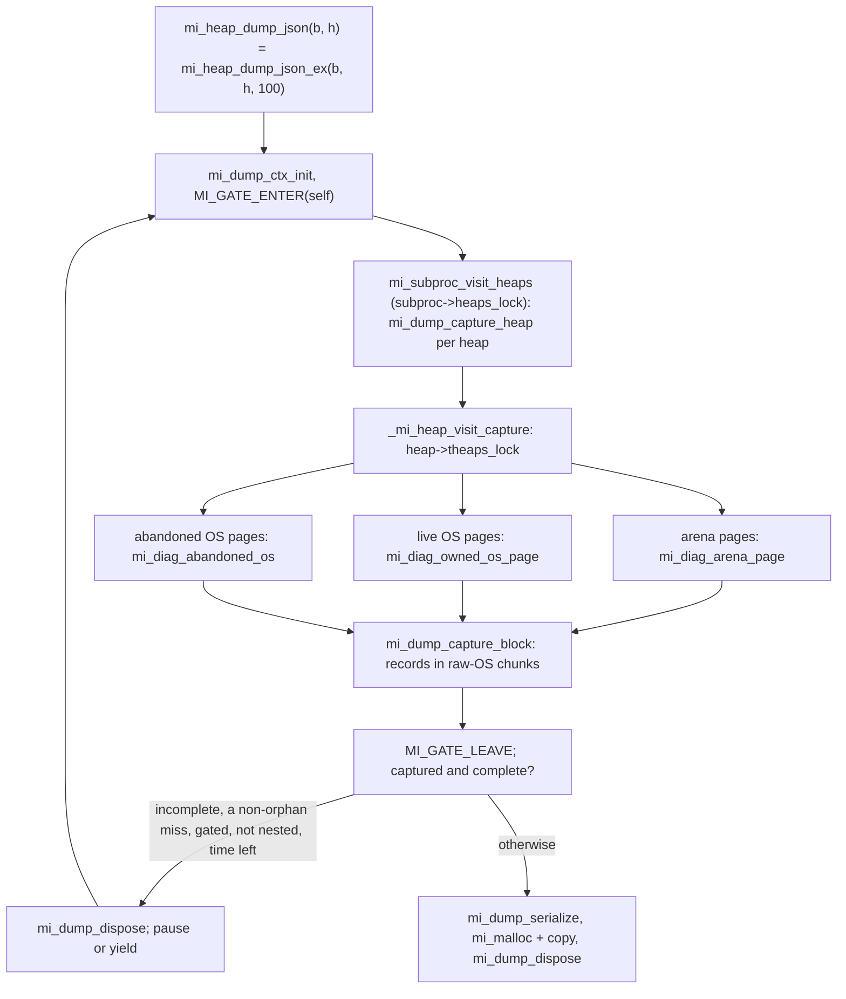

# Live heap JSON dump, the diagnostic walk, and `MI_DEBUG_FULL` lock diagnostics

*Part of the [mimalloc-pprof](../README.md) documentation.*

Three files share the word "diagnostic" but do two unrelated jobs:

- `src/heap-dump.c` serializes every live heap of the current sub-process to JSON
  (`mi_heap_dump_json`). It is production code, compiled in with `MI_DIAGNOSTICS`.
- `src/diagnostic-walk.c` is the ownership-protected page walk the dump captures through
  (`_mi_heap_visit_capture`). It exists only to serve the dump.
- `src/diagnostic.c` is the `MI_DEBUG > 2` checker behind every internal `mi_lock_t`, plus
  two TLS-growth assertions. It is never part of a release library.

The #167 methodology that `diagnostic.c` belongs to (the allocation inventory, the release
firewall, the audit loop) is in [internal-state-diagnostics.md](internal-state-diagnostics.md)
and is not repeated here.

## 1. Why these exist

**The dump (#269, Bun parity P4).** Bun ships `bun:jsc`
`heapStats({ dump: true | "blocks" }).mimallocDump`, backed by `mi_heap_dump_json`. Bun's
`heapStats-mimalloc.test.ts` (oven-sh/bun) is the shape specification, and
`test/test-heap-dump-json.c` re-asserts each of its checks in C. The accessor and the first
walk came in with #286 from oven-sh/mimalloc `942b8342` (README, "adopted" table).

**The rewrite (#374).** The imported walk read other threads' pages without owning them. The
comments and tests name what #374 replaced: an "unsafe RUNNING fallback" that read a busy
owner's pages anyway, a "fixed 64-owner cap", and a JSON buffer grown with `mi_rezalloc`,
which fired memory-event resize callbacks from inside the walk. The rewrite sets three
rules. A busy owner is **omitted, never read optimistically**. Capture and serialization use
only raw-OS scratch storage. The result says how much it saw (`complete`, `skipped_pages`,
`busy_theaps`). `mi_heap_dump_json_ex` and its `wait_ms` came with the owner-gated retry.
Since #414 the dump is opt-in, like every other observability subsystem.

**Lock diagnostics (#167).** A thread that re-acquires a non-recursive internal lock it
already holds hangs silently. Under `MI_DEBUG_FULL` every `mi_lock_t` carries an owner word,
so the hang becomes an immediate, named failure. #266 added thread ids, the lock's name and a
backtrace; #270's lock-order observer reads the same owner word.

## 2. Build and configuration surface

| knob | where | effect |
|---|---|---|
| CMake `MI_DIAGNOSTICS` (default `OFF`; `types.h` falls back to `0`) | `CMakeLists.txt`, `include/mimalloc/types.h` | `MI_DIAGNOSTICS=1`/`=0` in `mi_defines`; the same switch covers the binary snapshot ([heap-snapshot.md](heap-snapshot.md)) |
| cargo feature `diagnostics` (also in `full`) | `rust/mimalloc-pprof/Cargo.toml`, `rust/mimalloc-pprof/build.rs` | defines `MI_DIAGNOSTICS` to 1 or 0 for the vendored amalgamation |
| `MI_OWNER_GATE` (cargo `owner-gate`) | CMake option | enables the retry loop in `mi_heap_dump_json_ex` (§5.4) |
| `MI_DEBUG > 0` | debug builds | exports the test knobs `mi_debug_dump_fail_after` and `mi_debug_dump_retrying` |
| `MI_DEBUG > 2` | CMake `mi_need_diagnostic_c`: `MI_DEBUG_FULL=ON`, or `MI_DEBUG=N>2` in `MI_EXTRA_CPPDEFS`/`CMAKE_C_FLAGS` (#312) | adds `src/diagnostic.c` and `mi_lock_t`'s `debug_owner` (§8) |

The dump has no `mi_option_*`, no `MIMALLOC_*` variable, and no `#ifndef` overridable
constant. Its sizes are written inline in `src/heap-dump.c` and `src/diagnostic-walk.c`:
64 KiB per `mi_dump_chunk_t`, 8 KiB per `mi_dump_text_t`, 64 pages per
`mi_diag_os_batch_t`, 256 pause-waited retries before yield-waits, a 256-byte format buffer,
and the 100 ms default of `mi_heap_dump_json`.

**Compiled out.** With `MI_DIAGNOSTICS=0`, `src/heap-dump.c` above its `#else` disappears and
`src/arena.c` skips `diagnostic-walk.c`. The three exports become `src/profile.c`-style stubs
(both dumps return `NULL`, `mi_heap_get_seq` returns 0), and `test-heap-dump-json`,
`test-diagnostic-walks` and `test-diagnostic-walks-os` are not registered.

## 3. Public API

Declared in `include/mimalloc-stats.h`. The Rust wrappers are at the crate root of
`rust/mimalloc-pprof/src/lib.rs`.

| C | Rust | result |
|---|---|---|
| `mi_heap_dump_json_ex(bool include_blocks, bool hash_addresses, size_t wait_ms)` | `heap_dump_json_ex(..) -> Option<String>` | NUL-terminated JSON, freed with `mi_free`, or `NULL` |
| `mi_heap_dump_json(bool include_blocks, bool hash_addresses)` | `heap_dump_json(..)` | `mi_heap_dump_json_ex(.., 100)`; Rust calls the 100 `HEAP_DUMP_JSON_DEFAULT_WAIT_MS` |
| `mi_heap_get_seq(mi_heap_t* heap)` | `sys::mi_heap_get_seq` only | `heap->heap_seq`, or 0 for `NULL` |

- **Scope and threads.** From any thread, one call dumps every heap of the caller's
  sub-process; a thread that never allocated is initialized first (`_mi_thread_init`).
- **`NULL` means nothing was produced, never a partial result**: compiled out, thread init
  failed under OOM, a scratch request failed, or the final `mi_malloc` failed. A non-`NULL`
  result is always complete, well-formed JSON, although it may say `"complete": false`.
- **`wait_ms`** only matters with `MI_OWNER_GATE`. It bounds retries of incomplete attempts,
  not a capture in progress, the serialization, or the final allocation. `0` means one
  attempt. `SIZE_MAX` is valid, because the elapsed-time test never adds to it. A call made
  while the caller already holds its own gate (`tld->gate_depth != 0`) makes one attempt.
  So does an attempt whose only misses are fork orphans (§5.4), whatever `wait_ms` is.
- **`mi_heap_get_seq`** returns the per-sub-process creation number from `src/heap.c` (the
  pre-increment value of `mi_atomic_increment_relaxed(&subproc->heap_total_count)`). The main
  heap is 0, the same value that `NULL` and the stub return. Rust leaves it sys-only
  (`SYS_ONLY_WITH_REASON` in `ci/check_rust_surface.py`): it "needs a `mi_heap_t*`", v3
  removed `mi_heap_get_default`, "so Rust has no safe way to name a heap"; `heap_dump_json`'s
  `seq` fields are the wrapped route.

```c
#include <mimalloc.h>
#include <mimalloc-stats.h>
#include <stdio.h>
#include <string.h>

char* json = mi_heap_dump_json_ex(false, true, 250);
if (json == NULL) {
  fputs("heap dump unavailable (MI_DIAGNOSTICS=0, or out of memory)\n", stderr);
}
else {
  if (strstr(json, "\"complete\": false") != NULL) {
    fputs("some owners were busy: see skipped_pages / busy_theaps\n", stderr);
  }
  fputs(json, stdout);
  mi_free(json);
}
```

## 4. The JSON schema

`mi_dump_serialize` writes exactly this whitespace (one heap, `include_blocks`, illustrative
numbers; heaps are separated by `",\n"`; without blocks each heap ends `    ] }`).

```text
{ "heaps": [
  { "seq": 0,
    "pages": [
      { "id": 105553116266496, "block_size": 32, "used": 2, "reserved": 2040, "thread_id": 8246337216 },
      { "id": 105553116332032, "block_size": 128, "used": 1, "reserved": 510, "thread_id": 8246337216 }
    ],
    "blocks": [[105553116266496,32],[105553116266528,32],[105553116332032,128]] }
], "complete": true, "skipped_pages": 0, "busy_theaps": 0 }
```

| field | source | meaning |
|---|---|---|
| `heaps[]` | `subproc->heaps`, list order | one object per heap, including heaps with no pages |
| `seq` | `heap->heap_seq` | as `mi_heap_get_seq`; the main heap is 0 |
| `pages[]` | the walk of §5.3 | owned pages in walk order: arena pages (from a per-heap rotated arena index), then live OS, then abandoned OS |
| `id` | `area->blocks` = `mi_page_start(page)` | first block address, through `mi_dump_id` |
| `block_size` | `area->block_size` = `mi_page_usable_block_size` | **without** `MI_PADDING_SIZE`, so debug builds report less than the size class |
| `used` | pages only: `area->used` (`page->used`); with blocks: record count | see below |
| `reserved` | `area->reserved / area->block_size` | `page->reserved * full_block_size / usable_block_size`, which equals `page->reserved` only without padding |
| `thread_id` | `mi_page_thread_id(page)` | the owner's internal thread id (the thread pointer on most platforms), or a sentinel: `MI_THREADID_ABANDONED` (0), `MI_THREADID_ABANDONED_MAPPED` (4), `MI_THREADID_DETACHED` (8, the main heap's `theap_meta`). **Never hashed** |
| `blocks` | only with `include_blocks` | one flat array per **heap**, in page order, of `[id, size]` |
| `blocks[i][0]` | the walker's block pointer | block base in the page (not the user pointer in a guarded build), through `mi_dump_id` |
| `blocks[i][1]` | the walker's `block_size` | the usable size; always equal to its page's `block_size` |
| `complete` | `mi_dump_complete` | `skipped_pages == 0 && busy_theaps == 0` in the final attempt |
| `skipped_pages` | `mi_diag_coverage_t` | pages found but not owned (§5.3), including the pages of a fork orphan |
| `busy_theaps` | `mi_diag_coverage_t` | theaps whose owner could not be claimed for the live-OS pass, including a fork orphan's |

**`used` has two meanings.** Without blocks it is `page->used`, read under ownership but
*before* the walker collects pending cross-thread frees, so those blocks still count. With
blocks, `_mi_theap_area_visit_blocks` first runs `_mi_page_free_collect_no_unpurge`, and
`mi_dump_capture_block` counts the records it keeps, so the modes can disagree for one page.
In block mode `used` equals the page's `blocks` entries, in page order, so running sums map
each block to its page even with hashed ids.

**Hashing.** `mi_dump_id` XORs the address with a key, then applies an integer finalizer
(64-bit or 32-bit, by `MI_INTPTR_SIZE`). The key is `_mi_os_random_weak((uintptr_t)&ctx) | 1`,
computed once per call. Retries share it and separate calls do not, so hashed ids cannot be
compared across dumps. The key is weak randomness (address and clock): hashing hides
addresses but is not cryptographic protection. `thread_id` is written raw.

## 5. Architecture

### 5.1 Flow of one call



### 5.2 Scratch storage

`mi_dump_ctx_t` lives on the caller's stack. Everything it points to comes from
`mi_dump_alloc`, which bump-allocates pointer-aligned, zeroed memory from a list of
`mi_dump_chunk_t`s. Each chunk is 64 KiB plus a header, taken with `_mi_os_alloc(subproc, ..)`,
a direct OS primitive rather than an arena. A request that does not fit starts a new chunk.
`mi_dump_dispose` returns every chunk with `_mi_os_free`.

That allocator holds the capture records (tail-appended lists `mi_dump_heap_t` →
`mi_dump_page_t` → `mi_dump_block_t`), the walk's `mi_diag_os_batch_t`s (requested through
the `mi_diag_alloc_fun` callback), and the serializer's 8 KiB `mi_dump_text_t` chunks.
Failure is sticky: once a request fails (or `text_size` would overflow), every later
`mi_dump_alloc` and `mi_dump_print` fails too, the visitor returns `false`, and the call
returns `NULL`.

The only hooked allocation is the final `mi_malloc(ctx.text_size + 1)`, made from the
caller's default heap after every claim and lock is released. The profiler and memory events
see one ordinary allocation, never a resize (`test_dump_growth`).
`ci/internal-state-inventory.json` classifies both sites (`heap-dump-capture-scratch`,
`heap-dump-json-buffer`); see the
[allocation inventory](internal-state-diagnostics.md#allocation-inventory).

### 5.3 The capture walk (`src/diagnostic-walk.c`)

**Why it is compiled inside `arena.c`.** `src/arena.c` includes the file under
`#if MI_DIAGNOSTICS`, directly after the upstream visitor. The walk needs that translation
unit's private pieces: the `static` `mi_heap_arena_pages` and `mi_abandoned_page_unown`, and
the `mi_forall_arenas` / `mi_forall_arenas_end` macros. One guarded include keeps the
upstream diff small (rule 6). The Rust build gets the walk through `src/static.c` →
`arena.c`, which is inlined into `rust/mimalloc-pprof/vendor/mimalloc-pprof-amalgamated.c`.

As a side effect it compiles with `arena.c`'s upstream flags, not the `MI_STRICT_WARNINGS`
set of `src/heap-dump.c`. Its only external symbol, `_mi_heap_visit_capture`, is declared in
`src/diagnostic-walk.h` ("Not a general user-callback API"). `mi_diag_walk_t` holds the heap,
the `blocks` flag, visitor and argument, coverage pointer, current `arena_pages`, and the
allocate callback.

`_mi_heap_visit_capture` holds `heap->theaps_lock` throughout, which keeps its theaps' tlds
alive, and makes three passes:

| pass | pages | how exclusive access is proven | counted as missed |
|---|---|---|---|
| arena: `_mi_bitmap_forall_set` over `arena_pages->pages`, calling `mi_diag_arena_page` | every arena page of the heap | **pin** (`mi_bitmap_clear` of the page's bit). Abandoned (`tid <= MI_THREADID_ABANDONED_MAPPED`): `mi_page_claim_ownership`. Owned: find the tld on `heap->theaps`, `mi_diag_try_tld`, then re-read `mi_page_thread_id`, which must be unchanged | bit already clear, owner unclaimable or a fork orphan, abandoned page already owned, no tld, or owner changed → `skipped_pages` |
| live OS: `_mi_theap_visit_pages(theap, &mi_diag_owned_os_page, true, ..)` per theap | queue pages whose `memid.memkind` is not `MI_MEM_ARENA`; no bitmap or abandoned list holds them | `mi_diag_try_tld` on the theap's tld, held for the whole queue walk | claim fails, or a fork orphan → `busy_theaps` |
| abandoned OS: `mi_diag_abandoned_os` | `heap->os_abandoned_pages` | `mi_page_claim_ownership` under `os_abandoned_pages_lock`. Owned pages are stashed in batches, then visited and unowned after the lock is released | claim fails → `skipped_pages` (`mi_diag_claim_failed`) |

**The claim.** `mi_diag_try_tld` never waits. For the detached tld (`MI_THREADID_DETACHED`,
which backs `theap_meta`) it is `mi_lock_try_acquire(&subproc->theap_meta_lock)`. A tld with
`MI_GATE_FLAG_ORPHAN` in `gate_flags` fails without a CAS and adds one to
`mi_diag_coverage_t::orphaned` (see §7, forked child), the same test `mi_purge_walk_claim`
makes before it counts an orphan. That test comes before the thread-id match, because a
thread started in the child can reuse a dead thread's TLS block and so its id. The caller's
own tld then always succeeds, since the caller is the owner (and in a gated build holds its
gate). For any other tld it CASes
`park_state` from `MI_PARK_PARKED` to `MI_PARK_SWEEPING` (acq_rel) and then release-stores
the caller's id into `tld->sweeper`. `mi_diag_release_tld` release-stores `sweeper = 0`,
then `park_state = MI_PARK_PARKED`.

**Visiting a page.** `mi_diag_visit_page` fills a `mi_heap_area_t` (`_mi_heap_area_init`),
calls the visitor with `block == NULL` for the page record, and, for block dumps, calls
`_mi_theap_area_visit_blocks`. That walker folds pending frees through
`_mi_page_free_collect_no_unpurge` only when the page is abandoned (so owned by us) or when
`_mi_gate_held_theap` accepts the caller. A `sweeper` equal to the caller's id is exactly what
that predicate accepts, which is why the claim makes block lists exact. The walker also
reports purged hole blocks as free, so a dump never names discarded memory
([page-holes.md](page-holes.md)).

### 5.4 Retry in owner-gated builds

Each attempt runs `mi_dump_ctx_init`, `MI_GATE_ENTER(self)`, `mi_subproc_visit_heaps`, and
`MI_GATE_LEAVE`. The loop stops if the capture failed (the call then returns `NULL` without
serializing), is complete, or missed only fork orphans: `mi_dump_retry_can_help` is false
when `skipped_pages + busy_theaps` equals `coverage.orphaned`, since no retry can claim an
orphan. **With `MI_OWNER_GATE`** it also stops when the call is nested
(`can_retry` is false) or when `elapsed >= wait_ms`. Otherwise it calls `mi_dump_dispose`, increments
`mi_debug_dump_retrying` (debug builds), and waits once: a single `mi_atomic_pause` on each of
the call's first 256 retries, one `_mi_prim_thread_yield` on every later retry. Then it
recaptures. **Without the gate** it always stops after one attempt: "an ungated RUNNING owner
will not become claimable by waiting". In a gated build every thread outside the allocator is
PARKED, so a busy owner becomes claimable once its current call returns. In the default build
a thread is PARKED only between a successful `mi_on_thread_idle_start` and the matching
`mi_on_thread_idle_end` ([scavenger-and-idle-handoff.md](scavenger-and-idle-handoff.md)).

Nothing is held during the wait (no gate, lock, pin, claim or scratch), because "retaining any
while a RUNNING owner finishes can deadlock with heap creation, deletion, or page retirement":
the owner may need `heap->theaps_lock` to create a theap, or be retiring a pinned page
(`mi_bitmap_clear_once_set` waits for the pin bit). The purge-side view is in
[purge-all-implementation.md](purge-all-implementation.md#diagnostic-audit-374).

### 5.5 Contrast with `mi_heap_visit_blocks`

#374 left the upstream visitor's contract unchanged:

| | `mi_heap_visit_blocks` (`_mi_heap_visit_blocks`, `claim_pages = false`) | `_mi_heap_visit_capture` |
|---|---|---|
| visitor | any user callback | copies metadata to raw-OS storage; no user code, allocator reentry, or payload reads |
| precondition | nobody else frees into the heap (the #78 note in `include/mimalloc.h`) | other threads keep running |
| foreign pages | read without ownership | read only after pin + owner claim; otherwise omitted and counted |
| abandoned OS list | walked after the list lock is dropped | claimed under the lock, visited after |
| gate | `mi_heap_visit_blocks_gated`: the caller's own gate | the caller's gate, taken by `mi_heap_dump_json_ex` |
| result | `false` only if the visitor stopped | `false` on scratch exhaustion, plus `mi_diag_coverage_t` |

## 6. Invariants and concurrency

| # | acquired | by | kind |
|---|---|---|---|
| 1 | the caller's own gate | `MI_GATE_ENTER(self)` | owner acquire; a no-op without `MI_OWNER_GATE` |
| 2 | `subproc->heaps_lock` | `mi_subproc_visit_heaps` | blocking |
| 3 | `heap->theaps_lock` | `_mi_heap_visit_capture` | blocking, one heap at a time |
| 4 | a page pin | `mi_bitmap_clear` | try |
| 5 | a tld claim, page ownership, or `theap_meta_lock` | `mi_diag_try_tld`, `mi_page_claim_ownership` | try (CAS, atomic OR, try-acquire) |
| 4′ | `heap->os_abandoned_pages_lock` | `mi_diag_abandoned_os` | blocking, only while claiming |

1. **Never wait for another thread while holding a pin or a tld claim.** Pins, tld claims
   and page ownership are only ever tried, since the owner or an in-flight sweeper may be
   retiring that page and waiting for the pin bit. Two later steps do block: taking
   `os_abandoned_pages_lock` (4′, no pin or tld claim held), and the unown/free path, which may
   take that lock or wait on a bitmap bit (`_mi_arenas_page_unabandon`,
   `mi_bitmap_clear_once_set`) while other abandoned pages are still owned. That is
   deadlock-free: nobody waits for an abandoned page's ownership while holding those locks.
2. **At most one tld claim at a time**: one page (arena pass) or one theap's queues (OS
   pass), following `src/fork.c`'s "self RUNNING -> other SWEEPING", never two on one stack.
   The exception is page ownership in the abandoned-OS pass, which holds every page it
   claimed (in 64-page batches) until the post-lock loop unowns each one.
3. **Pin before locating; own before trusting.** A pin is "NOT a registered page map or
   stable owner-private fields". Only the atomic `mi_page_thread_id` is read before
   ownership, and it is re-read after the tld claim.
4. **Restore the pin before unowning.** `mi_bitmap_set` runs before `mi_abandoned_page_unown`,
   because unowning may free the page, and freeing waits on the pin.
5. **Unown abandoned OS pages after dropping `os_abandoned_pages_lock`.** Unowning can unlink
   the page from that same list.
6. **No hooked allocation and no user code while any lock or claim is held.** Either could
   need a held lock, retire a pinned page, or run a memory-event callback under the walk's
   locks. This is the reasoning of CLAUDE.md rule 4, applied to the dump.
7. **Production symbols stay out of the debug namespace.** `_mi_heap_visit_capture` is not a
   `_mi_diagnostic_*` name, because `ci/check_release_equivalence.py` rejects those tokens and
   `ci/verify_local.py`'s `diag` config rejects `_mi_.*diagnostic` in `MI_DEBUG=0` libraries.

**Memory orders.** The `park_state` claim is `mi_atomic_cas_strong_acq_rel`. `sweeper` and the
return to PARKED are release stores. Page ownership is `mi_atomic_or_acq_rel` on bit 0 of
`xthread_free`. The test knobs are relaxed. The dump adds no code to the allocation fast
path (it has no hook sites). `ci/check_fastpath_identity.py` does not cover it, because none
of its builds enables `MI_DIAGNOSTICS`.

## 7. Edge cases and accepted limits

- **`complete: true` describes coverage, not one instant.** Pages are captured one at a time.
- **Ungated, multi-threaded.** Pages owned by running threads are omitted, and sleeping does
  not help. The owner must park cooperatively through `mi_on_thread_idle_start`, which
  declines without a live scavenger (`test_dump_coverage` fakes the park).
- **`skipped_pages` is conservative.** A page freed between the bitmap scan and the pin, or
  whose owner has no theap on this heap's list, still counts as skipped.
- **Unbounded wait.** `SIZE_MAX` in a gated build retries until every owner is claimable, so
  a thread that stays inside the allocator keeps it waiting. A fork orphan does not.
- **Forked child.** `src/fork.c` resets every tld to `MI_PARK_RUNNING` and marks all but the
  forking thread's `MI_GATE_FLAG_ORPHAN`. Those threads do not exist in the child, so no
  orphan ever parks. The walk never claims an orphan and never waits for one, as
  `mi_purge_all_ex` counts orphans and returns: an orphan's pages count in `skipped_pages`,
  its theaps in `busy_theaps`, the result says `"complete": false`, and an attempt that missed
  only orphans is the last one, even with `SIZE_MAX`. The same holds for an abandoned page of
  a heap that existed at the fork (`heap->prefork_theaps`) whose ownership claim fails: a
  thread caught mid cross-thread free by `fork()` can leave it owned for good.
  `mi_heap_visit_page_claim` seizes such a page, but the capture never takes a page it
  cannot claim, so `mi_diag_claim_failed` counts the miss as orphaned too. The cost: in a
  forked child, a live thread that owns such a page only briefly is not waited for either. The JSON has no separate orphan count
  (`mi_purge_all_report_t` has `theaps_orphaned`). Before the fix `mi_diag_try_tld` did not
  read `gate_flags`, so a gated child never returned from `mi_heap_dump_json_ex(.., SIZE_MAX)`
  and every default call spent its whole 100 ms.
- **Scope.** Only the current sub-process; every sub-process's first heap is `seq` 0.
- **Guarded builds.** Block ids are block bases, and `MIMALLOC_GUARDED_SAMPLE_RATE=1` gives
  each allocation its own page. The tests therefore sum `used` per heap.
- **Platforms.** No platform code. `test-diagnostic-walks` uses native Windows threads (MSVC
  and win-gnu run it), needs `MI_BUILD_STATIC` for internal page state, is skipped under
  `MI_DEBUG_TSAN`, and compiles as C++ under `MI_USE_CXX`.

## 8. `MI_DEBUG_FULL` lock diagnostics (`src/diagnostic.c`)

The file body is inside `#if MI_DEBUG > 2`, and `src/static.c` includes it under the same
guard. CMake lists it when `mi_need_diagnostic_c` is set, which also catches `MI_DEBUG=3`
passed without the option; a miss leaves atomic.h's hook calls undefined at link time (#312).
At that level `MI_LOCK_DEBUG_FIELD` adds `_Atomic(uintptr_t) debug_owner` to `mi_lock_t`
(`include/mimalloc/atomic.h`) and every lock wrapper calls a hook. A release build contains
none of this ([release firewall](internal-state-diagnostics.md#release-performance-firewall)).

| hook (caller) | check | failure reason |
|---|---|---|
| `_mi_lock_debug_before_acquire` (`mi_lock_acquire`, `mi_lock_try_acquire`) | owner ≠ current thread | `reentrant_internal_lock_acquisition` |
| `_mi_lock_debug_after_acquire` | owner = 0; then records the current thread and, with `MI_FORK_LOCK_ORDER_CHECK`, calls `_mi_fork_lock_order_observe` | `internal_lock_owner_not_cleared` |
| `_mi_lock_debug_before_release` (`mi_lock_release`) | owner = current thread; then clears it | `internal_lock_release_by_non_owner` |
| `_mi_lock_debug_init` (`mi_lock_init`) | clears the owner | — |
| `_mi_lock_debug_done` (`mi_lock_done`) | owner = 0 | `destroying_owned_internal_lock` |
| `_mi_diagnostic_check_tls_owner` (`src/threadlocal.c`) | the grown TLS array's page belongs to a main heap | `internal_tls_storage_not_main_owned` |
| `_mi_diagnostic_check_zero` (`src/threadlocal.c`) | every new slot byte is zero | the caller's reason (`internal_tls_new_slots_not_zero`) |

**Owner values.** The owner is `mi_lock_debug_thread()`, i.e. `_mi_thread_id() | 1`, so 0
still means "unowned" even where the primitive can return 0. Relaxed accesses suffice: the
reentrancy test compares against the thread's own earlier store, and the post-acquire test
runs under the platform lock, whose acquire publishes the previous holder's clearing store.
Try-acquire runs the reentrancy check too, so a same-thread try-acquire of a held lock fails.

**The failure path.** `mi_lock_debug_fail` must never allocate, because these checks run
during bootstrap, teardown, and failure paths, where a hooked allocator would recurse. It
builds the message in a 512-byte stack buffer with `mi_diag_append` / `mi_diag_append_uint`
and writes it with `_mi_prim_out_stderr`:

```text
mimalloc: <reason> lock=<address> current_tid=<id> owner_tid=<id> at <file>:<line> (<func>)
mimalloc: lock identified as subproc->heaps_lock
<backtrace_symbols_fd frames>
```

- **The location names the wrapper, not the caller.** The lock hooks get `__FILE__`,
  `__LINE__` and `__func__` inside the `static inline` wrappers of `include/mimalloc/atomic.h`,
  so it always reads like `mi_lock_acquire`. Hence #266's lock name and backtrace.
- **Only three locks are named:** `_mi_subproc_main()`'s `theap_meta_lock`, `heaps_lock` and
  `arena_reserve_lock` (`mi_thread_locals_lock` is `static` to `threadlocal.c`).
- **Backtraces** need `MI_DIAG_HAVE_BACKTRACE` (`__APPLE__` or `__GLIBC__`) and use the
  non-allocating `backtrace_symbols_fd`. Windows, win-gnu and musl print only the text.
- **Ids.** Identical nonzero ids mean real reentrancy. `owner_tid` 0 while the check fires, or
  one degenerate value on unrelated threads, points at the thread-id primitive.
- **`_exit(134)`** avoids teardown from a corrupted state and a core dump in timed tests.

The `MI_TEST_TLS_CONTROL` controls (`_mi_test_tls_control_set`, `_mi_test_tls_control_mode`,
`_mi_test_tls_control_fail_growth`) also live here, compiled only into
`mimalloc-test-tls-controls` ([described here](internal-state-diagnostics.md#focused-dynamic-checks)).

## 9. Testing

| CTest name | file | registered when | asserts |
|---|---|---|---|
| `test-heap-dump-json` | `test/test-heap-dump-json.c` | `MI_DIAGNOSTICS` | Bun's shape: distinct, stable `seq`, 0 for main and for `NULL`; no `"blocks"` when pages-only; balanced braces; `used` sums (64, 1); `block_size` ≥ the request; `reserved` ≥ 1; block sizes match page sizes; hashing hides a raw id; 20 dumps racing frees stay non-`NULL` |
| `test-diagnostic-walks` | `test/test-diagnostic-walks.c` | `MI_DIAGNOSTICS`, `MI_BUILD_STATIC`, not `MI_DEBUG_TSAN`; `MIMALLOC_SCAVENGER=0`; `RUN_SERIAL` | the scenarios below |
| `test-diagnostic-walks-os` | same binary | same, plus `MIMALLOC_DISALLOW_ARENA_ALLOC=1` | the same scenarios with every page OS-allocated: the live-OS pass and multi-batch abandoned-OS claims |
| `test-lock-reentrancy`, `test-lock-uncleared-owner`, `test-lock-nonowner-release`, `test-lock-destroy-owned` | `test/test-lock-reentrancy.c` via `test/run-negative.cmake` | `mi_need_diagnostic_c` | each mode dies with its exact reason within 15 s |
| `test-tls-control-owner`, `test-tls-control-zero`, `test-tls-control-failure` | `test/test-tls-controls.c` | `MI_DEBUG_FULL` | see [internal-state-diagnostics.md](internal-state-diagnostics.md) |

| scenario in `test/test-diagnostic-walks.c` | proves |
|---|---|
| `test_report_gate` (gated, debug) | a holes reporter held at `mi_debug_stall_in_holes_report` is RUNNING, so `mi_purge_all_ex` reports it pending; after it leaves, the purge reaches it |
| `test_dump_waits_from_clean_boundary` (gated, debug) | a nested call is one-shot (`"complete": false`); `SIZE_MAX` retries to completion, and the owner attaches to a new heap mid-wait, proving `theaps_lock` was dropped |
| `test_dump_fork_orphan` (gated, POSIX) | fork while a second thread holds live blocks; in the child, `SIZE_MAX` returns within a 20 s `alarm` with `"complete": false`, `busy_theaps` ≥ 1 and (with arenas) `skipped_pages` ≥ 1, and with `MI_DEBUG > 0` after zero retries |
| `test_dump_fork_owned_page` (gated, POSIX) | fork while a second thread holds the ownership bit of an abandoned page of a pre-fork heap; in the child, `SIZE_MAX` returns within the `alarm` with `"complete": false` |
| `test_dump_coverage` | RUNNING owner → incomplete; synthetic PARKED → complete, exactly 32 blocks |
| `test_dump_growth` | more than 500,000 bytes of JSON; with `MI_MEMEVT`, zero `MI_MEMORY_RESIZE` callbacks |
| `test_dump_abandoned` | 70 abandoned single-block pages captured; `mi_debug_dump_fail_after` = 1..12 or `UINTPTR_MAX` returns `NULL` and leaks no claim |
| `test_many_owners` | 70 parked owners captured: no fixed cap |
| `test_retirement_churn` | 100 one-shot dumps against page-retiring churn |

**Where each part runs.** `test_report_gate` and `test_dump_waits_from_clean_boundary` need
`MI_OWNER_GATE && MI_DEBUG > 0`. In CI only the owner-gate row of `.github/workflows/asan.yml`
(Debug, `MI_DEBUG_FULL`) builds that; every other gated row is Release. The two fork scenarios
run in every gated POSIX build (the Windows gated bundles have no `fork`), and the orphan
scenario's zero-retry assertion only with `MI_DEBUG > 0`. The fault-injection loop needs `MI_DEBUG > 0`.

**Rust.** Two `lib.rs` unit tests (`heap_dump_json_reports_well_formed_json_with_current_heap`,
`heap_dump_and_snapshot_are_inert_when_compiled_out`) and `rust/mimalloc-pprof/tests/feature_contract.rs` pin both shapes.

**Running them locally:**

```text
uv run ci/dev_linux.py c-test     # MI_DIAGNOSTICS=ON, Release: the MI_DEBUG parts are out
cmake -B build-gated-debug -DCMAKE_BUILD_TYPE=Debug -DMI_DEBUG_FULL=ON \
      -DMI_OWNER_GATE=ON -DMI_DIAGNOSTICS=ON
cmake --build build-gated-debug
ctest --test-dir build-gated-debug -R "heap-dump|diagnostic-walks|test-lock-" --output-on-failure
cd rust && cargo test -p mimalloc-pprof --features diagnostics
```

**CI gates** ([ci-gates.md](ci-gates.md)). `-DMI_DIAGNOSTICS=ON` is passed by: the `release`
and `gated` rows of `.github/workflows/c-unit.yml`, the native `cl` trees, the Windows
release/debug-full/gated bundles, the macOS release/debug-full bundles, and three of the four
ASan rows (clang RelWithDebInfo keeps the compiled-out shape). Only the `release` row's
`assert_defines: MI_DIAGNOSTICS=1` catches a lost flag; the `gated` row asserts only
`MI_OWNER_GATE=1`. `ci/bundle_coverage.py` compares a configuration's own test list with what
ran, so it cannot see tests that were never registered. `ci/check_rust_surface.py` and
`ci/check_internal_state.py` guard the Rust surface and the inventory, and
`cargo run -p xtask -- check` rejects a stale amalgamation.

## 10. Where to look

| file | function / type | role |
|---|---|---|
| `src/heap-dump.c` | `mi_heap_dump_json_ex`, `mi_dump_retry_can_help` | retry loop and its orphan stop, gate, serialization, final `mi_malloc` |
| `src/heap-dump.c` | `mi_dump_alloc`, `mi_dump_dispose` | raw-OS bump scratch; sticky failure; fault injection |
| `src/heap-dump.c` | `mi_dump_capture_heap`, `mi_dump_capture_block` | heap, page and block records; both meanings of `used` |
| `src/heap-dump.c` | `mi_dump_serialize`, `mi_dump_print`, `mi_dump_id` | JSON text chunks; address hashing |
| `src/diagnostic-walk.h` | `_mi_heap_visit_capture`, `mi_diag_coverage_t` | internal entry point and coverage counters |
| `src/diagnostic-walk.c` | `mi_diag_arena_page` | pin, claim, re-check, visit, restore the pin, unown |
| `src/diagnostic-walk.c` | `mi_diag_try_tld`, `mi_diag_release_tld` | non-blocking SWEEPING or `theap_meta_lock` claim; refuses fork orphans |
| `src/diagnostic-walk.c` | `mi_diag_claim_failed` | a failed abandoned-page claim; orphaned in a forked child's pre-fork heap |
| `src/diagnostic-walk.c` | `mi_diag_abandoned_os`, `mi_diag_owned_os_page` | OS-page passes; batches claimed under the list lock |
| `src/arena.c` | `mi_heap_visit_blocks`, `_mi_heap_visit_blocks` | upstream visitor and contract; hosts the include |
| `src/theap.c` | `_mi_heap_area_init`, `_mi_theap_area_visit_blocks` | area fields; block walk with collect and purged-block marking |
| `include/mimalloc-stats.h` | `mi_heap_dump_json`, `mi_heap_get_seq` | declarations and contract comment |
| `rust/mimalloc-pprof/src/lib.rs` | `heap_dump_json`, `heap_dump_json_ex` | safe wrappers that `mi_free` the C string |
| `src/diagnostic.c` | `mi_lock_debug_fail`, `_mi_lock_debug_before_acquire` | allocation-free report; reentrancy check |
| `include/mimalloc/atomic.h` | `MI_LOCK_DEBUG_FIELD`, `mi_lock_acquire` | owner word and hook call sites |
