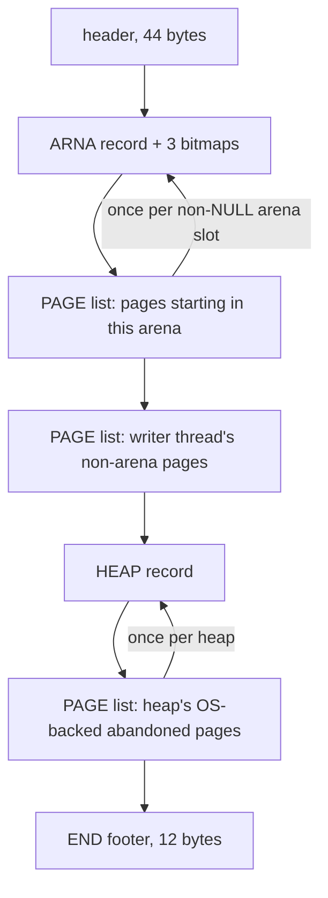

# Heap snapshots (binary arena/page map) and mi-heapview

*Part of the [mimalloc-pprof](../README.md) documentation.*

`mi_heap_snapshot` writes a compact, fixed-width binary description of every arena and
every page to a file descriptor. With a flag it also writes a free map for each page the
calling thread owns, recording which blocks are free. The point is to answer "why is this
process using so much memory?" offline, after the process has moved on or exited. Three
things read the file: the standalone C viewer `tools/mi-heapview.c`, the Python reference
reader `examples/heap-snapshot/mi_snapshot.py`, and an independent reader inside
`test/test-snapshot-exit.c`. This page covers the writer (`src/heap-snapshot.c`), format
version 1 field by field, the viewers, and the tests that keep all of them in agreement.

The live-heap JSON dump (`mi_heap_dump_json`) is behind the same build switch. It is a
separate subsystem with its own ownership protocol, covered in
[heap-dump-and-diagnostics.md](heap-dump-and-diagnostics.md).

## 1. Purpose and provenance

A snapshot shows where the committed memory is (by block size, thread and heap), which
pages waste the most, and the three slice bitmaps of every arena (committed, free,
purge-scheduled). Waste is `committed - used * block_size`: memory the OS backs for a page
that no live block covers. With free maps it also gives a page's live block addresses as
of the writer's collect (`mi-heapview blocks`), which `mi-heapview peek` uses to read block contents out of
a core file. The snapshot is point-in-time and best-effort. It does not stop other threads
(section 7).

`src/heap-snapshot.c` and `tools/mi-heapview.c` were imported verbatim from
oven-sh/mimalloc @ `b20b60d9` (MIT) in issue #338, for Bun parity. Bun itself never calls
the API. The gap analysis rates it a nice-to-have debug tool, not a shipped feature
([bun-gap-analysis-2026-09-01.md](bun-gap-analysis-2026-09-01.md), row B16). Issue #414
then made it opt-in, like every other observability subsystem (CLAUDE.md rule 6).

## 2. Build and configuration surface

| Surface | Name | Default | Effect |
|---|---|---|---|
| CMake option | `MI_DIAGNOSTICS` | `OFF` | `ON` appends `MI_DIAGNOSTICS=1` to `mi_defines`, `OFF` appends `MI_DIAGNOSTICS=0`. The same switch controls the JSON dump. |
| C define | `MI_DIAGNOSTICS` | `0` (`include/mimalloc/types.h`, `#ifndef`-guarded) | A direct `src/static.c` compile has to define it to get the writer. |
| cargo feature | `diagnostics` | off (`default = []`). Part of `full`. | `rust/mimalloc-pprof/build.rs` maps `CARGO_FEATURE_DIAGNOSTICS` to `MI_DIAGNOSTICS`. |
| API flag | `MI_SNAPSHOT_BLOCKS` (`0x01`) | — | Adds free maps for pages owned by the calling thread. |
| runtime option | `mi_option_snapshot_on_exit` / `MIMALLOC_SNAPSHOT_ON_EXIT` | `0` | `1` writes pages only at process exit. `2` or more also writes free maps. |
| environment | `MIMALLOC_SNAPSHOT_PATH` | unset | Output path for the exit snapshot. Falls back to `mimalloc-snapshot.<pid>.bin` in the working directory. |

`mi_option_snapshot_on_exit` is declared in `src/options.c` as `MI_OPTION(snapshot_on_exit)`
with `MI_OPTION_UNINIT`, so it is read from the environment the first time it is used. Its
enumerator value is 60 (`rust/mimalloc-pprof/src/sys.rs`), while Bun's is slot 47: option
slots from 47 on diverged long ago. Bun parity covers the environment variable name and the
file format, not the enum value, so always refer to the option by name.

The writer's constants are plain `#define`s: `MI_SNAPSHOT_MAGIC`, `MI_SNAPSHOT_VERSION`,
the section tags, and the 16 KiB output buffer `MI_SNAP_BUFSIZE`. Magic, version and tags
are the format itself. `MI_SNAP_BUFSIZE`, the 512-byte free-map window and the 512-byte
exit-path buffer are literals from the verbatim import. They are not `#ifndef` tuning knobs
of the kind rule 11 asks new code to use. The lower-case platform macros (`mi_snap_write`,
`mi_snap_open`, `mi_snap_close`, `mi_snap_getpid`) are grandfathered in
`ci/macro_case_baseline.txt` (rule 10).

**Compiled out.** With `MI_DIAGNOSTICS=0` the whole writer is replaced by the `#else` block
at the end of `src/heap-snapshot.c`, which follows the stub template of `src/profile.c`.
`mi_heap_snapshot` and `mi_heap_snapshot_to_file` return `-1` without touching their
arguments, and `_mi_heap_snapshot_on_exit` is empty. `mi_option_snapshot_on_exit` still
exists and can be set, but nothing reads it. So no downstream code needs an `#ifdef`
([c-integration.md](c-integration.md)). The viewer is built either way (section 9).

## 3. Public API

The C declarations are in `include/mimalloc.h`.

| Entry point | Contract |
|---|---|
| `int mi_heap_snapshot(int fd, unsigned flags)` | Writes the whole snapshot to `fd`, starting at the descriptor's current position, and does not close it. Returns `0` on success. Returns `-1` if `fd < 0`, or if any `write` returned `<= 0`, in which case a partial file is left behind. Only the `MI_SNAPSHOT_BLOCKS` bit of `flags` means anything, but the raw value is stored in the header. |
| `int mi_heap_snapshot_to_file(const char* path, unsigned flags)` | Returns `-1` if `path` is NULL or the open fails. Otherwise creates or truncates the file with mode `0644` (`O_WRONLY\|O_CREAT\|O_TRUNC`, plus `_O_BINARY` on Windows), calls `mi_heap_snapshot`, closes the file and returns its result. |

Both functions walk the main sub-process's arenas and heaps while other threads keep
running. Call them from any thread that does not already hold `sp->heaps_lock` or a heap's
`os_abandoned_pages_lock` (section 7). In an ungated build, do not call them between
`mi_on_thread_idle_start` and `mi_on_thread_idle_end`. A caller with no initialised theap
is not protected against a concurrent `MI_PURGE_RECLAIM` (section 8). Without
`MI_SNAPSHOT_BLOCKS` they change no allocator state; with it they collect the free lists
of the calling thread's own pages.

```c
#include <mimalloc.h>

// 0 = written; -1 = open/write error, or a build without MI_DIAGNOSTICS
int rc = mi_heap_snapshot_to_file("snap.bin", MI_SNAPSHOT_BLOCKS);
mi_option_set(mi_option_snapshot_on_exit, 2);   // and write another one at process exit
(void)rc;
```

**At exit.** `_mi_heap_snapshot_on_exit` (declared in `include/mimalloc/internal.h`) runs
from `mi_process_done_once` in `src/init.c`. It runs after `_mi_scavenger_stop()` and
before everything else, including the `_mi_process_is_initialized` check. It returns if
`mi_option_snapshot_on_exit` is `<= 0`. Otherwise it resolves the path into a 512-byte
stack buffer with `_mi_getenv("MIMALLOC_SNAPSHOT_PATH", ...)`, falling back to
`mimalloc-snapshot.<pid>.bin` when that returns non-zero, and calls
`mi_heap_snapshot_to_file`. Success is reported through `_mi_verbose_message` (visible with
`MIMALLOC_VERBOSE`), failure through `_mi_warning_message`.

**Rust** (`rust/mimalloc-pprof/src`):

| Item | Notes |
|---|---|
| `mimalloc_pprof::heap_snapshot_to_file(path, blocks) -> std::io::Result<()>` | Builds a `CString` from `as_encoded_bytes()`. An interior NUL gives `InvalidInput`, a non-zero return gives `io::Error::other`. Always returns `Err` without the `diagnostics` feature. |
| `sys::mi_heap_snapshot(fd, flags)` | sys-only. `fd` is a CRT descriptor, not a `HANDLE`. |
| `sys::mi_heap_snapshot_to_file(path, flags)`, `sys::MI_SNAPSHOT_BLOCKS` | Raw bindings. |
| `options::Opt::SNAPSHOT_ON_EXIT` with `options::set` | The exit option. |

The C writer allocates nothing, but the Rust wrapper allocates a `CString`, plus a
`String` on error. It is not itself safe to call from inside a `GlobalAlloc`
implementation.

## 4. Format version 1

`examples/heap-snapshot/mi_snapshot.py` is the executable spec. The tables below follow
that file and the writer's emit functions.

**Conventions.**

- A packed byte stream with no alignment padding: readers `memcpy` or `struct.unpack`.
- Every field is written by `mi_snap_u8`/`mi_snap_u32`/`mi_snap_u64`, a `memcpy` of a
  native integer, so the bytes are in **host order**. The writer's comment supports only
  same-endianness reading. Every CI target (x86_64, aarch64) is little-endian, and
  `mi_snapshot.py` always decodes little-endian.
- Addresses are `u64` whatever the `ptr_size`. Signed values (`numa_node`, `arena_idx`)
  are two's-complement `u32`, so `0xFFFFFFFF` means `-1`.
- A page list is a `u32 'PAGE'` tag, page records, then a `u64 0` where the next record's
  `page_start` would be. Readers peek one `u64` at a time.



**Header** (44 bytes):

| Off | Type | Field | Written from |
|---|---|---|---|
| 0 | u32 | magic | `MI_SNAPSHOT_MAGIC` = `0x5348494D` (the bytes `MIHS`) |
| 4 | u32 | version | `MI_SNAPSHOT_VERSION` = 1 |
| 8 | u32 | ptr_size | `MI_INTPTR_SIZE` |
| 12 | u32 | slice_size | `MI_ARENA_SLICE_SIZE`: 64 KiB on 64-bit, 32 KiB on 32-bit, 128 KiB under `MI_SECURE>=5` on Apple arm64 or 16 KiB-page systems |
| 16 | u32 | flags | the caller's `flags`, unmasked |
| 20 | u32 | reserved | 0 |
| 24 | u64 | clock_ms | `_mi_clock_now()`: a monotonic clock (`CLOCK_MONOTONIC` / `QueryPerformanceCounter`), not wall time |
| 32 | u64 | writer_tid | `_mi_prim_thread_id()`: the thread pointer, not an OS thread id |
| 40 | u32 | arena_count | sum of `mi_arenas_get_count(sp)` over the sub-processes walked |

**Arena record** (40 bytes, then 3 bitmaps, then its page list):

| Off | Type | Field | Source |
|---|---|---|---|
| 0 | u32 | tag | `MI_SNAP_SEC_ARENA` = `0x414E5241` (`ARNA`) |
| 4 | u32 | idx | slot index in its sub-process's `arenas[]` (not globally unique) |
| 8 | u64 | base | the `mi_arena_t*` itself, i.e. the start of the arena |
| 16 | u64 | size | `mi_size_of_slices(slice_count)` |
| 24 | u32 | slice_count | `arena->slice_count` |
| 28 | u32 | info_slices | metadata slices at the arena start. The page walk begins after them. |
| 32 | u32 | numa_node | `arena->numa_node` (i32, `-1` = any) |
| 36 | u8, u8, u8[2] | pinned, exclusive, pad | `memid.is_pinned`, `is_exclusive` |
| 40 | bitmap ×3 | committed, free, purge | `slices_committed`, `slices_free` (a `mi_bbitmap_t`), `slices_purge` |

A **bitmap** is `u32 chunk_count | u32 chunk_bytes | chunk_count × chunk_bytes bytes`.
`chunk_bytes` is `MI_BCHUNK_SIZE` in bytes, which is 64 (512 bits) on 64-bit. A
`chunk_count` of 0 encodes a NULL bitmap. The payload is the live `bfields` words, each
read with `mi_atomic_load_relaxed`. Bit *i* is slice *i*. Viewers count only the first
`slice_count` bits (`mi-heapview` rounds that up to a whole byte).

**Page record** (80 bytes, then an optional free map):

| Off | Type | Field | Source |
|---|---|---|---|
| 0 | u64 | page_start | `mi_page_start`, the first block. The value `0` is the sentinel. |
| 8 | u64 | slice_start | `mi_page_slice_start` |
| 16 | u64 | block_size | `mi_page_block_size` |
| 24 | u32 ×3 | reserved, capacity, used | `page->reserved` (blocks reserved), `page->capacity` (blocks initialised), `page->used` (in use, including pending thread frees) |
| 36 | u64 | committed | `mi_page_committed`, in bytes |
| 44 | u64 | tid | `mi_page_thread_id`, flag bits masked. `0` is `MI_THREADID_ABANDONED`; `4` is `MI_THREADID_ABANDONED_MAPPED`. |
| 52 | u64 | heap_seq | `page->heap->heap_seq`, or 0 |
| 60 | u32 | arena_idx | arena slot for pages found by the arena walk. `0xFFFFFFFF` for pages from the other two lists. |
| 64 | u32 ×2 | slice_index, slice_count | `memid.mem.arena.*` for `MI_MEM_ARENA`, else 0 |
| 72 | u8 | memkind | raw `mi_memkind_t`: 0 NONE, 1 EXTERNAL, 2 STATIC, 3 OS, 4 OS_HUGE, 5 OS_REMAP, 6 ARENA, 7 MALLOC |
| 73 | u8 | page_kind | `mi_snap_page_kind`: 0 small, 1 medium, 2 large, 3 singleton |
| 74 | u8 ×3 | abandoned, full, has_freemap | `mi_page_is_abandoned`, `mi_page_is_full` (`reserved == used`), whether a free map follows |
| 77 | u8[3] | pad | 0 |
| 80 | u32 + bytes | freemap | only when `has_freemap`: `nbytes = ceil(capacity / 8)`, then the map |

`page_kind` is derived, not stored: `mi_snap_page_kind` returns singleton when
`mi_page_is_singleton` (`reserved == 1`). Otherwise it compares `block_size` against
`MI_SMALL_MAX_OBJ_SIZE` and `MI_MEDIUM_MAX_OBJ_SIZE`. `memkind` is an enum value, so
format parity also depends on `mi_memkind_t` keeping its order.

**Free map.** Bit *j* of byte `j >> 3` (least significant bit first) is `1` when block *j*
is **free**. The writer first calls `_mi_page_free_collect_no_unpurge(page, true)`, which
folds the thread-free and local-free lists into `page->free`. A block then counts as free
if it is on `page->free`, or if `mi_page_block_index_is_purged` says it is a purged hole.
Hole purging keeps purged blocks off the free list ([page-holes.md](page-holes.md)), and
inspection must not fault them back in. Blocks in `[capacity, reserved)` are not
described. `mi_snap_emit_page` samples `used`, `full` and `abandoned` *before* this collect,
so on a page with a free map `used` (and so `full`) can overcount by the pending thread
frees the collect then folds. The free map is the accurate one.

When the map fits the 512-byte window (capacity up to 4096) the writer walks the free list
once. It computes each block index with a copy of the fast-divisor arithmetic. Larger pages
take a windowed slow path that rescans the free list for each 512-byte window using plain
division.

**Heap record** (24 bytes, then its page list): `u32 'HEAP'` (`0x50414548`),
`u64 heap_seq`, `u32 numa_node` (i32), `u64 exclusive_arena`. The last field is the
*pointer value* of `heap->exclusive_arena` (0 if none), so it matches an arena's `base`,
not its `idx`.

**Footer** (12 bytes): `u32 ' END'` (`0x444E4520`), then `u64 page_count`, the number of
page records written.

**Reader strictness differs.** `parse` in `mi_snapshot.py` expects exactly `arena_count`
ARNA records, each followed by a PAGE list, then one more PAGE list, then HEAP records
until END. It checks the footer count and raises `FormatError` on anything else, including
truncation. The reader in `test/test-snapshot-exit.c` is just as strict. `hv_parse` in
`tools/mi-heapview.c` accepts PAGE and HEAP sections in any order after the arenas, and
ignores the footer count. All three reject every version but 1. The docstring of
`ci/tests/test_heap_snapshot_example.py` records the rule: a change to the writer's format
must bump the version.

## 5. How the writer walks the heap

1. **`mi_heap_snapshot`** is an owner-gate site (#366). In a `MI_OWNER_GATE` build it
   brackets the work with `MI_GATE_ENTER`/`MI_GATE_LEAVE`, unless the calling theap is
   uninitialised. The free-map path writes owner-private state in the caller's pages:
   without the gate a parked caller could be swept meanwhile, and the gated check in
   `_mi_page_free_collect_no_unpurge` would skip the collect
   ([purge-all-implementation.md](purge-all-implementation.md) §5).
2. **`mi_heap_snapshot_inner`** returns `-1` for a negative `fd`. It starts from
   `_mi_subproc_main()`, not `_mi_subproc()`, because at process exit TLS can already
   point at an empty theap. It zeroes a stack `mi_snap_out_t` and writes the header.
3. **Arena pass.** For each non-NULL slot (`mi_atomic_load_ptr_acquire`),
   `mi_snap_emit_arena_header` writes the record and bitmaps. `mi_snap_walk_arena_pages`
   then steps from `info_slices` to `slice_count`, finding each slice's page with
   `mi_arena_slice_start` and `_mi_safe_ptr_page` (a page-map lookup). It emits a page only
   at the page's first slice (`start == mi_page_slice_start(page)`) and then skips the
   page's `memid` slice count; otherwise it moves one slice.
4. **Own non-arena pages.** `mi_snap_walk_own_theaps` visits every theap of the caller's
   tld (`tld->theaps`, `tnext`) and every bin below `MI_BIN_COUNT`, emitting pages whose
   `memid.memkind` is not `MI_MEM_ARENA`. Per the source, this catches OS-direct pages
   created while preloading, before any arena existed (common with macOS dynamic override).
5. **Heap pass.** Under `sp->heaps_lock`, each heap gets a HEAP record.
   `mi_snap_walk_heap_os_pages` then walks `heap->os_abandoned_pages` under
   `heap->os_abandoned_pages_lock`.
6. **Footer and flush.** The function returns `-1` if any write failed.

**Output path.** `mi_snap_put` copies into the 16 KiB buffer and flushes when it is full.
`mi_snap_flush` loops over short writes. A `write` returning `<= 0` sets `err`, and every
later put becomes a no-op. The walk still runs to the end, so the locks are taken and
released normally.

**Touch points in upstream-owned files** (rule 6):

| File | What |
|---|---|
| `src/init.c` | One unconditional call to `_mi_heap_snapshot_on_exit()` in `mi_process_done_once`. The stub makes an `#if` unnecessary. |
| `src/options.c`, `include/mimalloc.h` | the option entry and enumerator; `MI_SNAPSHOT_BLOCKS` and the two entry points |
| `include/mimalloc/internal.h`, `include/mimalloc/types.h` | the `_mi_heap_snapshot_on_exit` declaration; the `MI_DIAGNOSTICS` default |
| `src/static.c` | `#include "heap-snapshot.c"`, needed by the Rust amalgamation |
| `src/page.c` | `_mi_page_free_collect_no_unpurge`, the #272 hook this writer shares with the block visitors |

## 6. The parity contract and the local deviations

Format version 1 is a parity contract with oven-sh/mimalloc @ `b20b60d9`: a snapshot from
either allocator must open in either viewer. For that reason `src/heap-snapshot.c` carries
no fork extensions *to the format*, and any change to the byte layout breaks the contract.
The file's header comment lists two local deviations, both outside the format. First, the
two `src/arena.c` functions it calls, `mi_arenas_get_count` and `mi_arena_slice_start`,
are declared in the file because this tree's `internal.h` does not export them
(`src/arena-reclaim.c` copies the pattern). Second, the exit message goes through
`_mi_verbose_message`, because this tree has no ungated `_mi_message`.

Three more fork adaptations are not in that list, and none changes a byte of output: the #414 `#if MI_DIAGNOSTICS` guard and its stubs, the #366
owner-gate wrapper around `mi_heap_snapshot`, and the `_mi_getenv` test in
`_mi_heap_snapshot_on_exit`. This tree's `_mi_getenv` returns an errno-style code (`0` =
found) where Bun's returns a bool, so the test is inverted to keep the same meaning.

## 7. Invariants and concurrency

**Allocation discipline.** The writer allocates nothing. All its memory, a little over
16 KiB, is on the stack: `mi_snap_out_t` with its 16 KiB buffer, the 512-byte `map`, one
chunk of `fields[MI_BCHUNK_FIELDS]`, and at exit the 512-byte `path`. There is no
`mi_malloc` and no `_mi_os_alloc`. That is stricter than rule 4, which allows raw-OS
memory, and it is what makes the writer safe to run from `mi_process_done` and from inside
hooked allocation paths. Keep it that way. The snapshot bytes go through `write`/`_write`.
The exit hook's single status line uses mimalloc's normal message output: by default
`_mi_prim_out_stderr` (`fputs` to stderr on POSIX), unless an output handler is registered.

**Locks.** The writer takes `sp->heaps_lock`, and inside it `heap->os_abandoned_pages_lock`,
which matches the `src/fork.c` order (step 2, then step 10, a leaf). No lock is held during
the arena and own-theap passes, and `mi_subprocs_lock` is never taken. The locks are not
recursive, so calling the writer from code that holds either one deadlocks. An example is
a callback reached during heap teardown, which frees under `heaps_lock` (`src/fork.c`).

**Reads.** Arena slots are loaded with acquire, bitmap words relaxed, and the page owner
through the atomic `xthread_id` (`mi_page_thread_id`). For pages of *other* threads,
`used`, `capacity` and `reserved` are plain field reads of memory that the owner is
writing, which is why their counts can be slightly stale. The header comment's claim that
every shared read goes through an atomic or a const field does not hold for these fields.

**Writes.** The writer changes allocator state only when `MI_SNAPSHOT_BLOCKS` is set, and
only for pages the caller owns. The test is `tid == self_tid`, with
`tid > MI_THREADID_ABANDONED_MAPPED`. `_mi_page_free_collect_no_unpurge` refuses a
non-abandoned page unless the caller is its owner (inside its gate, in a gated build),
holds the tld's sweep claim, or the theap is detached from its heap (#366). It folds
abandoned pages for anyone; the writer never passes one (the `tid` test). No unpurge.

## 8. Edge cases and accepted limits

- **Declared arena count against records written.** `arena_count` is computed before the
  walk, but the walk skips NULL slots. A NULL slot inside `mi_arenas_get_count` therefore
  produces fewer ARNA records than declared, and all three readers reject the file (each
  loops `arena_count` times expecting an ARNA tag). This happens after `MI_PURGE_RECLAIM` releases an arena that was not the last slot
  ([arena-reclaim.md](arena-reclaim.md)), and lasts until `mi_arenas_add` reuses the slot.
  It also happens for a moment while `mi_arenas_add` has bumped `arena_count` but not yet
  stored the pointer. An arena added between the count and the walk causes the opposite
  mismatch.
- **Possible defect, found by static trace (not reproduced): a concurrent
  `MI_PURGE_RECLAIM`.** The arena pass takes no lock. The reclaim establishes quiescence by
  claiming every registered tld of the sub-process (`src/arena-reclaim.c`), then clears
  the slot and frees the arena with `_mi_os_free_ex`. Two callers do not block it: one with
  no initialised theap (`mi_heap_snapshot` skips the gate for it, and it normally has no
  tld in `sp->tlds`), and, in an ungated build, one parked by `mi_on_thread_idle_start`
  (`MI_GATE_ENTER` does nothing there). Such a walk can read a just-unmapped arena. With
  `MI_SNAPSHOT_BLOCKS`, a parked caller's collect also races the scavenger's sweep of its
  own theaps.
- **Sub-processes.** The code comment says the writer walks the main sub-process's
  siblings, but `mi_subproc_init` pushes each new sub-process at the *head* of the registry
  and main registers first, so `_mi_subproc_main()->next` is always NULL. Only the main
  sub-process is written; memory of `mi_subproc_new` sub-processes is missing.
- **Not recorded:** non-arena pages of other live threads (the own-theap pass covers only
  the caller), and anything of another mimalloc instance in the same process.
- **Free maps** exist only for the calling thread's pages (for the exit snapshot, the thread
  running `mi_process_done`), never for abandoned pages. `mi-heapview blocks` says why.
- **Windows.** `fd` must be a descriptor of the C runtime mimalloc uses, not a `HANDLE`,
  opened in binary mode (`_O_BINARY`) as `mi_snap_open` and `test/test-snapshot.c` do.
  `_open` takes a narrow path while the Rust wrapper passes `as_encoded_bytes()`, so keep
  snapshot paths ASCII there.
- **Exit path fallbacks.** The path falls back silently to the default name when
  `MIMALLOC_SNAPSHOT_PATH` is unset, too long for the 512-byte buffer, or unreadable;
  `MI_NO_GETENV` builds always use the default. Option values above 2 behave like 2. The
  exit snapshot never runs if `_mi_auto_process_done` returns early (`MI_NO_PROCESS_DETACH`,
  or `mi_option_destroy_on_exit` at 2 or more) unless the embedder calls `mi_process_done`
  itself, and `mi_process_done` runs its body at most once.
- **Exit ordering.** The exit snapshot runs after the scavenger has stopped, and before the
  theap cache reset, `_mi_prim_thread_done_auto_done` and the final collect, so the
  caller's pages and theaps are still live. `test-snapshot-exit` pins this ordering.
- **Errors.** A `write` of `-1`, including `EINTR`, is not retried; the partial file stays.
- **Fork.** Nothing in `src/fork.c` is snapshot-specific; the two locks the writer takes are
  among those `_mi_process_fork_prepare` quiesces ([fork-safety.md](fork-safety.md)).

## 9. mi-heapview and the Python reader

**Building the viewer.** CMake target `mi-heapview` builds `tools/mi-heapview.c`. The tool
includes no mimalloc header and never links the allocator. It is built whenever
`MI_BUILD_TESTS=ON` (the default), whatever the value of `MI_DIAGNOSTICS`, so every gate
proves it compiles. It is not installed, and no CTest runs it. On its own:
`cc -O2 tools/mi-heapview.c -o mi-heapview`.

| Command | Output |
|---|---|
| `summary` | arena reserved/committed/purgeable, heap and page counts, page memory, internal fragmentation |
| `sizes [--top N] [--by-tid\|--by-heap]` | per-block-size histogram, sorted by committed bytes |
| `frag [--top N] [--min-waste B]` | pages sorted by waste (default top 30) |
| `arenas` | per arena: committed, free and purgeable bytes (bit count × `slice_size`), NUMA node, pinned/excl |
| `pages [--top N] [--size B] [--sort waste\|addr\|used] [--min-waste B]` | page table |
| `blocks --addr 0xADDR` | live blocks in the page containing ADDR (needs a free map) |
| `diff <snapshot2> [--top N] [--by-tid\|--by-heap]` | per (size, group) deltas `snapshot2 - snapshot`, sorted by \|Δcommitted\| |
| `peek --core FILE --size B [--tid T] [--sample N] [--bytes N]` | hexdumps of sampled live blocks from a core dump |
| `json` | full dump as JSON |

`--human` prints sizes as KiB/MiB/GiB. If `<snapshot>.meta.json` exists with
`{"threads":{"0xTID":"name"}}`, thread names are shown. Nothing in this tree writes that
file, and its keys must be the writer's thread ids (thread pointers), not OS thread ids.
Threads with `tid <= 4` are labelled `abandoned`.

**peek** (`hv_sample_blocks`) samples pages with `used > 0` that either have a free map or
have `used == capacity` (every initialised block live). It reads ELF cores
when built on Linux or FreeBSD and 64-bit Mach-O cores when built on macOS. If at least
half of the samples share their first 8 bytes, it reports that value as a likely vtable.

**Python.** `examples/heap-snapshot/mi_snapshot.py` is stdlib-only and importable
(`load`, `parse`, `Snapshot`, `Arena`, `Heap`, `Page`, `Bitmap`, `FormatError`).
`heapview.py` mirrors `summary`, `sizes`, `frag`, `pages`, `blocks`, `arenas` and `diff`
with the same columns and ordering, leaving out `peek`, `json`, `--human` and the meta
file. `demo.c` is a two-thread workload that writes a snapshot (usage in its `README.md`).

## 10. Testing

| Test | CTest name / target | When | What it asserts |
|---|---|---|---|
| `test/test-snapshot.c` | `test-snapshot` / `mimalloc-test-snapshot` | `MI_BUILD_TESTS` and `MI_DIAGNOSTICS` | Allocates 12 size classes × 200, keeps a third, adds one 8 MiB block. `mi_heap_snapshot(fd, MI_SNAPSHOT_BLOCKS)` must return 0, and the file is deleted afterwards. Optional arguments produce the fixtures by hand: a second snapshot after 5000 × 300-byte allocations stamped `0xC0DEFACE00112233`, `--pause` to wait for a core dump (POSIX), `--keep` to keep the files. |
| `test/test-snapshot-exit.c` | `test-snapshot-exit` / `mimalloc-test-snapshot-exit` | same | Re-runs itself as a child (`fork`+`execl`, or `_spawnv`) with `MIMALLOC_SNAPSHOT_ON_EXIT=2` and `MIMALLOC_SNAPSHOT_PATH` set. The child allocates on two threads and exits normally. The parent's independent reader checks magic, version 1, `MI_SNAPSHOT_BLOCKS` in the flags, the ARNA/PAGE/HEAP/END structure, more than 0 pages, footer count equal to the records read, and at least one free map. The free map proves the exit ordering. |
| `ci/tests/test_heap_snapshot_example.py` | pytest | always | Parses `ci/tests/fixtures/heap-snapshot/test-snapshot.bin` (Linux x86_64): version 1, `ptr_size` 8, one arena, more than 50 pages, footer matches, some free map. Checks that `heapview.py` output equals the committed `mi-heapview-*.txt` output for seven commands, and that bad input exits 1 with `bad magic`. |
| `rust/mimalloc-pprof/tests/t18_heap_snapshot.rs` | cargo `t18_heap_snapshot` | `required-features = ["diagnostics"]` | For both flag settings: magic and version, flags at offset 16, the END footer with a page count above 0. An unwritable path gives `Err`. |
| `rust/mimalloc-pprof/tests/feature_contract.rs`; `lib.rs` test `heap_dump_and_snapshot_are_inert_when_compiled_out` | cargo | every configuration | A `diagnostics` build writes a non-empty file; without the feature the call returns `Err`. |
| `ci/check_crate_package.py` | release packaging | publish | `pub fn heap_snapshot_to_file` is still in the published archive. |

Neither CTest test has LABELS or `RUN_SERIAL`. The fixtures tie the C viewer to the Python
reader; per the test's docstring, regenerate them when the *viewer* changes on purpose. A
*writer* format change is caught by `test-snapshot-exit` and must bump the version.

**Running locally.** `uv run ci/dev_linux.py c-test` runs the whole suite and configures
with `-DMI_DIAGNOSTICS=ON`, among others, because otherwise these tests are not registered.
For just these tests, configure with `-DMI_DIAGNOSTICS=ON`, build, and run
`ctest --test-dir build -R test-snapshot`, which matches both. The Python side is
`python3 -m pytest ci/tests/test_heap_snapshot_example.py -q`; the Rust side is
`cargo test -p mimalloc-pprof --features diagnostics --test t18_heap_snapshot`, run from
`rust/`.

**CI gates.** These rows pass `-DMI_DIAGNOSTICS=ON` and therefore run both CTest tests: in
`.github/workflows/c-unit.yml` the `release`, `debug-full`, `gated` and `musl` rows plus
`build-windows-native` (the hard `ctest (windows-latest)` gate), and the bundles of
`.github/workflows/windows-bundles.yml` (win-gnu and MSVC-ABI),
`.github/workflows/macos-bundles.yml` and `.github/workflows/asan.yml`. The minimal
`pprof-off` row compiles the stubs instead. `python-lint.yml` runs
`python3 -m pytest ci/tests -q`. `src/heap-snapshot.c` is on the `MI_STRICT_WARNINGS`
fork-source list ([ci-gates.md](ci-gates.md)).

## 11. Where to look

| File | Function / symbol | What it is |
|---|---|---|
| `src/heap-snapshot.c` | `mi_heap_snapshot`, `mi_heap_snapshot_inner` | owner-gate wrapper; header, arena, own-theap and heap passes, footer |
| `src/heap-snapshot.c` | `mi_snap_emit_arena_header`, `mi_snap_emit_bitmap` | ARNA record and the three slice bitmaps |
| `src/heap-snapshot.c` | `mi_snap_walk_arena_pages`, `mi_snap_emit_page` | page-map walk of an arena; the 80-byte page record |
| `src/heap-snapshot.c` | `mi_snap_emit_page_freemap` | collect own page, then fast or windowed free-map build |
| `src/heap-snapshot.c` | `mi_snap_walk_own_theaps`, `mi_snap_walk_heap_os_pages` | the caller's non-arena pages; a heap's OS-backed abandoned pages |
| `src/heap-snapshot.c` | `mi_snap_put`, `mi_snap_flush` | 16 KiB stack buffer, short-write loop, sticky `err` |
| `src/heap-snapshot.c` | `_mi_heap_snapshot_on_exit`, `#else` stubs | exit-time path resolution; the compiled-out API |
| `src/init.c` | `mi_process_done_once` | calls the exit hook after `_mi_scavenger_stop()` |
| `src/page.c` | `_mi_page_free_collect_no_unpurge` | owner-only collect that leaves holes purged |
| `include/mimalloc.h` | `MI_SNAPSHOT_BLOCKS`, `mi_option_snapshot_on_exit` | public surface |
| `tools/mi-heapview.c` | `hv_parse`, `cmd_*`, `hv_core_open` | the C viewer; `peek`'s ELF/Mach-O segment map |
| `examples/heap-snapshot/mi_snapshot.py` | `parse`, `load` | executable format spec |
| `examples/heap-snapshot/heapview.py` | `main` | Python mirror of the viewer |
| `test/test-snapshot-exit.c` | `parent_check` | third, independent v1 reader |
| `rust/mimalloc-pprof/src/lib.rs` | `heap_snapshot_to_file` | safe Rust wrapper |
