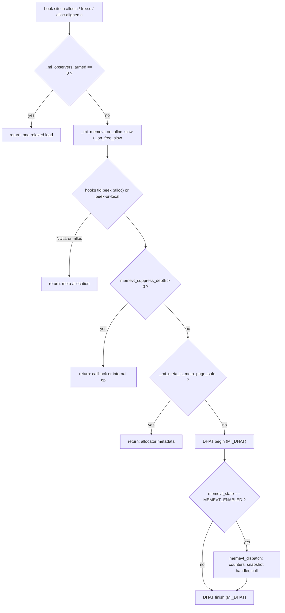

# Memory events: hook sites, dispatch and the observer fast path

*Part of the [mimalloc-pprof](../README.md) documentation.*

The maintainer's view of `src/memory-events.c`: how an allocation reaches a callback, what the
default build pays when nobody listens, and why. The user-facing page is
[the memory-events API](dhat-and-memory-events.md#memory-events-api); the contract is
`include/mimalloc/memory-events.h`.

## 1. Purpose and provenance

Memory events (issue #20) give an embedder an exact, process-global account of the heap (live
and cumulative usable bytes and counts) plus a callback on every allocate, free and resize.
Fork-original (`docs/fork-divergence.md`: "this fork / not upstream") and independent of
`MI_PPROF`, it copies `src/profile.c`'s patterns: once-guarded lazy env read,
snapshot-then-release dispatch, per-thread reentrancy depth. It also carries the **shared observer
hook sites** (DHAT has none of its own and is called from these slow paths, hence
`MI_MEMEVT || MI_DHAT`; see [DHAT's internals](dhat-internals.md)), the #371 **observer fast
path** (`_mi_observers_armed`, tested inline first), and **`mi_unwrapped_*`**, a raw-OS family
for instrumentation that must not recurse into `mi_malloc`, real in every configuration.

History: #266 moved per-thread hook state off `__thread` onto `mi_tld_t` (section 5); #270
made the lock fork-safe; #271 replaced a dangling `page->heap` read; #371/#372 moved every
prologue behind the inline flag; #414 made the subsystem compile-time opt-in because even
disabled hooks cost 9-13 instructions per malloc/free pair (18-26%); #415 tracks undoing that.

## 2. Build and configuration surface

| Surface | Name | Default | Effect |
|---|---|---|---|
| CMake option | `MI_MEMEVT` | `OFF` | appends `MI_MEMEVT=1`/`MI_MEMEVT=0` to `mi_defines` |
| cargo feature | `memory-events` | off (`default = []`) | `rust/mimalloc-pprof/build.rs` defines `MI_MEMEVT` from `CARGO_FEATURE_MEMORY_EVENTS`; `dhat` implies it; `full` includes it |
| C define | `MI_MEMEVT` | `0` (`#ifndef` in `include/mimalloc/types.h`) | a direct `src/static.c` compile gets the minimal build |
| runtime option | `mi_option_memory_events` / `MIMALLOC_MEMORY_EVENTS` | `0` | read once, lazily, by `memevt_resolve_env` |
| Rust option | `Opt::MEMORY_EVENTS` | | the same option through `options` |

There are no tuning constants (the storage is four static counters, one lock and a three-slot
table). What compiles in depends on two flags, because DHAT dispatches through the same paths:

| `MI_MEMEVT` | `MI_DHAT` | hook sites in `alloc.c`/`free.c`/`alloc-aligned.c` | `mi_memory_*` API | `mi_unwrapped_*` |
|---|---|---|---|---|
| 0 | 0 | expand to nothing (empty `static inline` bodies) | stubs returning `false` | real |
| 1 | 0 | inline flag test + `_slow` call | real | real |
| 0 | 1 | inline flag test + `_slow` call (DHAT only) | stubs | real |
| 1 | 1 | inline flag test + `_slow` call (both) | real | real |

The stub block is the `#else  // !MI_MEMEVT` section near the end of `src/memory-events.c`:
`mi_memory_tracking_set_enabled`, `mi_memory_tracking_is_enabled`, `mi_memory_set_callbacks`,
`mi_memory_snapshot` and `mi_memory_visit_live_allocations` all return `false`, and the
`_mi_memevt_fork_*` hooks are empty. `_mi_memevt_suppress_begin`/`_end` stay real everywhere:
they touch state that always exists (`mi_tld_t::hooks`), are off the `mi_malloc`/`mi_free`
fast path, and so the unconditional call sites in `alloc.c`, `alloc-aligned.c` and `dhat.c`
stay untouched (rule 6). In the minimal build (every observability flag off, including
`MI_PPROF`, whose own free hook sits in `src/free.c`, and `MI_OWNER_GATE`) `mi_malloc`/`mi_free`
are byte-identical to upstream at the pinned base; `ci/check_fastpath_identity.py` proves it.

## 3. Public API

| Function | Returns | Contract |
|---|---|---|
| `mi_memory_tracking_set_enabled(bool)` | `true` when compiled in, `false` from the stub | enables or disables accounting at any time; authoritative over the env var, before or after it was read |
| `mi_memory_tracking_is_enabled()` | current state | one relaxed load of `memevt_state` |
| `mi_memory_set_callbacks(const mi_memory_callbacks_t*)` | `true` when compiled in | copies all `MI_MEMORY_CHANGE_COUNT` handler/arg pairs under `memevt_cb_lock`; `NULL` clears the table; the caller's struct may be stack-local, but each `arg` must stay valid (section 7) |
| `mi_memory_snapshot(mi_memory_snapshot_t*)` | `false` for `NULL` or a `size`/`version` mismatch | four independent relaxed loads, so not a consistent cut under concurrency; works while tracking is off (the totals just stop moving) |
| `mi_memory_visit_live_allocations(visitor, arg)` | `false` for a `NULL` visitor or when called inside a callback/suppressed operation; `true` otherwise, including on an uninitialised thread and on early stop | walks only the calling thread's theaps (section 4.7); does not depend on tracking being enabled |
| `mi_unwrapped_malloc(size, alignment)` | pointer or `NULL` | raw OS mapping per call; `alignment` 0 means `sizeof(void*)`, non-power-of-two returns `NULL` |
| `mi_unwrapped_free(p)` | | `NULL` is a no-op; a pointer without the magic header prints an `EINVAL` diagnostic and does nothing |
| `mi_unwrapped_realloc(p, new_size, alignment)` | pointer or `NULL` | `p == NULL` allocates, `new_size == 0` frees and returns `NULL`; otherwise always allocate-copy-free; on failure `p` is left intact |

`mi_memory_snapshot_t` is versioned and sized (`MI_MEMORY_SNAPSHOT_VERSION` = 1); initialise it
with `mi_memory_snapshot_t_decl(name)` (a lower-case macro grandfathered in
`ci/macro_case_baseline.txt`). A `mi_memory_change_t` carries `kind`, `total_bytes` (live
bytes after this event), a signed `delta_bytes`, and `request_size` (0 for a free).

"Usable bytes" means `mi_page_usable_block_size(page)`: the size class minus padding, and for
an aligned allocation the whole block including the alignment slack. In a padded build this
differs from the public `mi_usable_size(p)`, which is why `test/test-memory-events.c` always
compares against an event's own `delta_bytes`.

The Rust wrappers live in `rust/mimalloc-pprof/src/lib.rs`:

| Rust | Wraps | Notes |
|---|---|---|
| `memory_events::set_enabled` / `is_enabled` | `mi_memory_tracking_set_enabled` / `_is_enabled` | the doc comment says "returns the previous state", but the C function returns whether the subsystem is compiled in, which the module example and `feature_contract.rs` rely on |
| `memory_events::snapshot()` | `mi_memory_snapshot` | `None` from the stub or a layout mismatch |
| `memory_events::set_callbacks(&'static Callbacks)` / `clear_callbacks()` | `mi_memory_set_callbacks` | plain `fn(&Change)` pointers, no closures; one `extern "C"` trampoline `dispatch` serves all slots with the `&'static Callbacks` as `arg`, and `catch_unwind` stops a panic at the C frame |
| `memory_events::visit_live_allocations` (unsafe) | `mi_memory_visit_live_allocations` | closure via `visit_trampoline`; a panic ends the walk (`unwrap_or(false)`) |
| `unwrapped_malloc` / `unwrapped_free` / `unwrapped_realloc` (unsafe, crate root) | `mi_unwrapped_*` | family isolation is a safety precondition |

Complete use from C, including clearing the table before the state it points at goes away:

```c
#include <mimalloc.h>
#include <mimalloc/memory-events.h>
#include <stdint.h>

static uint64_t peak_live;   /* callbacks can run on any thread; one writer here */

static void on_allocate(const mi_memory_change_t* change, void* arg) {
  (void)arg;
  if (change->total_bytes > peak_live) peak_live = change->total_bytes;
}

int main(void) {
  if (!mi_memory_tracking_set_enabled(true)) return 1;   /* built without MI_MEMEVT */
  mi_memory_callbacks_t callbacks = { { NULL }, { NULL } };
  callbacks.handlers[MI_MEMORY_ALLOCATE] = &on_allocate;
  if (!mi_memory_set_callbacks(&callbacks)) return 1;
  void* p = mi_malloc(1000);
  mi_free(p);
  mi_memory_set_callbacks(NULL);
  mi_memory_snapshot_t_decl(snap);
  return (mi_memory_snapshot(&snap) && peak_live > 0) ? 0 : 2;
}
```

## 4. Architecture

### 4.1 Hook sites

Rule 6 keeps each upstream call site to one line calling a `static inline` wrapper from
`include/mimalloc/internal.h`. The sites, all passing the block's *start* (never an interior
aligned or guard-offset pointer, so free-side lookups by DHAT find the record):

| File, function | Wrapper | Notes |
|---|---|---|
| `src/alloc.c`, `mi_page_malloc_zero` | `_mi_memevt_on_alloc(page, block, size - MI_PADDING_SIZE)` | every page allocation, including `_mi_malloc_generic`'s, ends here; runs after the pop and zeroing, just before `return block` |
| `src/alloc.c`, `mi_theap_malloc_guarded_hooked_inner` | suppress, then `_mi_memevt_on_alloc(gpage, gblock, size)` | hides the over-allocated inner event and re-emits the caller's request |
| `src/alloc-aligned.c`, `mi_theap_malloc_guarded_aligned` and `mi_theap_malloc_zero_aligned_at_overalloc` | suppress the inner allocation, then `_mi_memevt_on_alloc` with the page block and the requested size | one normalised ALLOCATE per aligned request (except on a thread without a tld, section 8) |
| `src/free.c`, `mi_free_block_local` and `mi_free_block_mt` | `_mi_memevt_on_free(page, block)` | before the block is pushed on `local_free` / CAS-published on `xthread_free`, so the owner cannot reuse the address while DHAT still holds its record |
| `src/alloc.c`, `mi_expand` and the in-place branch of `mi_theap_realloc_zero_ex`; `src/alloc-aligned.c`, `mi_theap_realloc_zero_aligned_at` | `_mi_memevt_on_realloc_in_place` | same page, same size class: a RESIZE with delta 0 |
| `src/alloc.c`, `mi_theap_realloc_zero_ex` and `src/alloc-aligned.c`, `mi_theap_realloc_zero_aligned_at` (moving) | suppress around the inner allocate+`mi_free`, then `_mi_memevt_on_resize(oldp, newp, usable_pre, usable_post, newsize)` | one RESIZE instead of an ALLOCATE/FREE pair; only when `p != NULL` and the new allocation succeeded (but see section 8 for a thread without a tld) |

Deferred reclamation (`mi_page_thread_collect_to_local` in `src/page.c`) is deliberately not
hooked: it moves already-freed blocks, and the free event was emitted at `mi_free` time.

### 4.2 The observer word

```text
_mi_observers_armed   bit 0 MI_OBSERVERS_MEMEVT_UNRESOLVED   bit 1 MI_OBSERVERS_MEMEVT_ON
                      bit 2 MI_OBSERVERS_DHAT_UNRESOLVED     bit 3 MI_OBSERVERS_DHAT_ON
initial value         MI_OBSERVERS_INITIAL = the UNRESOLVED bit of each COMPILED-IN observer
```

Each wrapper is `if mi_likely(_mi_observers_idle()) return;` (one relaxed load compared with
zero) followed by the `_slow` call. The word starts non-zero so the first hook still resolves
the environment in the slow path ("never during process startup"); once every compiled-in
observer resolved to off it is zero, and a hook costs one load and a not-taken branch. A
compiled-out observer contributes no `UNRESOLVED` bit, or the slow branch would run forever.
Each module owns its two bits (`memevt_publish_armed`, `dhat_publish_armed`, using
`mi_atomic_or_acq_rel`/`mi_atomic_and_acq_rel`) and sets `ON` before clearing `UNRESOLVED`, so
the word is never transiently zero while an observer is on. It is `mi_decl_cache_align` so
the per-event counters never share its line.



### 4.3 The `_slow` bodies

`_mi_memevt_on_alloc_slow` runs, in this order: the `_mi_hooks_tld_peek` (NULL returns; this
must be first, see section 5); the suppression check; the meta-page check
`_mi_meta_is_meta_page_safe(page)`; `_mi_dhat_begin_alloc`; the `memevt_state` load, resolving
the env on `MEMEVT_UNINIT`; `memevt_dispatch(MI_MEMORY_ALLOCATE, +usable, request)`;
`_mi_dhat_finish_event`. The free body is the same but uses `_mi_hooks_tld_peek_or_local`
and never resolves the env. The in-place and moving resize bodies skip the meta-page check
(metadata is never resized) and dispatch `MI_MEMORY_RESIZE` with 0 or
`usable_post - usable_pre`.

The meta-page check keeps allocator metadata (`mi_tld_t`/`mi_theap_t` from `_mi_meta_zalloc`)
out of both observers, and the matching check on free keeps ALLOCATE/FREE balanced; the live
counters are running deltas, so an unmatched free would wrap them. It reads the arena through
the immutable `page->memid` instead of `page->heap`: a cross-thread free can race
`mi_heap_delete`/`mi_heap_destroy` freeing that heap, which reproduced as a SIGSEGV in
`_mi_meta_is_meta_page` (#271). **Possible defect (static trace, not reproduced):** the safe
form returns false for any page that is not `MI_MEM_ARENA`, and a meta theap's page falls back
to `mi_arena_os_alloc_aligned` when arena allocation fails or is gated off (the MinGW-static
case of section 4.7). Then a meta allocation on an initialised thread (a new theap in
`src/theap.c`, TLS slots in `src/threadlocal.c`) is dispatched as ALLOCATE under
`theap_meta_lock`, and `_mi_meta_free` -> `mi_free` at thread exit emits FREEs for the tld/theap
whose ALLOCATEs the NULL-peek rule skipped, so the live counters drift down and can wrap.

### 4.4 Activation state

`memevt_state` is an `_Atomic(size_t)`, not a bool, because MSVC's plain-C atomic wrapper only
implements pointer-width and 64-bit primitives. Its values are `MEMEVT_UNINIT` (0),
`MEMEVT_DISABLED` (1) and `MEMEVT_ENABLED` (2). `memevt_once` (a `mi_atomic_once_t`) arbitrates
the two ways it first resolves:

- `memevt_resolve_env`, called from the alloc slow path on `MEMEVT_UNINIT`, reads
  `mi_option_is_enabled(mi_option_memory_events)` inside the once, stores the result with
  release order and publishes the bits. A losing thread blocks on the once's lock and then
  reloads the winner's result. A same-thread recursive entry returns without blocking
  (`_mi_atomic_once_enter` compares the owner tid), and the reloaded state is still
  `MEMEVT_UNINIT`, so that nested hook simply does not dispatch.
- `mi_memory_tracking_set_enabled` enters the same once. If it wins, the env is never read.
  If it loses, it writes `memevt_state` and the bits anyway, so an explicit call always
  overrides.

Setting `mi_option_memory_events` after resolution has no effect; only the API changes the
state from then on.

### 4.5 Dispatch and the counters

`memevt_dispatch` re-checks the suppression depth, then updates `memevt_live_bytes` with a
relaxed add or subtract; `total_bytes` is the returned previous value plus the delta. ALLOCATE
increments `memevt_live_count` and `memevt_accum_count` and adds to `memevt_accum_bytes`; FREE
decrements `memevt_live_count`; a growing RESIZE adds to `memevt_accum_bytes`. It then takes
`memevt_cb_lock`, copies one handler/arg pair, releases the lock, and calls the handler with
`memevt_suppress_depth` incremented around the call. `memevt_cb_lock` is never held while
user code runs; allocator locks further up the stack can be (section 7).

### 4.6 Coexistence with DHAT and the profiler

DHAT's begin runs before the user callback, while the original pointers are still at hand;
its finish commits after the callback returns. The shared `memevt_suppress_depth` hides a
callback's own allocations and the moving-realloc internals from both observers.
`mi_dhat_dump` brackets its stdio with `_mi_memevt_suppress_begin`/`_end` so a lazily
allocating `fopen` cannot reach a callback under `dhat_lock`. The profiler is separate: its
countdown lives in `_mi_malloc_generic`, it has its own `prof_callback_depth`, and only the
guarded paths suppress both (`_mi_prof_suppress_begin` next to `_mi_memevt_suppress_begin`).

### 4.7 The live-allocation visitor

`mi_memory_visit_live_allocations` is not built on `mi_heap_visit_blocks` (the header and Rust
doc still say it is): that walker misses pages a live theap took from the OS (`MI_MEM_OS`),
and on MinGW static executables `_mi_preloading()` never turns false, so every page was
`MI_MEM_OS` and the old implementation visited nothing. The current code walks
every theap on the calling thread (`tld->theaps` via `tnext`), each theap's
`pages[MI_BIN_COUNT]` queues, and each page through `_mi_theap_area_visit_blocks`, with
`memevt_visit_adapter` dropping the per-area (block `NULL`) calls. It runs inside
`MI_GATE_ENTER`/`MI_GATE_LEAVE` (#366) because the block walker folds thread frees, an
owner-private write. Other threads' live blocks are not visited.

### 4.8 `mi_unwrapped_*`

Each allocation is its own `_mi_os_alloc_aligned(_mi_subproc_main(), total, alignment, true,
false, &memid)` mapping, with a `mi_unwrapped_header_t` (`base`, `total_size`,
`payload_size`, `memid`, `magic`) placed immediately before the returned pointer and the
header space rounded up to `alignment`. `mi_unwrapped_free` validates `MI_UNWRAPPED_MAGIC`
through `mi_unwrapped_header_of` and returns the mapping with `_mi_os_free`. Nothing here
reaches a hook, so observers never see these blocks: rule-4 discipline offered to callers
(the module's own bookkeeping is static). `ci/internal-state-inventory.json` records the OS
call as `memory-events-unwrapped-block`. `mi_unwrapped_malloc` first calls `mi_thread_init()`,
not `mi_process_init()` (which initialises only the thread that wins its once), because the
OS address-hint path reads per-thread randomness; its crash comment uses v2 names, and v3's
`_mi_os_get_aligned_hint` also checks `mi_theap_is_initialized` itself.

## 5. Per-thread hook state and the #266 reentrancy problem

`mi_hooks_tld_t` (`include/mimalloc/types.h`) lives inline in `mi_tld_t::hooks`: memory-events'
`memevt_suppress_depth`, DHAT's `dhat_observer_depth` and `dhat_event`, the profiler's
`prof_callback_depth` and `prof_lock_owner`. These were file-local `mi_decl_thread` variables.
On a macOS dylib the loader can create a thread's `__thread` block on first touch through a
dyld-interposed `calloc`, including inside `_mi_thread_init_with_heap` -> `_mi_meta_zalloc`,
which holds `subproc->theap_meta_lock` for the thread's own tld/theap. A hook touching
`__thread` there re-entered mimalloc and re-acquired that non-recursive lock: a deadlock, or an
assertion under `MI_DEBUG_FULL`. `mi_tld_t` is reached through `_mi_theap_default()`, the
non-allocating fast-path accessor, which cannot re-enter.

`include/mimalloc/hooks-tld.h` offers two accessors and deliberately no third:

- `_mi_hooks_tld_peek()` returns NULL when `mi_theap_is_initialized` is false. The alloc hook
  and `_mi_memevt_suppress_begin`/`_end` use it. The alloc hook returns on NULL (an alloc
  without a tld is the thread's own meta allocation), and the peek must come first.
- `_mi_hooks_tld_peek_or_local(&local)` falls back to a zeroed, caller-stack
  `mi_hooks_tld_t`. The free, in-place and resize hooks use it, because a NULL there is a real
  event: a foreign thread whose first mimalloc call is a cross-thread `mi_free`
  (`test_free_from_foreign_thread`), or a free after the thread's own teardown. The pointer is
  valid only for that one call.
- **No force-initialising accessor.** `&mi_theap_get_default()->tld->hooks` would run
  `mi_thread_init()`. That is unsafe mid-init (the #266 crash) and mid-teardown:
  `mi_thread_theaps_done` resets the default theap to the empty sentinel before freeing the
  theaps precisely so nothing re-initialises it, and `src/free.c` explicitly supports frees
  "after thread_done was called". The scavenger also depends on it: its sweep asserts that it
  never acquires a theap of its own (see [the scavenger](scavenger-and-idle-handoff.md)).

## 6. Invariants and concurrency

| Object | Kind | Writers / order | Readers / order |
|---|---|---|---|
| `_mi_observers_armed` | `_Atomic(size_t)`, cache aligned | `memevt_publish_armed`, `dhat_publish_armed`: acq_rel or/and | every hook: relaxed |
| `memevt_state` | `_Atomic(size_t)` | release store, inside or after `memevt_once` | slow paths and `mi_memory_tracking_is_enabled`: relaxed |
| four counters | `_Atomic(size_t)` | `memevt_dispatch`: relaxed RMW | `mi_memory_snapshot`: relaxed |
| handler table | plain arrays | `mi_memory_set_callbacks` under `memevt_cb_lock` | `memevt_dispatch` copies one slot under the lock |
| `mi_hooks_tld_t` fields | plain, non-atomic | owning thread only | owning thread only |

Relaxed loads of the word are enough because it is a hint that gates work, not data: a
thread that reads a stale zero misses an event close to an enable, which is the documented
partial-accounting caveat, and a stale non-zero only costs a slow-path visit that re-reads
`memevt_state`. The handler and its `arg` are ordered by the lock.

There are two locks: `memevt_cb_lock`, and the internal lock of `memevt_once`, which
`memevt_resolve_env` holds across `mi_option_is_enabled` while losers block on it.
`memevt_cb_lock` is never held across user code, but `memevt_dispatch` can take it under the
allocator locks listed in section 7, which is why `src/fork.c` quiesces it innermost, as
level 14 (`MI_FORK_LOCK_MEMEVT`) after the profiler (12) and DHAT (13), before only the options
output buffer (15). The child continues: `_mi_memevt_fork_child` re-initialises
`memevt_cb_lock` and resets `memevt_once` with `_mi_atomic_once_fork_child_reset`. Registered
handlers are the embedder's problem across fork; see [fork safety](fork-safety.md).

**Why nothing may precede the flag test.** Before #371 the flags were read after a prologue (TLS
peek, suppression read, meta-page lookup, DHAT's two global RMWs on its in-flight counter),
which serialised the allocator: 0.69x from 1 to 8 threads. Rule 6 now forbids any call, TLS
read or atomic RMW before the flag test, enforced twice.
`ci/check_fastpath_identity.py` disassembles `mi_malloc`, `mi_zalloc`, `mi_free`,
`mi_heap_malloc_small` and `mi_malloc_small` in a Release build pinned to `-DMI_PPROF=ON
-DMI_DHAT=ON -DMI_MEMEVT=ON` and rejects any `lock`-prefixed or memory `xchg` instruction
(`mi_free` is allowed one, the `xthread_free` CAS). That cannot see an RMW hidden behind an
unconditional call, which was #371's actual shape, so `test/test-observer-scaling.c` asserts
the behaviour instead (section 9).

## 7. Callback contract

A handler runs on the thread performing the operation, possibly on many threads at once.
`memevt_cb_lock` is released before it runs, but allocator locks further up the stack can be
held for internal events: `theap_meta_lock` for meta allocations (section 4.3), a non-main
heap's `arena_pages_lock` while `mi_heap_ensure_arena_pages` allocates that heap's arena-pages
table from `heap_main` (`mi_arena_pages_alloc`), and `heaps_lock` + `tlds_lock` while
`MI_PURGE_RECLAIM` frees such tables. A handler that sees those events runs under the outer
lock, so it must not create heaps or allocate from that same non-main heap. For an
allocation the block is already popped and zeroed; for a free it has not yet been pushed
back. `change->total_bytes` is this event's own view of the live total.

| From inside a handler | Result |
|---|---|
| `mi_malloc`, `mi_free`, `mi_realloc` | allowed; on a thread with a tld the nested operation is suppressed, so it is not counted, dispatched or seen by DHAT |
| `mi_memory_snapshot`, `mi_memory_tracking_is_enabled`, `mi_memory_set_callbacks`, `mi_memory_tracking_set_enabled` | allowed; the first two are pure loads, the lock is free and the once has resolved |
| `mi_memory_visit_live_allocations` | on a thread with a tld, returns `false` without walking (depth > 0) |
| `mi_unwrapped_malloc`/`_free`/`_realloc` | allowed: the intended non-recursive scratch storage |
| `longjmp` or a C++ exception out of the handler | unsupported: `memevt_suppress_depth` never comes back down, so that thread's events are suppressed from then on and a DHAT event is left armed |

Two consequences of snapshot-then-release that the header wording does not spell out:

- `mi_memory_set_callbacks(NULL)` returning does not mean no thread is still inside the old
  handler. A thread that copied the old pair before the swap calls it after the lock is
  released. An `arg` must outlive every dispatch that could have started, which is why the
  Rust API demands `&'static Callbacks`.
- Suppression lives on the thread's tld, or on a stack-local for a thread without one (a
  foreign thread whose first call is a free). **Possible defect (static trace, not
  reproduced):** on such a thread nothing the handler does is suppressed. Each nested free
  gets a fresh zeroed local from `_mi_hooks_tld_peek_or_local`, so a FREE handler that frees
  re-dispatches itself without bound; once a nested allocation initialises the thread, every
  nested operation after it is dispatched; and the visitor returns `true` (nothing to walk)
  before that init and walks after it.

## 8. Edge cases and accepted limits

- **Partial accounting.** Totals are never reconstructed. A block allocated while disabled and
  freed while enabled is subtracted without having been added, and the `size_t` counters wrap.
  Exact totals need tracking enabled before the first allocation and never disabled.
- **The env var resolves on the first user allocation**, not on any hook: meta allocations and
  NULL-peek calls return before `memevt_resolve_env`, and the free and resize bodies never
  resolve it. Until it resolves, every free also takes the slow path.
- **Concurrent opposite `mi_memory_tracking_set_enabled` calls** are not one atomic step: the
  state store and the bit publication can interleave so that `memevt_state` says enabled while
  `MI_OBSERVERS_MEMEVT_ON` is clear. Unless a DHAT bit keeps the word non-zero, events then
  stop until the next call.
- **Suppression on a thread without a tld.** *Possible defect (static trace, not
  reproduced).* `_mi_memevt_suppress_begin`/`_end` do nothing when the peek finds no tld. A
  first-call `mi_realloc(p, bigger)` on such a thread initialises it inside the "suppressed"
  inner allocation, so ALLOCATE and FREE escape, `_end` drops the new tld's depth to -1, and
  the RESIZE follows: three events, the growth counted twice. A first-call over-allocated
  `mi_malloc_aligned` emits two ALLOCATEs. The -1 persists: later suppressed pairs leak their
  inner events and callback nesting is off by one. A fix would record whether begin
  incremented, or initialise the thread before begin.
- **`mi_heap_destroy`** frees pages wholesale (`_mi_heap_force_destroy` -> `_mi_heap_destroy_pages`)
  without the per-block free path. DHAT forgets the heap through `_mi_dhat_forget_heap`;
  memory-events has no counterpart, so blocks still live in a destroyed heap stay in
  `live_bytes`/`live_count`.
- **Purges.** Page purges and hole discards emit nothing. `MI_PURGE_RECLAIM` emits one FREE per
  non-main heap's arena-pages table it releases (`mi_arena_reclaim_release_heap_pages` ->
  `_mi_arena_pages_free` -> `_mi_free_subproc_safe`), on the purging thread, under
  `heaps_lock`/`tlds_lock`. [Hook and profiler attribution](purge-all.md#hook-and-profiler-attribution)
  lists page purges and hole discards as memory-events bookkeeping; the code emits none for them.
- **Platforms.** Linux: `mimalloc-static` overrides `malloc`, so glibc's pthread bookkeeping
  shows up in the counters (T7 filters on its size class). Windows: an MSVC DLL allocates in
  `DLL_PROCESS_ATTACH` and CRT teardown (#69, once a test leaving callbacks on a dead frame);
  MinGW static is section 4.7. macOS: #266, guarded on every platform by T12.
- **`MI_GUARDED`.** With `MIMALLOC_GUARDED_SAMPLE_RATE` forcing guards, the debug double-free
  sub-case turns guarding off on the test thread (a guarded page is reclaimed on free), and T7
  asserts only ALLOCATE/FREE pairing, since guarded blocks leave its size class (#131).

## 9. Testing

| CTest name | Executable / source | Registered when | What it asserts |
|---|---|---|---|
| `test-memory-events` | `mimalloc-test-memory-events`, `test/test-memory-events.c` | `MI_MEMEVT` | T1 off by default; T3 API authoritative after the env resolved; T4 table replace/clear; T5/T6 event shapes, one RESIZE per moving realloc, delta 0 in place, no event for failed allocs, failed reallocs or (debug) double frees; T7 8 threads x 2000 pairs lose or duplicate nothing; T8 reentrant callback dispatched once; T9 exact snapshot deltas; T10 no reconstruction; T11 visitor sizes, early stop, freed blocks absent; foreign-thread free decrements; T12 new thread's first alloc with profiler, DHAT and memory-events active (#266); `mi_unwrapped_*` round trip, no events, bad-magic diagnostic |
| `test-memory-events-env-enabled` | same binary, `--env-enabled-check` | `MI_MEMEVT` | with `MIMALLOC_MEMORY_EVENTS=1`, the first allocation resolves the env and callbacks fire |
| `test-observer-scaling` | `mimalloc-test-observer-scaling`, `test/test-observer-scaling.c` | always; `RUN_SERIAL` via `mi_serial_tests`, timeout 300 s | aggregate throughput from 1 to 4 threads is at least `MIN_SPEEDUP` (1.20x); skips with fewer than 4 hardware threads, in `MI_OWNER_GATE` builds, at guarded sample rate 1, and below 1 Mops/s single-threaded |
| `test-fork-locks-memevt-env` | `mimalloc-test-fork-locks` | `MI_MEMEVT`, non-Windows | fork with `memevt_cb_lock` live does not deadlock |
| `test-dhat` | `test/test-dhat.c` | `MI_DHAT` | DHAT coexists with an installed callback table; with `MI_MEMEVT=0` the API is stubbed |
| `test-diagnostic-walks` | `test/test-diagnostic-walks.c` | `MI_DIAGNOSTICS` | `test_dump_growth`: the JSON dump grows its buffer without a RESIZE event |

The scaling test runs in every configuration: in the minimal build it is the positive control
that compiling the hooks out did not break the fast path. `test-memory-events` carries no
`macos` label, so the selective macOS lane skips it; full bundles run it.

Rust: `rust/mimalloc-pprof/tests/t20_memory_events.rs` and `t21_visit_live.rs` (both require
`memory-events`), `feature_contract.rs` (real with the feature, stubbed without),
`t19_layout.rs` (`memory_events_structs_match_c`), and the `unwrapped_*` unit tests in `lib.rs`.

CI: c-unit rows `release`, `memevt-only`, `dhat-on` (`MI_MEMEVT=0 MI_DHAT=1`, where the
shared hook-site guard is load-bearing), `debug-full`, `pprof-off` ([CI gates](ci-gates.md));
`ci/check_fastpath_identity.py` (base vs HEAD, minimal vs upstream, gate control);
`ci/check_scaling_parity.py`; `ci/check_rust_surface.py`; `ci/check_no_diagnostic_suppression.py`;
`ci/check_crate_package.py`; `ci/check_internal_state.py`.

Running locally:

```text
uv run ci/dev_linux.py c-test          # configures -DMI_MEMEVT=ON -DMI_DHAT=ON ..., whole suite
uv run ci/verify_local.py              # includes the memevt-only configuration
cmake -S . -B out/me -DMI_MEMEVT=ON && cmake --build out/me
ctest --test-dir out/me -R 'test-memory-events|test-observer-scaling' --output-on-failure
python3 ci/check_fastpath_identity.py
cargo test --manifest-path rust/mimalloc-pprof/Cargo.toml --features memory-events
```

## 10. Where to look

| File / symbol | What it is |
|---|---|
| `src/memory-events.c`, `memevt_dispatch` | counters, handler snapshot, suppressed call |
| `src/memory-events.c`, `_mi_memevt_on_alloc_slow` / `_mi_memevt_on_free_slow` | the ordered slow-path prologues; DHAT dispatch |
| `src/memory-events.c`, `memevt_resolve_env`, `mi_memory_tracking_set_enabled`, `memevt_publish_armed` | once-guarded activation; this module's two bits of `_mi_observers_armed` |
| `src/memory-events.c`, `mi_memory_visit_live_allocations` | per-thread page-queue walker |
| `src/memory-events.c`, `mi_unwrapped_malloc` | raw-OS scratch family |
| `include/mimalloc/internal.h`, `_mi_observers_idle`, `_mi_memevt_on_alloc` | inline wrappers; empty when no observer is compiled in |
| `include/mimalloc/internal.h`, `_mi_meta_is_meta_page_safe` | heap-free meta-page test (#271) |
| `include/mimalloc/hooks-tld.h` | `_mi_hooks_tld_peek`, `_mi_hooks_tld_peek_or_local` |
| `include/mimalloc/types.h`, `mi_hooks_tld_t` | per-thread hook state on `mi_tld_t` |
| `src/alloc.c`, `mi_theap_realloc_zero_ex` | moving-realloc suppression and the synthesized RESIZE |
| `src/free.c`, `mi_free_block_mt` | free hook before the `xthread_free` publish |
| `rust/mimalloc-pprof/src/lib.rs`, `memory_events` | Rust wrappers |
