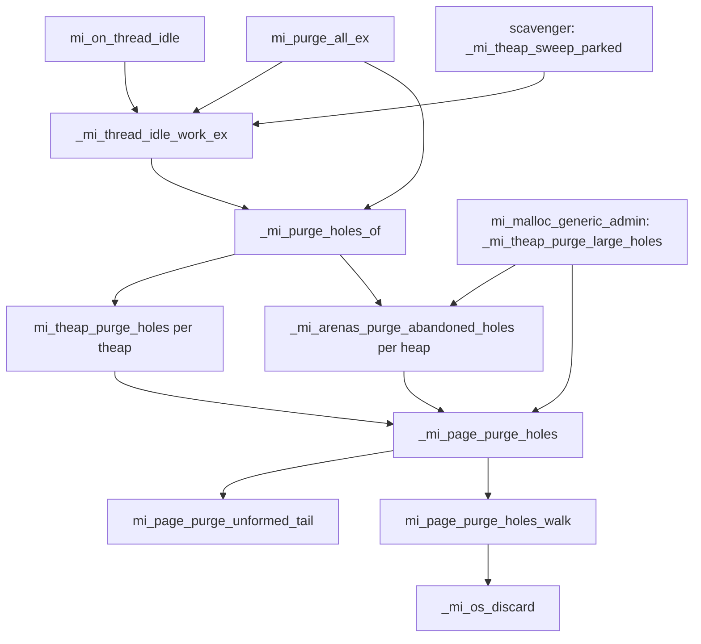

# Page hole purging

*Part of the [mimalloc-pprof](../README.md) documentation.*

Upstream mimalloc gives a page's memory back to the OS only when **every** block in it is
free. One long-lived object therefore keeps a whole 64 KiB small page, 512 KiB medium page
or 4 MiB large page resident, and a server that churns allocations pays for pages that are
mostly free. Hole purging discards the memory of the free blocks *inside* a still-used page,
one OS page at a time, at an idle point. This document is about how that works and why each
rule exists. The numbers are in the README ([Hole purging, measured](../README.md#hole-purging-measured)),
and the option reference is in [c-integration.md](c-integration.md#scavenger-and-hole-purging).

## 1. Where it came from

The engine was imported from `oven-sh/mimalloc` @ `942b8342` (MIT) under issue #272 as
Bun parity phase **P7b**. P7a, landed first, brought the scavenger and the idle handoff.
Bun's motivating report (oven-sh/bun#39844) was a heap peaking at 1.4–2.6x Node's. Later
fork issues built on it: #366 (`mi_purge_all`), #477 (sweeping large pages while busy),
#478 (no sweep on a thread's first tick), #483 (retired large pages of idle threads),
#491 (the release bound) and #493 (reserved pages, and the slack past the last block).

The structural difference from Bun is CLAUDE.md rule 6. Bun keeps the engine in `src/page.c`
(about 1,000 extra lines) and the drivers as `src/theap.c` statics; here all of it lives in
`src/page-holes.c`, `src/page.c` carries single-line hook calls, `src/theap.c` only exports
`_mi_theap_visit_pages`, and the shared inline helpers sit in `include/mimalloc/internal.h`.

> **`docs/fork-divergence.md` is stale here.** It lists hole purging and the background purge
> thread as *deliberately not adopted*; #272 adopted both. Hole purging does not change what
> `mi_usable_size` or the memory-events counters mean (§6). The purge thread's objection (a
> purge decommitting a page a live sample record points into) is met by construction, since
> every free unlinks its record, and `mi_arenas_page_free_ex` asserts it in `MI_PPROF` debug
> builds: no page goes back to the arena with a record attached.

## 2. Build and configuration surface

**There is no build flag.** `src/page-holes.c` is in the CMake source list and included
unconditionally by the `src/static.c` amalgamation, so the Rust crate always has it. It is
not an observability subsystem (rule 6's "OFF by default" does not apply): it is a
**runtime** feature, **on by default**, and its `mi_page_t`/`mi_tld_t` fields always exist.

| `mi_option_*` | Environment | Default | Effect |
|---|---|---|---|
| `mi_option_purge_holes` | `MIMALLOC_PURGE_HOLES` | `1` | master switch, read on every page (`_mi_page_purge_holes`) and at every pass entry |
| `mi_option_purge_holes_min_interval` | `MIMALLOC_PURGE_HOLES_MIN_INTERVAL` | `100` ms | minimum start-to-start gap between two sweeps of one thread's heaps, clamped to 0..3600000 |
| `mi_option_purge_holes_full_every` | `MIMALLOC_PURGE_HOLES_FULL_EVERY` | `64` | every Nth sweep ignores the per-page skip (§4.3); `0` disables the full walk (Bun's default) |
| `mi_option_purge_holes_eager_zero` | `MIMALLOC_PURGE_HOLES_EAGER_ZERO` | `0` | zero a range before discarding it, so a mis-scoped discard shows up as corruption; forced on when `MI_DEBUG>1 && !MI_SECURE`; compiled out when `MI_TRACK_ENABLED` |
| `mi_option_purge_delay` | `MIMALLOC_PURGE_DELAY` | 100 ms here | a negative value disables every purge, holes included |

Do not confuse `purge_holes_eager_zero` with `mi_option_purge_zeroes`. The latter is
zero-tracking for arena purges, and it goes the other way: it lets `mi_zalloc` *skip* work.

Compile-time constants, all in `include/mimalloc/types.h` unless noted:

| Macro | Value | Overridable | Meaning |
|---|---|---|---|
| `MI_PAGE_PURGE_BITS` / `MI_PAGE_PURGE_WORDS` | 256 / 4 | no (sizes `mi_page_t::purged`) | purge units a page can track |
| `MI_PAGE_SWEPT_NONE` | all ones | no | "no sweep state" for `swept_state` |
| `MI_RETIRED_PAGE_SLOTS` | 16 | `#ifndef` | retired large pages one thread can publish (#483) |
| `MI_RETIRED_RELEASE_MULT` | 10 | `#ifndef` | purge delays a published page waits before its memory is discarded |
| `MI_PAGE_RESERVE_RELEASE_MULT` | 10 | `#ifndef` | the same window for reserved pages (#493); kept equal on purpose |
| `MI_RELEASE_SLACK_MS` | 300 | `#ifndef` | scavenger wake slack in `_mi_release_bound_ms` (#491) |
| `MI_PURGE_HOLES_MAX_HEAPS` | 8 | no (`src/page-holes.c`) | distinct heaps whose abandoned pages one sweep visits |
| `MI_HOLES_MAX_CAP`, `MI_HOLES_HIST_BUCKETS`, `MI_HOLES_GRAN_COUNT` | 65536, 5, 5 | no (`src/page-holes.c`, `internal.h`) | hole-report sizing |

## 3. Public API

```c
#include <mimalloc.h>

mi_option_set(mi_option_purge_holes_min_interval, 0);   /* do not pace this demo */
mi_on_thread_idle();              /* collect, sweep holes, purge arenas: on this thread */
mi_purge_holes_stats_t h;
mi_purge_holes_stats_get(&h);     /* h.purged_bytes: discarded now; h.discard_calls: syscalls */
mi_purge_holes_report();          /* read-only: what could NOT be discarded, and why */
```

- **`mi_on_thread_idle`**, and the **`mi_on_thread_idle_start`** / **`mi_on_thread_idle_end`**
  handoff, are the entry points. Hole purging has no call of its own. The idle call runs
  `_mi_thread_idle_work`, which is a collect, then `_mi_purge_holes_of`, then the arena
  purge. Call it from any thread; it does nothing on a thread that never allocated. The
  park protocol behind `_start`/`_end` is covered in
  [scavenger-and-idle-handoff.md](scavenger-and-idle-handoff.md).
- **`mi_purge_holes_stats_get(mi_purge_holes_stats_t*)`** fills process-wide counters. It
  ignores `NULL`, takes no lock, and is safe from any thread. Each field is read by a relaxed atomic add of 0,
  so the struct is not a consistent snapshot. `purged_bytes`, `purged_blocks` and
  `unformed_bytes` are gauges. The three `ineligible_*` fields are a gauge that
  `_mi_purge_holes_of` resets when it starts a sweep. Every other field is monotonic. These
  counters are not part of `mi_stats_t`, because the sweep also covers pages no heap owns and
  `mi_stats_t` cannot grow. `mi_stats_print` adds four `holes:` lines when `discard_calls`,
  `purged_bytes_total` or `ineligible_pages` is non-zero (unformed-tail discards alone do not).
- **`mi_purge_holes_report(void)`** prints, per size class, the free bytes that share an OS
  page with a live block, and how many live blocks pin each such page. It also prints a
  "granularity curve": what *would* be discardable at 4/8/16/32/64 KiB OS pages. It is
  read-only (no collect, purge or un-purge) and owner-only: it covers the calling thread's
  theaps plus the mapped abandoned pages of the heaps behind them (a concurrent cross-thread
  free can make a block read as live). It collects under the lock and prints afterwards, so
  a user output function never runs while `tld->theaps_lock` is held.
- **`mi_purge_all_ex`** reports `hole_bytes` as the delta of `purged_bytes_total` over the
  call. See [purge-all.md](purge-all.md). Under `MI_PURGE_FORCE`, `_mi_purge_holes_of`
  skips the interval pacing and forces a full sweep.

Rust (`rust/mimalloc-pprof/src/lib.rs`): `on_thread_idle()`, `park_while_idle()` (returns
`Option<IdlePark>`: `None` when nothing was handed off, else a guard ending the park on drop), `purge_holes_stats()` returning
`sys::MiPurgeHolesStats`, `purge_holes_report()`, and the option constants
`Opt::PURGE_HOLES`, `Opt::PURGE_HOLES_EAGER_ZERO`, `Opt::PURGE_HOLES_MIN_INTERVAL` and
`Opt::PURGE_HOLES_FULL_EVERY`.

## 4. Architecture

### 4.1 The unit: an OS page, recorded per page in a bitmap

The unit is the OS page, because that is what `madvise`/`MEM_RESET` work in.
`page->purged[MI_PAGE_PURGE_WORDS]` is a bitmap over the page's block area. Bit `k` names
the range starting at `mi_page_purge_base(page) + k * mi_page_purge_unit(page)`. The base is
the block-area start rounded down to a unit, so every bit is an OS-page-aligned range in
absolute terms. That is exactly what `_mi_os_discard` and `_mi_os_reuse` need.

`mi_page_purge_unit` starts at `_mi_os_page_size()` and doubles until the block area fits
in 256 bits (#477). On a 4 KiB OS page, small and medium pages use 16 and 128 bits. A 4 MiB
large page would need 1,024 bits, so one bit covers 16 KiB there. On a 16 KiB OS page
(Apple Silicon) a large page needs exactly 256 bits. The unit is computed at run time,
because the OS page size is not a compile-time constant.

`mi_page_can_purge_holes` decides eligibility, and eligibility is fixed for a page's
lifetime. A page is rejected when it is a singleton (`reserved <= 1`, which covers huge
pages), when its memory is pinned (large/huge OS pages), when its arena has a custom
`commit_fun`, or when its units do not fit the bitmap. `mi_page_holes_madvisable` is the
weaker test used for the unformed tail (§4.5), which needs no bitmap.

`_mi_page_purge_os_page_blocks` maps OS page `k` to the blocks `[first,last]` overlapping it
for the sweep and the un-purge paths (the read-only report clips its own ranges). It returns `false` when OS page `k` is not *entirely*
inside `[page_start, page_start + capacity * block_size)`. Such an OS page holds bytes the
page does not own: header bytes when the meta is in front of the page, or blocks not formed
yet. It is never discarded.

### 4.2 Three block states, and why a purged block leaves the free list

Every block is exactly one of three things:

- **free-listed**: on `free`, `local_free` or `xthread_free`.
- **purged**: free, but its memory is discarded. A block is purged exactly when it overlaps
  a discarded OS page (`mi_page_block_index_is_purged`). No per-block bit is stored.
- **live**.

mimalloc threads its free list through the free blocks themselves. A discarded block reads
back as zero (or as stale data on macOS/Windows), so it cannot hold a `next` pointer, and a
purged block is kept **off every list**. `mi_page_is_valid_init` asserts the conservation
invariant `used + |free| + |local_free| + _mi_page_purged_count == capacity` (`used` still
counts uncollected `xthread_free` blocks). `_mi_page_holes_assert_valid`, called from
`_mi_page_is_valid` (reached through `mi_assert_expensive`, so `MI_DEBUG >= 3`), asserts
that no list holds a purged block and that only eligible pages carry holes. That makes every
existing test in the suite a test of this machinery.

### 4.3 Sweeping one page — `_mi_page_purge_holes`

The function returns early when the option is off, when the page is entirely free (the
page itself is about to go), or when `purge_delay < 0`. It then discards the unformed tail
(§4.5), counts ineligible pages, and runs `mi_page_purge_holes_walk`:

1. Walk `page->free` and count, per OS page, the free-listed blocks that overlap it
   (`nfree[]`, a `uint16_t` array on the stack).
2. An OS page may be discarded when every block overlapping it is free. Only its first and
   last block can stick out into a neighbour that is already purged, so those two are the
   only ones that need the purged test.
3. Rebuild `page->free` without the blocks about to lose memory. This has to happen
   **before** the discard, because the walk follows `next` pointers stored in that memory.
   Clear `free_is_zero`.
4. Set the bits, then call `mi_page_holes_discard` once per maximal run of units. If a
   discard fails (for example ENOMEM), `mi_page_unpurge_range(..., false)` hands those
   blocks straight back, and the walk reports itself incomplete.

**The skip.** `page->swept_state` records the `(capacity << 32) | used` the sweep left the
page in (`mi_page_sweep_state`); a later sweep that finds it unchanged skips the page without
walking its free list, which avoids a per-park re-walk that grew with uptime. It is sound in
one direction: an OS page that *became* discardable gained a free block, so `used` fell or
`capacity` grew. It can miss churn (as many frees as allocations, a different free set),
which costs memory, never correctness; `purge_holes_full_every` bounds that delay to N
sweeps. The state is recorded only after a complete walk, so a failed discard never looks
"done", and `mi_page_unpurge_range` resets it to `MI_PAGE_SWEPT_NONE`
(`mi_page_sweep_state_invalidate`) because it grows the free list without moving
`(capacity,used)`.

### 4.4 Giving holes back

- **To serve an allocation.** HOOK 1/5 in `mi_page_free_collect_ex` fires when the free
  list is empty and the page has holes, unless the calling thread is inside its own sweep.
  It calls `_mi_page_unpurge_run`, which brings back the **first maximal run** of purged
  units with one `_mi_os_reuse`, re-listing the blocks that are whole again in address order;
  the rest stay discarded. The reclaim path in `src/page.c` does the same unconditionally for
  an abandoned page whose free blocks are all purged.
- **Without an allocation to serve.** `_mi_page_free_collect_no_unpurge` (hook 2/5) is used by
  the collect in `mi_theap_page_collect`, by `_mi_page_abandon` (hook 3/5), by the block
  visitors, by the heap snapshot and by the sweep itself. Un-purging there would only fault
  memory back in that the next sweep discards again, at the cost of a reuse syscall on macOS.
- **When the page goes back to the arena.** `mi_arenas_page_free_ex` (`src/arena.c`) is the
  single choke point for that. It calls `_mi_page_unpurge_all`, which calls `_mi_os_reuse`
  on every run and on the unformed tail, and then `_mi_page_purged_reset`. The page is dead
  by then, so its free list is *not* rebuilt: writing `next` pointers would fault every hole
  back in. The reuse must come first: the arena may hand the memory out as committed with no
  reuse call of its own, and on macOS a `MADV_FREE_REUSABLE` page stays reclaimable (and
  charged to the process) until `MADV_FREE_REUSE`. `_mi_page_init` (hook 5/5) resets the
  bitmap for a fresh page.

### 4.5 The unformed tail, and the slack past the last block

The blocks in `[capacity, reserved)` have never been formed. When a page is carved from a
recycled slice, their memory is often already resident anyway. `mi_page_purge_unformed_tail`
discards the whole OS pages inside that tail that are also committed. It records them as two
byte offsets, `unformed_purged_lo`/`_hi`, and **not** in `purged`, because a bit there means
"a free block off every list", and these blocks do not exist yet. `mi_page_extend_free`
(hook 4/5) calls `_mi_page_unpurge_unformed_upto` on exactly the range it is about to format,
before it writes the first free-list pointer.

`mi_page_discard_slack` (#493) discards the bytes between the last block and the end of the
page's slices. It runs only when a retired page is released for idling, never when a page is
created: under churn the arena hands those slices to the next page right away, and
discarding them would only cause refaults.

### 4.6 Who drives the sweep



- **The idle sweep, `_mi_purge_holes_of(tld, force)`.** It paces first: a sweep of the same
  tld started less than `purge_holes_min_interval` ago returns at once. The stamp is the
  *start* time, a skipped sweep does not stamp, and the stamp happens even when the option is
  off, so that the scavenger's pre-claim check sees the same clock in both configurations. It
  then decides whether this is a full sweep, zeroes the ineligible gauge, and under
  `tld->theaps_lock` sweeps every initialized theap of the tld, full pages included. A page
  that the sweep's forced collect empties is freed instead (`pages_freed`). After
  that it sweeps the abandoned pages of up to `MI_PURGE_HOLES_MAX_HEAPS` distinct heaps
  behind those theaps. Abandoned pages matter because every page that ever became full ends
  up in the arena's abandoned map. Non-default heaps matter too: JSC allocates from
  `mi_heap_new_in_arena`.
- **The busy sweep (#477), `_mi_theap_purge_large_holes`.** It runs from
  `mi_malloc_generic_admin` every 1000 generic mallocs, at most once per
  `purge_holes_min_interval`, and covers only the large bins. The reason is that a thread
  that never goes idle would otherwise never be swept. With `holes_busy` set, a page whose
  free-list head or `(capacity,used)` changed since the previous tick is only re-stamped.
  Since #478 a thread's first call starts its clock instead of sweeping; otherwise every
  short-lived thread swept, and then refaulted, the dead thread's pages it was about to
  reclaim.
- **Retired large pages (#483).** When a large page empties, `_mi_page_retire` calls
  `_mi_page_publish_retired`. The owner un-purges it and resets it to "nothing formed"
  (`capacity = 0`, `free = NULL`). It then publishes the page in a `tld->retired_pages`
  slot. Once the page has stayed published for `MI_RETIRED_RELEASE_MULT` purge delays, the
  scavenger's `_mi_pages_release_retired` discards its whole block area as an unformed tail,
  plus its slack. The same pass releases expired reserved pages (#493) through
  `_mi_arenas_release_reserved`, but only for the main heap and only when it gets the arena
  purge guard; other heaps' reserved pages go back through their threads' sweeps or deletion.

### 4.7 Hook sites in upstream files

| File | Call | Why |
|---|---|---|
| `src/page.c` `mi_page_free_collect_ex` | `_mi_page_unpurge_run` (HOOK 1/5) | an empty free list gets one run back |
| `src/page.c` | `_mi_page_free_collect_no_unpurge` (2/5), used by `_mi_page_abandon` (3/5) | collect without un-purging |
| `src/page.c` `mi_page_extend_free` | `_mi_page_unpurge_unformed_upto` (4/5), `_mi_page_unpublish_retired` | reuse before formatting |
| `src/page.c` `_mi_page_init` | `_mi_page_purged_reset` (5/5) | fresh page |
| `src/page.c` | `_mi_page_holes_assert_valid`, `_mi_page_purged_count` in validity asserts; `_mi_page_unpurge_run` on the reclaim path; `_mi_page_publish_retired` in `_mi_page_retire`; `_mi_theap_purge_large_holes` in `mi_malloc_generic_admin` | added after the original five (#366, #477, #483) |
| `src/arena.c` | `_mi_page_unpurge_all` in `mi_arenas_page_free_ex`; `_mi_arenas_purge_abandoned_holes`; `_mi_arenas_holes_report` / `_mi_arenas_holes_committed` | arena side |
| `src/theap.c` | `_mi_page_free_collect_no_unpurge` in `mi_theap_page_collect` and `_mi_theap_area_visit_blocks`; `_mi_theap_unpublish_retired` in `_mi_heap_detach_theaps` | collects and visitors |
| `src/free.c` `mi_check_is_double_free` | `mi_page_block_is_purged` (under `MI_CHECK_DOUBLE_FREE` only) | a purged block is on no list, so the list walk alone cannot see it is already free |
| `src/os.c` / `src/prim/*/prim.c` | `_mi_os_discard` → `_mi_prim_discard`; `_mi_os_reuse` → `_mi_prim_reuse` | the syscalls |

None of these lines is on the `mi_malloc`/`mi_free` fast path. In a build without
`MI_PADDING` and `MI_ENCODE_FREELIST`, the `mi_page_hot_fields_first_cacheline` static
assert in `src/page-holes.c` proves that the fields the fast paths read still fit in the
first cache line. `purged`, `unformed_purged_*`, `swept_state` and the retired fields sit
at the tail of `mi_page_t`.

## 5. Invariants and concurrency

**Who may rewrite a page's free list.** `page->free`, `used` and the bitmap are plain fields
of the owning thread. `mi_theap_purge_holes` proceeds only when the caller is the owner
(`tld->thread_id`), or when an acquire load of `tld->park_state` reads `MI_PARK_SWEEPING`,
meaning the scavenger or `mi_purge_all` holds the claim. Abandoned pages have no owner.
`mi_arena_page_purge_holes_at` clears the page's bit in the abandoned bitmap, then takes
`mi_page_claim_ownership`. If ownership fails, it puts the bit back and skips the page. It
also puts the bit back **before** `mi_abandoned_page_unown`, because unowning can free the
page.

**Lock order.** `_mi_purge_holes_of` holds `tld->theaps_lock` across both passes. That keeps
every `heaps[i]` alive: a heap is freed only after `_mi_heap_detach_theaps` has detached our
theap, and the detach needs this lock. The sweep is a **leaf**. While it holds the lock it
takes no other tld/heap lock, and the abandoned pass reads `heap->arena_pages[]` atomically.
The two locks that could close a cycle are both taken the other way round by
`_mi_heap_detach_theaps` and `_mi_tld_detach_theaps`, and both only *try* to acquire.
Before detaching, `mi_heap_detach_theaps` (`src/heap.c`) calls `_mi_park_leave` on each
parked tld whose `park_theap0` belongs to the heap (none in a gated build, where it is NULL);
any other running sweep is excluded by the `tld->theaps_lock` that the detach try-acquires.

**Bounded waits.** An owner leaving a park sets `park_reclaim` and spins. The sweep checks
`mi_tld_reclaim_requested` between pages and between heaps, and
`mi_arena_page_purge_holes_at` checks `park_reclaim` between abandoned pages. The wait is
therefore about one page's walk. `MI_GATE_FLAG_RECLAIM_IGNORED`, which `mi_purge_all` sets
under `MI_PURGE_FORCE`, makes `mi_tld_reclaim_requested` answer false, so the theap walk and
the heap loop run to completion. The abandoned-page callback reads `park_reclaim` directly,
so a claimed tld's abandoned pass still stops when its owner asks; phase B of
`mi_purge_all_ex` has already swept every heap's abandoned pages by then.

**Re-entrancy.** While a sweep rewrites a page, a nested `mi_malloc` on the sweeping thread
(reachable only through a user output function called from a warning) must not un-purge
under it. `_mi_page_purge_holes_begin` and `_mi_page_purge_holes_end` bracket every pass
with `tld->holes_sweeping`. `_mi_page_purge_holes_in_progress` reads the **caller's** tld
through `_mi_theap_default()`, which every TLS model reads without allocating, instead of a
hole-specific thread-local: on emulated-TLS targets a new `__thread` variable allocates on
first access and would re-enter without bound (oven-sh/bun#38051). Since #366 it asks about
the caller, not the swept tld; a nested allocation comes out of the caller's own theaps.

**Atomics.** The sweep state on the tld (`holes_sweep_*`, `holes_busy*`) is plain, meant for
the owner or the claim holder only. `mi_purge_all_ex` therefore enters its own gate before
phase B, which passes the caller's tld to `_mi_arenas_purge_abandoned_holes`; before #417
(`ff7b5e5b`) a gated caller was still PARKED there and the scavenger could sweep the same tld.
`_mi_theap_sweep_parked` reads `holes_sweep_last` after the acquire that pairs with the
owner's release-store of `MI_PARK_PARKED`; an owner leaving the park concurrently can still
race that read, harmlessly, because the claim CAS then fails. Keep
any future atomic field word-width: the MSVC C atomics wrapper is word-width only (see the
`types.h` comment). Process counters are `int64_t` under `mi_atomic_addi64_relaxed`; the
`skipped`/`visited` tallies accumulate on the tld and are folded in once per pass. Retired
slots: the owner finds an empty slot with a relaxed load (only it fills slots) and publishes
with a release store; the scavenger CASes (acq_rel) a page to `MI_RETIRED_SLOT_BUSY` for one
discard and releases it back; `_mi_page_unpublish_retired` CASes it to `NULL` for good,
yielding while busy. `subproc->retired_published` wakes the scavenger only on the 0→1 edge.

**Commit state never changes.** The arena tracks commit per 64 KiB slice and cannot
represent a hole inside a slice. So `_mi_os_discard` keeps the mapping committed, with
`MADV_DONTNEED`, `MADV_FREE_REUSABLE`, or `MEM_RESET` plus `VirtualUnlock`. `_mi_os_purge`
is deliberately not used: with the default `purge_decommits=1` it decommits, and in debug
builds it also `mprotect`s. A decommitted hole in a page the arena later reissued as
"committed" would fault on the first write on Windows.

**Allocation discipline (rule 4).** Nothing here allocates. The per-page arrays (`nfree`,
`todo`), the `heaps[8]` array and the whole `mi_holes_report_t` are on the stack, and the
report adds an 8 KiB `freelisted` bitmap per page it reports. Profiler records come from
the profiler's raw-OS arena and are never inside a page.

## 6. Interactions and accepted limits

- **Profiler.** A record is attached to a *live* block, and only OS pages whose blocks are
  all free are discarded, so no record can lie in a discarded range. With
  `MI_PPROF && MI_DEBUG`, `mi_page_holes_discard` calls
  `_mi_prof_debug_assert_no_records_in` before every in-page hole and unformed-tail discard.
  It runs before the eager zero on purpose, so the zero cannot destroy the evidence. The
  check try-acquires `prof_lock` to avoid an ABBA deadlock with `mi_prof_visit`.
  `_mi_thread_idle_work_ex` asserts that a sweep leaves `tld->profiler` untouched. See
  [profiler-internals.md](profiler-internals.md).
- **Visitors, snapshots, DHAT, memory events.** `_mi_theap_area_visit_blocks` marks purged
  blocks as free, so `mi_heap_visit_blocks`, the memory-events walker and the diagnostic
  walks are never handed a discarded pointer. `mi_snap_emit_page_freemap` in
  `src/heap-snapshot.c` does the same ([heap-snapshot.md](heap-snapshot.md)). Memory-events
  and DHAT count logical allocations and frees. A discard is neither, so their counters do
  not move ([memory-events-internals.md](memory-events-internals.md),
  [dhat-internals.md](dhat-internals.md)).
- **`mi_usable_size`.** It is defined only on live blocks, and a live block is never inside
  a discarded OS page, so hole purging does not change it. `test-purge-holes` fills the full
  `mi_usable_size` of every survivor with a pattern and checks every byte after each sweep.
- **Zero-tracking.** Holes never claim zero. The sweep clears `page->free_is_zero`,
  `_mi_os_discard` leaves the arena's dirty bits alone, and `mi_option_purge_zeroes` acts
  only in the arena purge (`mi_arena_purge`).
- **`mi_stats_t` and `mi_purge_all`.** `_mi_os_discard` also bumps the subprocess stats
  `purge_calls` and `purged`. `mi_purge_all_ex` derives `arena_bytes` as `purged` minus the
  `purged_bytes_total` delta. Unformed-tail and slack discards feed `purged` but not
  `purged_bytes_total`, so they are counted in `arena_bytes`, not `hole_bytes`.
- **Platforms.** `_mi_prim_discard`: Linux uses `MADV_DONTNEED`. macOS uses
  `MADV_FREE_REUSABLE`, falling back to `MADV_DONTNEED`, and `_mi_prim_reuse` issues
  `MADV_FREE_REUSE`. Windows (MSVC and win-gnu share `src/prim/windows/prim.c`) uses
  `MEM_RESET` followed by `VirtualUnlock`, and reuse is a no-op there. On WASI and
  Emscripten `MI_PRIM_HAS_DISCARD` is 0 and nothing is released: every discard "fails", so
  the walk hands its blocks straight back and never records the page as swept.
- **Page geometry.** A free run yields nothing until it covers a whole OS page (16 KiB on
  Apple Silicon), and one live block pins its OS page; the report's curve measures the cost.
- **More than 8 heaps on one thread.** The theaps' own pages are always swept, but the
  abandoned pass of the 9th and later distinct heaps is skipped on every sweep.
- **The ineligible gauge is process-wide.** Any thread's `_mi_purge_holes_of` resets it, and
  busy ticks also add to it. With several threads sweeping it describes a mix of sweeps.
- **Teardown and fork.** After `_mi_scavenger_stop`, no sweep can start on the scavenger. A
  direct `mi_on_thread_idle()` still sweeps its own thread. A theap detached by a heap delete
  takes its published retired pages back while its tld is certainly alive.
  `_mi_process_fork_prepare` first leaves the forking thread's own park, so the scavenger is
  not mid-rewrite of that thread's free lists when the child's image is taken
  ([fork-safety.md](fork-safety.md)).

## 7. Testing

| CTest name | Source | Registered when | What it asserts |
|---|---|---|---|
| `test-purge-holes` | `test/test-purge-holes.c` | not `WIN32`, `MI_BUILD_STATIC`, not `MI_DEBUG_TSAN` | survivors byte-for-byte intact for block sizes 16 B–64 KiB, and that small and medium pages actually purge; churn without aliasing; 16 KiB-aligned blocks; page lifecycle (a `MEM_DECOMMIT` regression would fault); abandoned and large pages; the OS-page arithmetic against brute force; the report against a known pinned layout, and that it is read-only; the unformed tail; the `swept_state` skip and its `full_every` bound; no un-purge on collect; owner pacing; no sweep on a new thread's first tick; busy-time large holes; #483/#493 releases (POSIX only, polled up to `_mi_release_bound_ms` × `RELEASE_TEST_MARGIN` = 4); no hole outstanding at exit |
| `test-purge-holes-off` | same binary, `MIMALLOC_PURGE_HOLES=0` | same | every integrity check still passes and nothing is ever discarded |
| `test-thread-idle-rss` | `test/test-thread-idle-rss.cpp` | C++ available, static, not TSAN (Windows included) | P7a acceptance: a worker frees 256 MiB, calls `mi_on_thread_idle` and idles; RSS must fall to at most start + half of what it held within 200 × 5 ms polls (skipped if under 128 MiB became resident); declares the entry points without the header to catch mangling or `noexcept` drift; `RUN_SERIAL` |

The test binary forces `purge_holes_eager_zero` on (without it a macOS release build passes
vacuously: `MADV_FREE_REUSABLE` keeps a wrongly discarded block's data) and sets
`purge_holes_min_interval` to 0 so back-to-back cases are not skipped. It is static-only
because it calls hidden internals (`_mi_ptr_page`, `_mi_page_purged_count`).

Related coverage: `test-park-handoff{,-no-scavenger,-eager}` (among them
`test_exit_while_hole_swept_stress` and `test_survivors_intact`); `test-profile-race`
scenario 5, registered with `MI_PPROF`, which checks that purged pointers never reach a
visitor and uses `_mi_prof_debug_records_in` as a negative control; `test-purge-all`; and
the Rust tests `t18_thread_idle.rs`, `t22_options_stats.rs`, `t23_purge_holes_report.rs`
(the report discards nothing) and `t19_layout.rs` (the `mi_purge_holes_stats_t` layout).

Run locally with `uv run ci/dev_linux.py c-test` (the whole suite), or
`ctest --test-dir <build> -R 'test-purge-holes|test-thread-idle-rss' --output-on-failure`.
`test-purge-holes` is not registered on Windows, so MSVC and win-gnu exercise holes only
through the rest of the suite, where the `MI_DEBUG=3` rows arm `_mi_page_holes_assert_valid`.

Gates: the Linux rows of `c-unit.yml` and the macOS bundles run the CTest rows (the serial
group is described in [ci-gates.md](ci-gates.md#the-serial-group-and-why-it-is-in-cmakeliststxt)).
`ci/check_rust_surface.py` requires bindings for `mi_purge_holes_stats_get`,
`mi_purge_holes_report` and the `purge_holes*` options. `python-lint.yml` runs
`ci/bench_hole_purging.py --check` to keep the README chart in step with its data, and
`src/page-holes.c` is compiled under `MI_STRICT_WARNINGS`.

## 8. Where to look

| File / function | What it is |
|---|---|
| `src/page-holes.c` header comment | design, the profiler argument, the teardown/lock-order audit |
| `_mi_page_purge_os_page_blocks` | the only OS-page → block-range arithmetic |
| `_mi_page_purge_holes`, `mi_page_purge_holes_walk` | one page: skip checks, the four-step walk |
| `_mi_page_unpurge_run`, `mi_page_unpurge_range`, `_mi_page_unpurge_all` | giving holes back |
| `mi_page_purge_unformed_tail`, `_mi_page_unpurge_unformed_upto`, `mi_page_discard_slack` | memory outside the formed blocks |
| `_mi_purge_holes_of`, `mi_theap_purge_holes`, `mi_theap_page_purge_holes` | the idle sweep of one tld |
| `_mi_theap_purge_large_holes` | the busy-time large-page sweep (#477/#478) |
| `_mi_page_publish_retired`, `_mi_page_unpublish_retired`, `_mi_pages_release_retired` | retired large pages (#483) |
| `_mi_purge_holes_report_collect`, `_mi_page_holes_report_page`, `_mi_page_holes_report_print` | the read-only report |
| `mi_purge_holes_stats_get`, `_mi_page_purge_holes_begin` / `_end` | counters and pass bracketing |
| `include/mimalloc/internal.h` | `mi_page_purge_unit`, `mi_page_purge_base`, `mi_page_can_purge_holes`, `mi_page_block_index_is_purged`, `mi_page_sweep_state` |
| `include/mimalloc/types.h` | `mi_page_t::purged` … `retired_at`, the `mi_tld_t` `holes_*` fields, the constants |
| `src/arena.c` `mi_arena_page_purge_holes_at`, `_mi_arenas_purge_abandoned_holes` | abandoned pages via the ownership protocol |
| `src/os.c` `_mi_os_discard`, `_mi_os_reuse` | commit-preserving discard, eager zero |
| `src/scavenger.c` `_mi_thread_idle_work_ex`, `_mi_theap_sweep_parked` | who calls the sweep ([scavenger-and-idle-handoff.md](scavenger-and-idle-handoff.md)) |
